## 设计通知系统
近年来，通知系统已经成为许多应用程序非常流行的功能。 通知提醒用户重要信息，如突发新闻、产品更新、事件、产品等。它已成为我们日常生活中不可或缺的一部分。 在本章中，你将被要求设计一个通知系统。

通知不仅仅是移动推送通知。 三种类型的通知格式是：移动推送通知、SMS 消息和电子邮件。 图 10-1 显示了每个通知的示例。

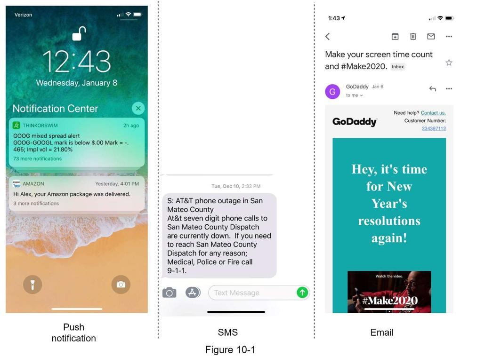

### 第1步 - 了解问题并确定设计范围
构建一个每天发送数百万条通知的可扩展系统并非易事。它需要对通知生态系统有深入的了解。面试问题特意设计为开放式和模棱两可的，你有责任提出问题以澄清要求。

候选人：系统支持哪些类型的通知？
面试官：推送通知、短信、邮件。

候选人：是实时系统吗？
采访者：让我们说它是一个软实时系统。我们希望用户尽快收到通知。但是，如果系统处于高工作负载下，则可以接受轻微的延迟。

候选人：支持的设备有哪些？
面试官：iOS 设备、Android 设备和笔记本电脑/台式机。

候选人：什么触发通知？
面试官：通知可以由客户端应用程序触发。它们也可以在服务器端安排。

候选人：用户可以选择退出吗？
面试官：是的，选择退出的用户将不再收到通知。

候选人：每天发出多少通知？
面试官：1000 万条手机推送通知，100 万条短信，500 万封电子邮件。

### 第2步 - 提出高级设计并获得支持
本节展示了支持各种通知类型的高级设计：iOS 推送通知、Android 推送通知、SMS 消息和电子邮件。 它的结构如下：

- 不同类型的通知
- 联系信息收集流程
- 通知发送/接收流程

#### 不同类型的通知
我们首先来看看每种通知类型在高层次上是如何工作的。

##### iOS 推送通知

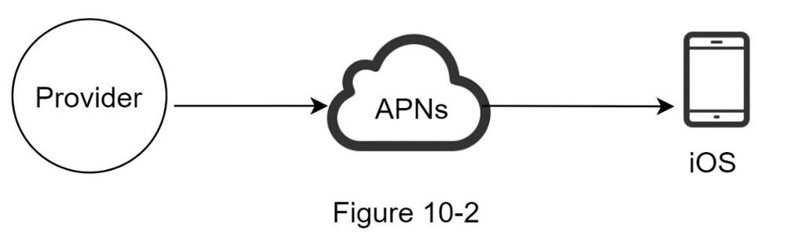

我们主要需要三个组件来发送 iOS 推送通知：

- 提供者。 提供者构建通知请求并将其发送到 Apple 推送通知服务 (APNS)。 为了构建推送通知，提供者提供以下数据：
  - 设备令牌：这是用于发送推送通知的唯一标识符。
  - Payload：这是一个包含通知负载的 JSON 字典。 这是一个例子：
  ```json
  {
      "aps": {
          "alert": {
              "title": "Game Request",
              "body": "Bob wants to play chess",
              "action-loc-key": "PLAY"
          },
          "badge": 5
      }
  }
  ```
- APNS：这是Apple 提供的一项远程服务，用于将推送通知传播到iOS 设备。
- iOS 设备：它是接收推送通知的终端客户端。

##### 安卓推送通知
Android 采用了类似的通知流程。 Firebase Cloud Messaging (FCM) 不使用 APN，通常用于向 Android 设备发送推送通知。

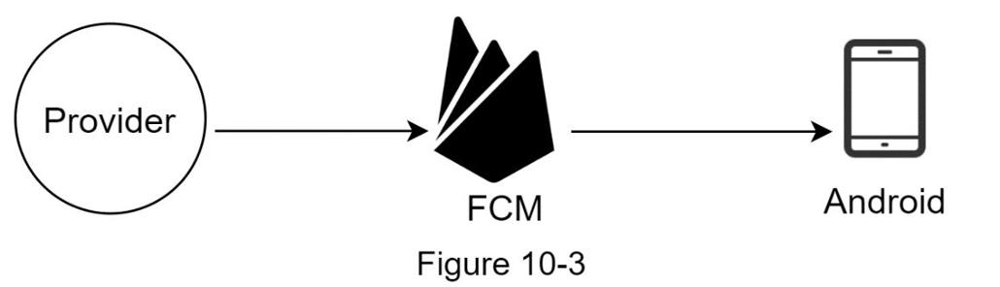

###### 短信
对于 SMS 消息，通常使用第三方 SMS 服务，如 Twilio [1]、Nexmo [2] 和许多其他服务。 其中大部分是商业服务。

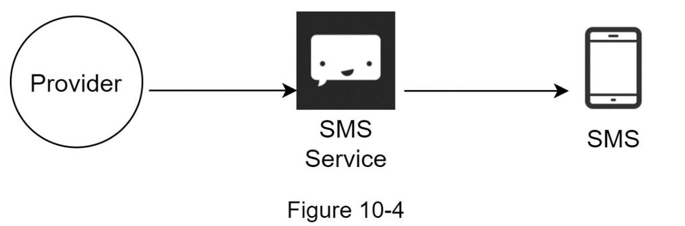

###### 电子邮件
尽管公司可以建立自己的电子邮件服务器，但其中许多人选择商业电子邮件服务。 Sendgrid [3] 和 Mailchimp [4] 是最受欢迎的电子邮件服务之一，它们提供了更好的传递率和数据分析。

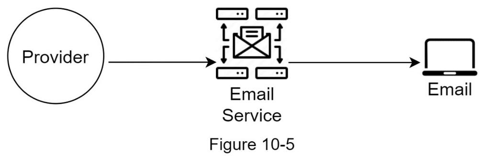

图 10-6 显示了包含所有第三方服务后的设计。

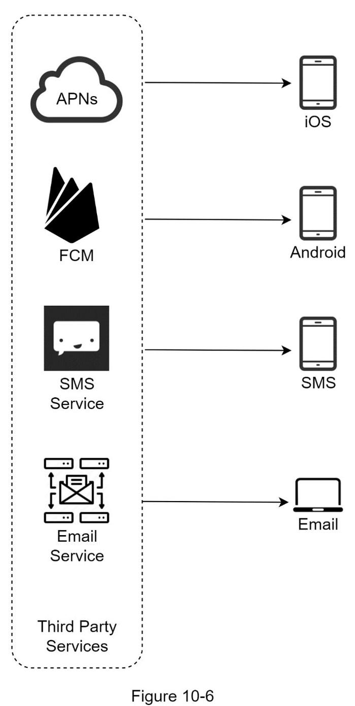

#### 联系信息收集流程
要发送通知，我们需要收集移动设备令牌、电话号码或电子邮件地址。 如图 10-7 所示，当用户安装我们的应用程序或第一次注册时，API 服务器会收集用户联系信息并将其存储在数据库中。

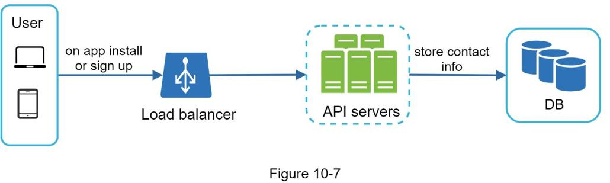

图 10-8 显示了用于存储联系信息的简化数据库表。 电子邮件地址和电话号码存储在用户表中，而设备令牌存储在设备表中。 一个用户可以有多个设备，表示可以向所有用户设备发送推送通知。

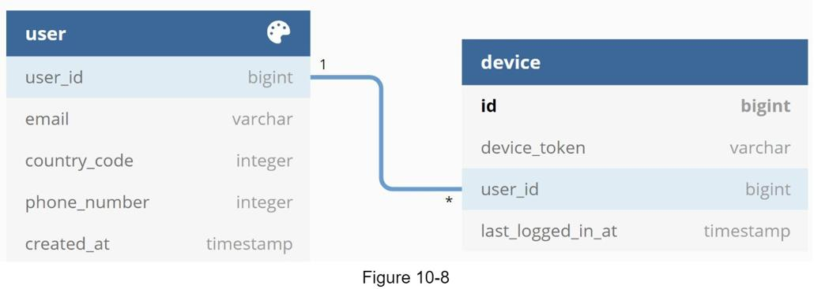

##### 通知发送/接收流程
我们将首先介绍初始设计； 然后，提出一些优化。

#### 高级设计
图 10-9 显示了设计，下面解释了每个系统组件。

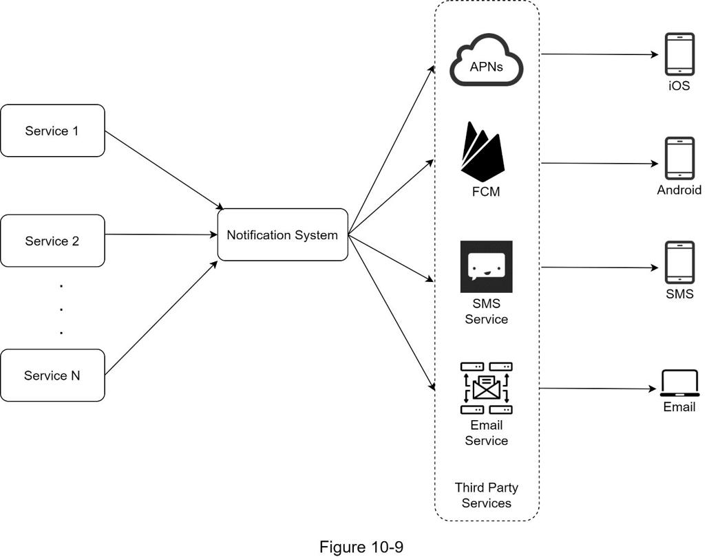

**服务 1 到 N**：服务可以是微服务、cron 作业或触发通知发送事件的分布式系统。例如，计费服务会发送电子邮件提醒客户到期付款，或者购物网站通过 SMS 消息告诉客户他们的包裹将于明天交付。

**通知系统**：通知系统是发送/接收通知的核心。从简单的开始，只使用一个通知服务器。它为服务 1 到 N 提供 API，并为第三方服务构建通知负载。

**第三方服务**：第三方服务负责向用户发送通知。在与第三方服务集成时，我们需要特别注意可扩展性。良好的可扩展性意味着可以轻松插入或拔出第三方服务的灵活系统。另一个重要的考虑因素是第三方服务可能在新市场或未来不可用。例如，FCM 在中国是不可用的。因此，那里使用了替代的第三方服务，例如 Jpush、PushY 等。

iOS、Android、SMS、电子邮件：用户在他们的设备上接收通知。

在这个设计中发现了三个问题：

- 单点故障(SPOF)：单个通知服务器意味着SPOF。
- 难以扩展：通知系统在一台服务器上处理与推送通知相关的所有事情。独立扩展数据库、缓存和不同的通知处理组件具有挑战性。
- 性能瓶颈：处理和发送通知可能是资源密集型的。例如，构建 HTML 页面和等待第三方服务的响应可能需要时间。在一个系统中处理所有内容可能会导致系统过载，尤其是在高峰时段。

#### 高级设计（改进）

在列举了初始设计中的挑战之后，我们改进了设计，如下所示：

- 将数据库和缓存移出通知服务器。
- 添加更多通知服务器并设置自动水平缩放。
- 引入消息队列以解耦系统组件。

图 10-10 显示了改进的高级设计。

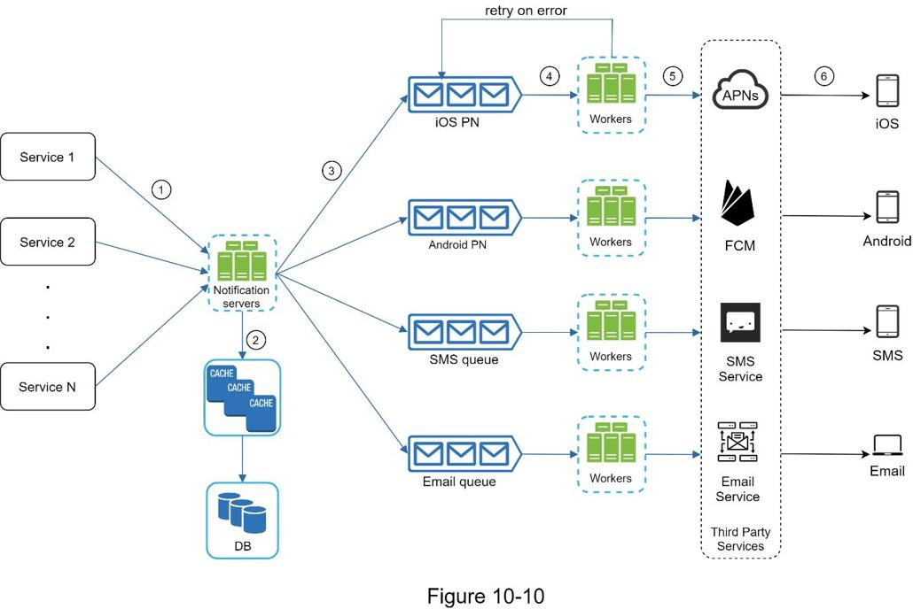

浏览上图的最佳方式是从左到右：

**服务 1 到 N**：它们代表通过通知服务器提供的 API 发送通知的不同服务。

**通知服务器**：它们提供以下功能：

- 为服务提供API 以发送通知。 这些 API 只能在内部访问或由经过验证的客户端访问，以防止垃圾邮件。
- 进行基本验证以验证电子邮件、电话号码等。
- 查询数据库或缓存以获取呈现通知所需的数据。
- 将通知数据放入消息队列进行并行处理。

以下是发送电子邮件的 API 示例：

发布 https://api.example.com/v/sms/send
请求正文

```json
{
    "to": [
        {
            "user_id": 123456
        }
    ],
    "from": {
        "email": "from_addr@example.com"
    },
    "subject": "Hello, World!",
    "content": {
        "type": "text/plain",
        "value": "Hello, World!"
    }
}
```

**缓存**：缓存用户信息、设备信息、通知模板。

**DB**：它存储有关用户、通知、设置等的数据。

**消息队列**：它们消除组件之间的依赖关系。当要发送大量通知时，消息队列用作缓冲区。每种通知类型都分配有不同的消息队列，因此一个第三方服务的中断不会影响其他通知类型。

**Workers**：Worker 是从消息队列中拉取通知事件并将其发送到相应的第三方服务的服务器列表。

**第三方服务**：在初始设计中已经说明。

iOS、Android、SMS、Email：在最初的设计中已经解释过了。

接下来，让我们检查每个组件如何协同工作以发送通知：
1. 服务调用通知服务器提供的API发送通知。
2. 通知服务器从缓存或数据库中获取元数据，例如用户信息、设备令牌和通知设置。
3. 一个通知事件被发送到相应的队列进行处理。例如，iOS 推送通知事件被发送到 iOS PN 队列。
4. Worker 从消息队列中拉取通知事件。
5. 工人向第三方服务发送通知。
6. 第三方服务向用户设备发送通知。

### 第3步 - 设计深入研究
在高层设计中，我们讨论了不同类型的通知、联系信息收集流程和通知发送/接收流程。我们将深入探讨以下内容：

- 可靠性。
- 其他组件和注意事项：通知模板、通知设置、速率限制、重试机制、推送通知中的安全性、监控排队通知和事件跟踪。
- 更新的设计。

#### 可靠性
在分布式环境中设计通知系统时，我们必须回答几个重要的可靠性问题。

#### 如何防止数据丢失？
通知系统中最重要的要求之一是它不能丢失数据。通知通常可以延迟或重新排序，但绝不会丢失。为了满足这个需求，通知系统将通知数据持久化到数据库中，并实现了重试机制。包含通知日志数据库用于数据持久化，如图 10-11 所示。

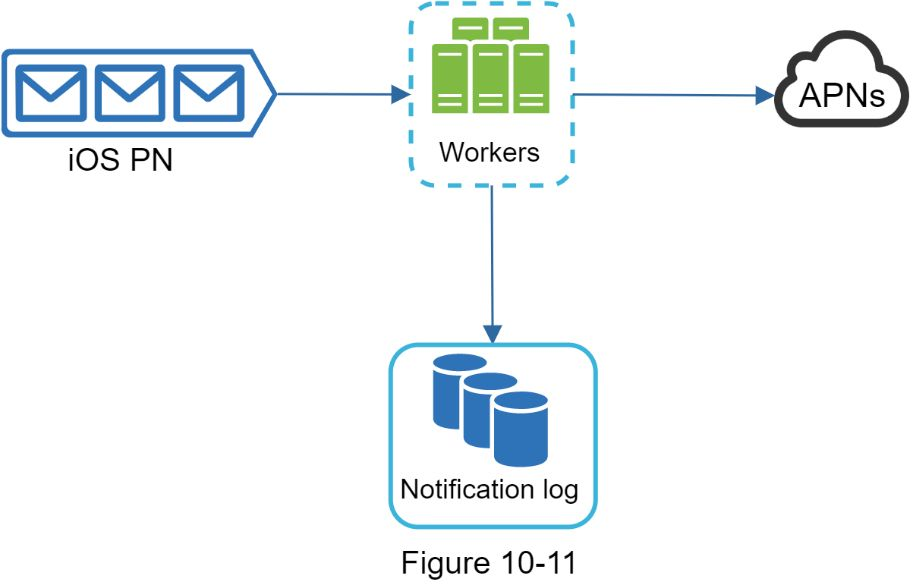

#### 收件人会只收到一次通知吗？
最简洁的答案是不。尽管通知在大多数情况下只发送一次，但分布式特性可能会导致重复通知。为了减少重复的发生，我们引入了重复数据删除机制，并仔细处理每个失败案例。这是一个简单的重复数据删除逻辑：

当通知事件第一次到达时，我们通过检查事件 ID 来检查它是否之前被看到。如果之前看到过，则将其丢弃。否则，我们将发出通知。对于有兴趣的读者来探索为什么我们不能完全一次性交付，请参阅参考资料 [5]。

#### 其他组件和注意事项
我们已经讨论了如何收集用户联系信息、发送和接收通知。通知系统远不止于此。在这里，我们讨论其他组件，包括模板重用、通知设置、事件跟踪、系统监控、速率限制等。

#### 通知模板
大型通知系统每天发送数百万条通知，其中许多通知遵循类似的格式。引入通知模板以避免从头开始构建每个通知。通知模板是预先格式化的通知，通过自定义参数、样式、跟踪链接等来创建你的独特通知。这是推送通知的示例模板。

Body：
你梦见了它。我们敢。 [ITEM NAME] 回来了——只到 [DATE]。
号召性用语：
现在下单。或者，保存我的 [项目名称]

使用通知模板的好处包括保持格式一致、减少边距错误和节省时间。

#### 通知设置
用户通常每天都会收到太多通知，他们很容易感到不知所措。因此，许多网站和应用程序为用户提供了对通知设置的细粒度控制。此信息存储在通知设置表中，具有以下字段：

```
user_id   bigInt
channel  varchar    # 推送通知、电子邮件或短信
opt_in   boolean    # 选择接收通知
```

在向用户发送任何通知之前，我们首先检查用户是否选择接收此类通知。

#### 限流
为了避免用户收到太多通知，我们可以限制用户可以接收的通知数量。这很重要，因为如果我们发送得太频繁，接收者可能会完全关闭通知。

#### 重试
当第三方服务发送通知失败时，该通知将被添加到消息队列中进行重试。如果问题仍然存在，则会向开发人员发送警报。

#### 推送通知的安全性
对于 iOS 或 Android 应用程序，appKey 和 appSecret 用于保护推送通知 API [6]。只有经过身份验证或验证的客户端才能使用我们的 API 发送推送通知。有兴趣的用户可以参考参考资料[6]。

#### 监控排队通知
要监控的一个关键指标是排队通知的总数。如果数量很大，则工作人员处理通知事件的速度不够快。为了避免延迟通知传递，需要更多的工作人员。图 10-12（归功于 [7]）显示了一个待处理的排队消息示例。

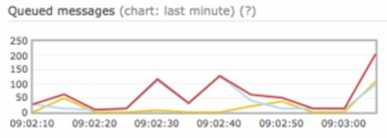

#### 事件追踪
通知指标，例如打开率、点击率和参与度，对于了解客户行为很重要。 分析服务实现事件跟踪。 通常需要在通知系统和分析服务之间进行集成。 图 10-13 显示了可能出于分析目的而跟踪的事件示例。

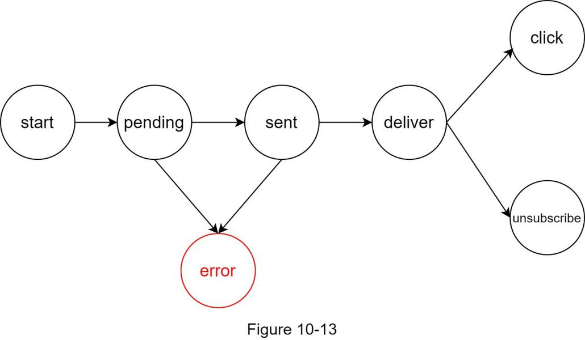

#### 更新设计
将所有内容放在一起，图 10-14 显示了更新后的通知系统设计。

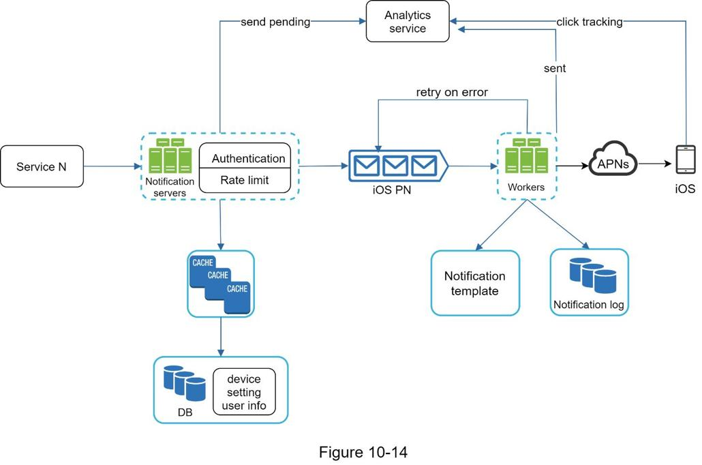

在这个设计中，与之前的设计相比，增加了许多新的组件。

- 通知服务器配备了两个更重要的功能：身份验证和限速。
- 我们还添加了重试机制来处理通知失败。 如果系统未能发送通知，它们将被放回消息队列中，并且工作人员将重试预定义的次数。
- 此外，通知模板提供了一致且高效的通知创建过程。
- 最后，添加了监控和跟踪系统，用于系统健康检查和未来改进。

### 第4步 - 总结
通知是必不可少的，因为它们可以让我们随时了解重要信息。它可以是关于你在 Netflix 上最喜欢的电影的推送通知、关于新产品折扣的电子邮件或关于你的在线购物付款确认的消息。

在本章中，我们描述了支持多种通知格式的可扩展通知系统的设计：推送通知、SMS 消息和电子邮件。我们采用消息队列来解耦系统组件。

除了高级设计之外，我们还深入挖掘了更多组件和优化。

- 可靠性：我们提出了一种强大的重试机制，以最大限度地降低故障率。
- 安全性：AppKey/appSecret 对用于确保只有经过验证的客户端才能发送通知。
- 跟踪和监控：这些在通知流程的任何阶段实施，以捕获重要的统计数据。
- 尊重用户设置：用户可以选择不接收通知。我们的系统在发送通知之前首先检查用户设置。
- 限速：用户会喜欢他们收到的通知数量的频率上限。

恭喜你走到这一步！现在拍拍自己的后背。好样的！

### 参考资料
1. Twilio 短信：https://www.twilio.com/sms
2. Nexmo 短信：https://www.nexmo.com/products/sms
3. 发送网格：https://sendgrid.com/
4. Mailchimp：https://mailchimp.com/
5. 你不能完全一次性交付：https://bravenewgeek.com/you-cannot-have-exactly-once-delivery/
6. 推送通知中的安全性：https://cloud.ibm.com/docs/services/mobilepush?topic=mobile-pushnotification-security-in-push-notifications
7. RadditMQ：https://bit.ly/2sotIa6
