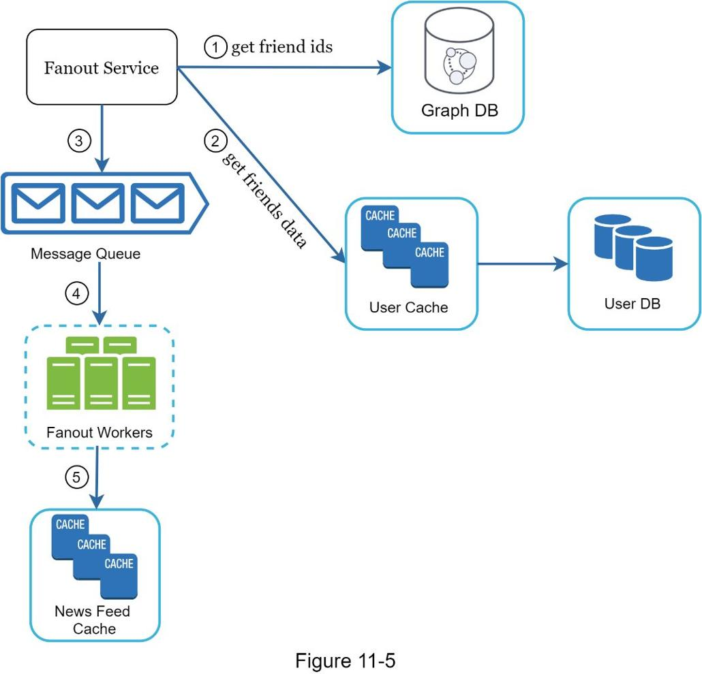

## 设计消息流系统
在本章中，你将被要求设计一个消息流系统。 什么是消息流？ 根据 Facebook 帮助页面，“消息流是主页中间不断更新的故事列表。 动态消息包括状态更新、照片、视频、链接、应用程序活动以及来自你在 Facebook 上关注的人员、页面和群组的点赞”[1]。 这是一个流行的面试问题。 常见的类似问题是：设计 Facebook 消息流、Instagram 消息流、Twitter 时间线等。


### 第1步 - 了解问题并确定设计范围

第一组澄清问题是了解面试官在要求你设计消息流系统时的想法。至少，你应该弄清楚要支持哪些功能。以下是候选人与面试官互动的示例：

候选人：这是一个移动应用程序吗？还是网络应用程序？或两者？
面试官：二者都有。
候选人：重要的特点是什么？
面试官：用户可以发布消息并在消息流页面上查看她朋友的消息。
候选人：消息流是按时间倒序排序还是按任何特定顺序（如主题分数）排序？例如，来自密友的消息得分较高。
面试官：为简单起见，让我们假设提要按时间倒序排序。
候选人：一个用户可以有多少个朋友？
面试官：5000
候选人：交通量是多少？
面试官：1000万DAU
候选人：提要可以包含图像、视频或仅包含文本吗？
面试官：它可以包含媒体文件，包括图片和视频。

现在你已经收集了需求，我们专注于设计系统。

### 第2步 - 提出高级设计并获得支持
该设计分为两个流程：信息发布和消息流构建。

- 信息发布：当用户发布消息时，将相应的数据写入缓存和数据库。一条消息被填充到她朋友的消息流中。
- 消息流构建：为简单起见，让我们假设消息流是通过按时间倒序聚合朋友的消息来构建的。

#### 消息流 API

消息流 API 是客户端与服务器通信的主要方式。这些 API 基于 HTTP，允许客户端执行操作，包括发布状态、检索消息流、添加朋友等。我们讨论两个最重要的 API：信息发布 API 和消息流检索 API。

##### 信息发布 API

要发布消息，将向服务器发送 HTTP POST 请求。 API 如下所示：
发布 ```/v1/me/feed```
参数：

- 内容：内容是消息的文本。
- auth_token：用于验证API 请求。

##### 消息流检索 API
检索消息流的 API 如下所示：

获取 ```/v1/me/feed```
参数：

- auth_token：用于验证API 请求。

#### 消息流检索
图 11-2 显示了消息流检索流程的高级设计。


- 用户：用户可以在浏览器或移动应用程序上查看消息流。 用户通过 API 发布内容为“Hello”的消息：
  ```/v1/me/feed?content=Hello&auth_token={auth_token}```
- 负载平衡器：将流量分配到Web 服务器。
- Web 服务器：Web 服务器将流量重定向到不同的内部服务。
- Post 服务：将 post 持久化到数据库和缓存中。
- 扇出服务：将新内容推送到朋友的消息流。 消息流数据存储在缓存中以便快速检索。
- 通知服务：通知朋友有新内容可用并发送推送通知。

#### 消息流构建

在本节中，我们将讨论消息流是如何在幕后构建的。 图 11-3 显示了高级设计：


- 用户：用户发送请求以检索她的消息流。 请求如下所示：```/v1/me/feed```。
- 负载平衡器：负载平衡器将流量重定向到Web 服务器。
- Web 服务器：Web 服务器将请求路由到新闻源服务。
- 消息流服务：消息流服务从缓存中获取消息流。
- 消息流缓存：存储呈现消息流所需的消息流ID。

### 第3步 - 设计深入研究
高级设计简要介绍了两个流程：信息发布和消息流构建。 在这里，我们将更深入地讨论这些主题。

#### 信息发布深入研究
图 11-4 概述了提要发布的详细设计。 我们已经讨论了高层设计中的大部分组件，我们将重点关注两个组件：Web 服务器和扇出服务。


##### 网络服务器
除了与客户端通信外，Web 服务器还强制执行身份验证和限速。只有使用有效 auth_token 登录的用户才能发帖。该系统限制了用户在一定时间内可以发布的消息数量，这对于防止垃圾信息和滥用内容至关重要。

##### 扇出服务

扇出是向所有朋友发送消息的过程。两种类型的扇出模型是：写时扇出（也称为推模型）和读时扇出（也称为拉模型）。两种模式各有利弊。我们解释他们的工作流程并探索支持我们系统的最佳方法。

**写时扇出**。使用这种方法，消息流在写入期间预先计算。新信息发布后会立即发送到朋友的缓存中。

优点：

- 动态消息实时生成，可即时推送给好友。
- 获取消息流很快，因为消息流是在写入期间预先计算的。

缺点：

- 如果用户有很多朋友，则获取朋友列表并为所有朋友生成消息流既慢又耗时。这被称为热键问题。
- 对于非活动用户或很少登录的用户，预先计算消息流会浪费计算资源。

**读时扇出**。消息流在阅读时生成。这是一个按需模型。当用户加载她的主页时，会提取最近的消息。

优点：

- 对于不活跃的用户或很少登录的用户，读时扇出效果更好，因为它不会浪费他们的计算资源。
- 数据不推送给朋友，所以没有热键问题。

缺点：

- 获取消息流很慢，因为消息流没有预先计算。

我们采用混合方法来获得这两种方法的好处并避免它们中的陷阱。由于快速获取消息流至关重要，我们为大多数用户使用推送模型。对于有很多朋友/追随者的名人或用户，我们让追随者按需拉取信息内容，以避免系统过载。一致的散列是缓解热键问题的有用技术，因为它有助于更均匀地分配请求/数据。

让我们仔细看看如图 11-5 所示的扇出服务。



扇出服务的工作方式如下：
1. 从图数据库中获取好友 ID。图数据库适用于管理朋友关系和朋友推荐。感兴趣的读者希望了解更多有关此概念的信息，请参阅参考资料 [2]。
2. 从用户缓存中获取好友信息。然后系统根据用户设置过滤掉朋友。例如，如果你将某人屏蔽，即使你仍然是朋友，她的信息也不会显示在你的消息流中。信息可能不显示的另一个原因是用户可以选择性地与特定朋友共享信息或对其他人隐藏信息。
3. 将好友列表和新消息ID发送到消息队列。
4. 扇出工作人员从消息队列中获取数据并将消息流数据存储在消息流缓存中。你可以将消息流缓存视为 <post_id, user_id> 映射表。每当发布新信息时，它都会被附加到消息流表中，如图 11-6 所示。如果我们将整个用户和 post 对象存储在缓存中，内存消耗会变得非常大。因此，仅存储 ID。为了保持较小的内存大小，我们设置了一个可配置的限制。用户滚动浏览消息流中数千个消息的机会很小。大多数用户只对最新的内容感兴趣，因此缓存未命中率很低。
5. 将 <post_id, user_id > 存储在消息流缓存中。图 11-6 显示了消息流在缓存中的样子的示例。
    

#### 消息流检索深入研究
图 11-7 说明了消息流检索的详细设计。


如图 11-7 所示，媒体内容（图片、视频等）存储在 CDN 中，以便快速检索。 让我们看看客户端如何检索消息流。
1. 用户发送请求以检索她的消息流。 请求如下所示：```/v1/me/feed```
2. 负载均衡器将请求重新分配到 Web 服务器。
3. Web 服务器调用消息流服务来获取消息流。
4. 消息流服务从消息流缓存中获取列表消息 ID。
5. 用户的消息流不仅仅是提要 ID 列表。 它包含用户名、个人资料图片、消息内容、消息图像等。因此，消息流服务从缓存（用户缓存和消息缓存）中获取完整的用户和消息对象，以构建完全水合的消息流。
6. 完全水合的消息流以 JSON 格式返回给客户端进行渲染。

#### 缓存架构

缓存对于消息流系统极为重要。 我们将缓存层划分为 5 层，如图 11-8 所示。


- 消息流：它存储消息流的ID。
- 内容：它存储每个消息数据。 热门内容存储在热缓存中。
- Social Graph：存储用户关系数据。
- Action：它存储有关用户是否喜欢消息、回复消息或对消息采取其他操作的信息。
- 计数器：存储点赞、回复、关注、关注等计数器。

### 第 4 步 - 总结
在本章中，我们设计了一个消息流系统。我们的设计包含两个流程：消息流发布和消息流检索。

像任何系统设计面试问题一样，设计系统没有完美的方法。每家公司都有其独特的限制条件，你必须设计一个系统来适应这些限制条件。了解设计和技术选择的权衡很重要。如果还剩几分钟，你可以讨论可扩展性问题。为避免重复讨论，下面仅列出面试要点。

扩展数据库：

- 垂直缩放与水平缩放
- SQL 与 NoSQL
- 主从复制
- 只读副本
- 一致性模型
- 数据库分片

其他要点：

- 保持网络层无状态
- 尽可能多地缓存数据
- 支持多个数据中心
- 带有消息队列的丢失偶组件
- 监控关键指标。例如，高峰时段的 QPS 和用户刷新消息流时的延迟是值得监控的。

恭喜你走到这一步！现在拍拍自己的后背。好样的！

### 参考资料
1. 新闻提要的工作原理：https://www.facebook.com/help/327131014036297/
2. Friend of Friend 推荐 Neo4j 和 SQL Sever：http://geekswithblogs.net/brendonpage/archive/2015/10/26/friend-of-friend-recommendations-with-neo4j.aspx
