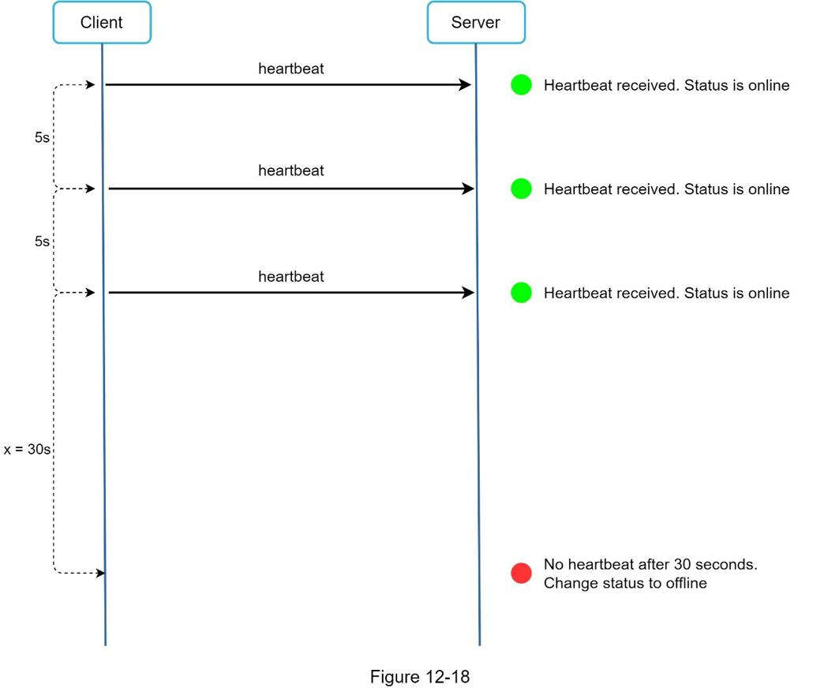

## 设计聊天系统
在本章中，我们将探讨聊天系统的设计。 几乎每个人都使用聊天应用程序。 图 12-1 显示了市场上一些最流行的应用程序。

聊天应用程序为不同的人执行不同的功能。 确定确切的要求非常重要。 例如，当面试官考虑一对一聊天时，你不想设计一个专注于群聊的系统。 探索功能需求很重要。

### 第1步 - 了解问题并确定设计范围
就要设计的聊天应用程序的类型达成一致至关重要。在市场上，有 Facebook Messenger、微信和 WhatsApp 等一对一聊天应用程序，Slack 等专注于群聊的办公室聊天应用程序，或专注于大群互动和低声音的游戏聊天应用程序如 Discord聊天延迟。

第一组澄清问题应该确定面试官在要求你设计聊天系统时的确切想法。至少，弄清楚你是否应该专注于一对一聊天或群聊应用程序。你可能会问的一些问题如下：

候选人：我们应该设计什么样的聊天应用？ 1对1还是小组？
面试官：应该支持1对1和群聊。
候选人：这是一个移动应用程序吗？还是网络应用程序？或两者？
面试官：两者都有。
候选人：这个应用的规模是多少？启动应用程序还是大规模？
面试官：应该支持5000万日活跃用户（DAU）。
候选人：群聊的群成员限制是多少？
面试官：最多100人
候选人：聊天应用有哪些重要的功能？可以支持附件吗？
面试官：1对1聊天，群聊，在线指示器。系统只支持短信。
候选人：有消息大小限制吗？
面试官：是的，文本长度应该小于 100,000 个字符。
候选人：需要端到端加密吗？
面试官：暂时不需要，如果时间允许我们会讨论。
候选人：聊天记录要保存多久？
面试官：永远。
在本章中，我们专注于设计像 Facebook messenger 这样的聊天应用程序，重点是以下功能：

- 交付延迟低的一对一聊天
- 小型群聊（最多100人）
- 在线状态
- 多设备支持。同一个账号可以同时登录多个账号。
- 推送通知

就设计规模达成一致也很重要。我们将设计一个支持 5000 万 DAU 的系统。

### 第2步 - 提出高级设计并获得支持
要开发高质量的设计，我们应该对客户端和服务器如何通信有基本的了解。在聊天系统中，客户端可以是移动应用程序或 Web 应用程序。客户端之间不直接通信。相反，每个客户端都连接到支持上述所有功能的聊天服务。让我们专注于基本操作。聊天服务必须支持以下功能：

- 接收来自其他客户端的消息。
- 为每封邮件找到正确的收件人并将邮件转发给收件人。
- 如果收件人不在线，则将该收件人的消息保留在服务器上，直到她在线。

图 12-2 显示了客户端（发送者和接收者）与聊天服务之间的关系。

当客户端打算开始聊天时，它会使用一种或多种网络协议连接聊天服务。对于聊天服务，网络协议的选择很重要。让我们和面试官讨论这个问题。

大多数客户端/服务器应用程序的请求由客户端发起。这也适用于聊天应用程序的发送方。在图 12-2 中，当发送者通过聊天服务向接收者发送消息时，它使用了久经考验的 HTTP 协议，这是最常见的 Web 协议。在这种情况下，客户端打开与聊天服务的 HTTP 连接并发送消息，通知服务将消息发送给接收方。 keep-alive 对此非常有效，因为 keep-alive 标头允许客户端保持与聊天服务的持久连接。它还减少了 TCP 握手的次数。 HTTP 是发送方的一个很好的选择，许多流行的聊天应用程序，如 Facebook [1] 最初使用 HTTP 来发送消息。

但是，接收端要复杂一些。由于 HTTP 是客户端发起的，因此从服务器发送消息并非易事。多年来，许多技术用于模拟服务器发起的连接：轮询、长轮询和 WebSocket。这些是系统设计面试中广泛使用的重要技术，所以让我们逐一检查。

#### 轮询
如图 12-3 所示，轮询是一种客户端定期询问服务器是否有可用消息的技术。根据轮询频率，轮询的成本可能很高。它可能会消耗宝贵的服务器资源来回答一个大多数时间都提供否定答案的问题。

#### 长轮询
因为轮询可能效率低下，下一个进展是长轮询（图 12-4）。

在长轮询中，客户端保持连接打开，直到实际有新消息可用或达到超时阈值。一旦客户端收到新消息，它会立即向服务器发送另一个请求，重新启动该过程。长轮询有几个缺点：

- 发送者和接收者不能连接到同一个聊天服务器。基于 HTTP 的服务器通常是无状态的。如果你使用轮询进行负载平衡，则接收消息的服务器可能与接收消息的客户端没有长轮询连接。
- 服务器没有很好的方法来判断客户端是否已断开连接。
- 效率低下。如果用户聊天不多，长轮询仍然会在超时后建立定期连接。

#### WebSocket
WebSocket 是从服务器向客户端发送异步更新的最常见解决方案。图 12-5 显示了它是如何工作的。

WebSocket 连接由客户端发起。它是双向的和持久的。它从 HTTP 连接开始，可以通过一些明确定义的握手“升级”到 WebSocket 连接。通过这种持久连接，服务器可以向客户端发送更新。即使有防火墙，WebSocket 连接通常也能正常工作。这是因为它们使用 HTTP/HTTPS 连接也使用的端口 80 或 443。

前面我们说过，在发送方，HTTP 是一个很好的协议，但由于 WebSocket 是双向的，所以没有强有力的技术理由不将其用于接收。图 12-6 显示了 WebSockets (ws) 如何用于发送方和接收方。

通过使用 WebSocket 进行发送和接收，它简化了设计并使客户端和服务器上的实现更加直接。由于 WebSocket 连接是持久的，因此有效的连接管理在服务器端至关重要。

#### 高级设计
刚才我们提到了选择WebSocket作为客户端和服务器之间的主要通信协议进行双向通信，需要注意的是，其他一切都不一定是WebSocket。事实上，聊天应用程序的大多数功能（注册、登录、用户配置文件等）都可以使用传统的 HTTP 请求/响应方法。让我们深入研究一下系统的高级组件。

如图12-7所示，聊天系统分为三大类：无状态服务、有状态服务、第三方集成。

#### 无状态服务
无状态服务是传统的面向公众的请求/响应服务，用于管理登录、注册、用户资料等。这些是许多网站和应用程序中的常见功能。

无状态服务位于负载均衡器后面，其工作是根据请求路径将请求路由到正确的服务。这些服务可以是整体的或单独的微服务。我们不需要自己构建许多这些无状态服务，因为市场上有可以轻松集成的服务。我们将深入讨论的一项服务是服务发现。它的主要工作是为客户端提供客户端可以连接到的聊天服务器的 DNS 主机名列表。

#### 有状态服务
唯一的有状态服务是聊天服务。该服务是有状态的，因为每个客户端都与聊天服务器保持持久的网络连接。在此服务中，只要服务器仍然可用，客户端通常不会切换到另一个聊天服务器。服务发现与聊天服务密切协调以避免服务器过载。我们将深入探讨。

#### 第三方集成

对于聊天应用，推送通知是最重要的第三方集成。这是一种在新消息到达时通知用户的方式，即使应用程序没有运行也是如此。推送通知的正确集成至关重要。有关详细信息，请参阅第 10 章设计通知系统。

#### 可扩展性
在小范围内，上面列出的所有服务都可以放在一台服务器中。即使在我们设计的规模上，理论上也可以在一台现代云服务器中安装所有用户连接。服务器可以处理的并发连接数很可能是限制因素。在我们的场景中，有 1M 并发用户，假设每个用户连接在服务器上需要 10K 的内存（这是一个非常粗略的数字，并且非常依赖于语言选择），它只需要大约 10GB 的内存来保存一个上的所有连接盒子。

如果我们提出一个所有东西都适合一个服务器的设计，这可能会在面试官的脑海中引发一个很大的危险信号。没有技术人员会在单个服务器中设计这样的规模。由于许多因素，单服务器设计是一个交易破坏者。其中单点故障是最大的。

但是，从单一服务器设计开始是完全可以的。只要确保面试官知道这是一个起点。将我们提到的所有内容放在一起，图 12-8 显示了调整后的高级设计。

在图 12-8 中，客户端维护与聊天服务器的持久 WebSocket 连接以进行实时消息传递。

- 聊天服务器方便消息发送/接收。
- Presence 服务器管理在线/离线状态。
- API 服务器处理一切，包括用户登录、注册、更改个人资料等。
- 通知服务器发送推送通知。
- 最后，键值存储用于存储聊天记录。当离线用户上线时，她会看到她之前的所有聊天记录。

#### 存储
至此，我们已经准备好服务器，运行服务并完成第三方集成。技术堆栈的深处是数据层。数据层通常需要一些努力才能使其正确。我们必须做出的一个重要决定是决定使用正确的数据库类型：关系数据库还是 NoSQL 数据库？为了做出明智的决定，我们将检查数据类型和读/写模式。

典型的聊天系统中存在两种类型的数据。首先是通用数据，例如用户资料、设置、用户好友列表。这些数据存储在健壮可靠的关系数据库中。复制和分片是满足可用性和可伸缩性要求的常用技术。

第二个是聊天系统独有的：聊天历史数据。了解读/写模式很重要。

- 聊天系统的数据量巨大。之前的一项研究 [2] 表明，Facebook Messenger 和 Whatsapp 每天处理 600 亿条消息。
- 只有最近的聊天被频繁访问。用户通常不会查找旧的聊天记录。
- 尽管在大多数情况下会查看最近的聊天记录，但用户可能会使用需要随机访问数据的功能，例如搜索、查看你的提及、跳转到特定消息等。这些情况应该得到数据访问层的支持。
- 1 对 1 聊天应用的读写比率约为 1:1。

选择支持我们所有用例的正确存储系统至关重要。我们推荐键值对存储的原因如下：

- 键值存储允许轻松的水平缩放。
- 键值存储提供非常低的访问数据延迟。
- 关系数据库不能很好地处理数据的长尾[3]。当索引变大时，随机访问代价高昂。
- 键值存储被其他经过验证的可靠聊天应用程序采用。例如，Facebook messenger 和 Discord 都使用键值对存储。 Facebook messenger 使用 HBase [4]，而 Discord 使用 Cassandra [5]。

#### 数据模型
刚才，我们谈到了使用键值存储作为我们的存储层。最重要的数据是消息数据。让我们仔细看看。

##### 1对1聊天的消息表
图 12-9 显示了 1 对 1 聊天的消息表。主键是message_id，它有助于决定消息的顺序。我们不能依赖 created_at 来决定消息顺序，因为可以同时创建两条消息。

##### 群聊消息表
图 12-10 显示了群聊的消息表。 复合主键是 (channel_id, message_id)。 频道和组在这里代表相同的含义。 channel_id 是分区键，因为群聊中的所有查询都在一个频道中操作。

##### 消息 ID

如何生成message_id是一个值得探讨的有趣话题。 Message_id 承担着保证消息顺序的责任。要确定消息的顺序，message_id 必须满足以下两个要求：

- ID 必须是唯一的。
- ID 应该可以按时间排序，这意味着新行的ID 高于旧行。

我们如何才能实现这两个保证？想到的第一个想法是 MySql 中的“auto_increment”关键字。但是，NoSQL 数据库通常不提供这样的功能。

第二种方法是使用全局 64 位序列号生成器，如 Snowflake [6]。这在“第 7 章：在分布式系统中设计唯一 ID 生成器”中进行了讨论。

最后一种方法是使用本地序列号生成器。本地意味着 ID 仅在组内是唯一的。本地 ID 起作用的原因是在一对一通道或组通道内维护消息序列就足够了。与全局 ID 实现相比，这种方法更容易实现。

### 第3步 - 设计深入研究
在系统设计面试中，通常希望你深入研究高级设计中的一些组件。对于聊天系统，服务发现、消息流和在线/离线指标值得深入探索。

#### 服务发现
服务发现的主要作用是根据地理位置、服务器容量等标准为客户端推荐最佳聊天服务器。Apache Zookeeper [7] 是一种流行的服务发现开源解决方案。它注册所有可用的聊天服务器，并根据预定义的标准为客户选择最佳的聊天服务器。

图 12-11 展示了服务发现（Zookeeper）的工作原理。

1. 用户 A 尝试登录应用。
2. 负载均衡器向 API 服务器发送登录请求。
3. 后端对用户进行身份验证后，服务发现会为用户 A 找到最佳聊天服务器。在本例中，选择服务器 2，并将服务器信息返回给用户 A。
4. 用户 A 通过 WebSocket 连接到聊天服务器 2。

#### 消息流
了解聊天系统的端到端流程很有趣。在本节中，我们将探讨 1 对 1 聊天流程、跨设备消息同步和群聊流程。

#### 1对1聊天流程
图 12-12 解释了当用户 A 向用户 B 发送消息时会发生什么。

1. 用户 A 向聊天服务器 1 发送聊天消息。
2. 聊天服务器 1 从 ID 生成器获取消息 ID。
3. 聊天服务器 1 将消息发送到消息同步队列。
4. 消息存储在键值存储中。
5. 
  1. 如果用户 B 在线，则将消息转发到连接用户 B 的聊天服务器 2。
  2. 如果用户 B 离线，则从推送通知 (PN) 服务器发送推送通知。

6. 聊天服务器 2 将消息转发给用户 B。用户 B 和聊天服务器 2 之间存在持久的 WebSocket 连接。

#### 跨多个设备的消息同步
许多用户拥有多个设备。 我们将解释如何在多个设备之间同步消息。 图 12-13 显示了消息同步的示例。

在图 12-13 中，用户 A 有两个设备：电话和笔记本电脑。当用户 A 用她的手机登录聊天应用程序时，它会与聊天服务器 1 建立 WebSocket 连接。同样，笔记本电脑和聊天服务器 1 之间也存在连接。

每个设备都维护一个名为 cur_max_message_id 的变量，它跟踪设备上的最新消息 ID。满足以下两个条件的消息被认为是新闻消息：

- 收件人ID 等于当前登录的用户ID。
- 键值存储中的消息 ID 大于 cur_max_message_id。

每个设备上都有不同的 cur_max_message_id，消息同步很容易，因为每个设备都可以从 KV 存储中获取新消息。

#### 小群聊天流程
与一对一聊天相比，群聊的逻辑更加复杂。图 12-14 和 12-15 解释了流程。

图 12-14 解释了当用户 A 在群聊中发送消息时会发生什么。假设组中有 3 个成员（用户 A、用户 B 和用户 C）。首先，来自用户 A 的消息被复制到每个组成员的消息同步队列：一个用于用户 B，第二个用于用户 C。你可以将消息同步队列视为收件人的收件箱。这种设计选择适合小群聊天，因为：

- 它简化了消息同步流程，因为每个客户端只需检查自己的收件箱即可获取新消息。
- 当组数较小时，在每个收件人的收件箱中存储一份副本不会太贵。

微信使用类似的方法，它将一个群组限制为 500 名成员 [8]。但是，对于拥有大量用户的组，为每个成员存储一份消息副本是不可接受的。

在收件人方面，收件人可以接收来自多个用户的消息。每个收件人都有一个收件箱（消息同步队列），其中包含来自不同发件人的消息。图 12-15 说明了该设计。

#### 在线状态
在线状态指示器是许多聊天应用程序的基本功能。通常，你可以在用户的个人资料图片或用户名旁边看到一个绿点。本节解释幕后发生的事情。

在高级设计中，在线状态服务器负责管理在线状态并通过 WebSocket 与客户端通信。有一些流程会触发在线状态更改。让我们检查它们中的每一个。

#### 用户登录
用户登录流程在“服务发现”部分进行了说明。客户端与实时服务建立 WebSocket 连接后，用户 A 的在线状态和 last_active_at 时间戳保存在 KV 存储中。状态指示器显示用户登录后在线。

#### 用户下线
当用户注销时，它会经历如图 12-17 所示的用户注销流程。在线状态在KV存储中变为离线。状态指示器显示用户离线。

#### 用户断开连接
我们都希望我们的互联网连接是一致和可靠的。然而，情况并非总是如此。因此，我们必须在设计中解决这个问题。当用户断开与 Internet 的连接时，客户端和服务器之间的持久连接将丢失。处理用户断开连接的一种简单方法是将用户标记为离线，并在连接重新建立时将状态更改为在线。但是，这种方法有一个重大缺陷。用户在短时间内频繁断开和重新连接到互联网是很常见的。例如，当用户通过隧道时，网络连接可以打开和关闭。每次断开/重新连接时更新在线状态会使在线状态指示器更改过于频繁，从而导致用户体验不佳。

我们引入心跳机制来解决这个问题。在线客户端会定期向在线状态服务器发送心跳事件。如果在线状态服务器在一定时间内收到心跳事件，例如来自客户端的 x 秒，则认为用户在线。否则，它处于脱机状态。

在图 12-18 中，客户端每 5 秒向服务器发送一次心跳事件。发送 3 次心跳事件后，客户端断开连接，x = 30 秒内没有重新连接（这个数字是任意选择的，用于演示逻辑）。联机状态更改为脱机。

#### 在线状态扇出
用户 A 的好友如何知道状态变化？ 图 12-19 解释了它是如何工作的。 Presence 服务器使用发布-订阅模型，其中每个朋友对维护一个频道。 当用户 A 的在线状态发生变化时，它会将事件发布到三个频道，频道 A-B、A-C 和 A-D。 这三个频道分别由用户 B、C 和 D 订阅。 因此，朋友很容易获得在线状态更新。 客户端和服务器之间的通信是通过实时 WebSocket 进行的。

上述设计对小用户群有效。 例如，微信使用类似的方法，因为它的用户群上限为 500 人。对于较大的群体，通知所有成员在线状态既昂贵又耗时。 假设一个组有 100,000 名成员。 每次状态更改都会产生 100,000 个事件。 为了解决性能瓶颈，一个可能的解决方案是仅在用户进入群组或手动刷新好友列表时才获取在线状态。

### 第4步 - 总结
在本章中，我们介绍了一个同时支持一对一聊天和小群聊天的聊天系统架构。 WebSocket 用于客户端和服务器之间的实时通信。聊天系统包含以下组件：用于实时消息传递的聊天服务器、用于管理在线状态的状态服务器、用于发送推送通知的推送通知服务器、用于聊天历史持久性的键值存储和用于其他功能的 API 服务器。

如果你在面试结束时有额外的时间，这里有额外的谈话要点：

- 扩展聊天应用程序以支持照片和视频等媒体文件。媒体文件的大小明显大于文本。压缩、云存储和缩略图是值得讨论的有趣话题。
- 端到端加密。 Whatsapp 支持消息的端到端加密。只有发件人和收件人可以阅读邮件。有兴趣的读者可以参考参考资料中的文章[9]。
- 在客户端缓存消息可以有效减少客户端和服务器之间的数据传输。
- 提高加载时间。 Slack 构建了一个地理分布的网络来缓存用户的数据、频道等，以获得更好的加载时间 [10]。
- 错误处理。
- 聊天服务器错误。到聊天服务器可能有数十万甚至更多的持久连接。如果聊天服务器离线，服务发现（Zookeeper）将为客户端提供一个新的聊天服务器以建立新的连接。
- 消息重发机制。重试和排队是重新发送消息的常用技术。

恭喜你走到这一步！现在拍拍自己的后背。好样的！

### 参考资料
1. Facebook 上的 Erlang：https://www.erlang-factory.com/upload/presentations/31/EugeneLetuchy-ErlangatFacebook.pdf
2. Messenger 和 WhatsApp 每天处理 600 亿条消息：https://www.theverge.com/2016/4/12/11415198/facebook-messenger-whatsapp-number-messages-vs-sms-f8-2016
3. 长尾：https://en.wikipedia.org/wiki/Long_tail
4. 消息的底层技术：https://www.facebook.com/notes/facebook-engineering/the-underlying-technology-of-messages/454991608919/
5. Discord 如何存储数十亿条消息：https://blog.discordapp.com/how-discord-stores-billions-of-messages-7fa6ec7ee4c7
6. 宣布雪花：https://blog.twitter.com/engineering/en_us/a/2010/announcing-snowflake.html
7. Apache ZooKeeper：https://zookeeper.apache.org/
8. 从无到有：微信后台系统的演进（中文文章）：https://www.infoq.cn/article/the-road-of-the-growth-weixin-background
9. 端到端加密：https://faq.whatsapp.com/en/android/28030015/
10. Flannel：一种应用级边缘缓存来实现 Slack 扩展：https://slack.engineering/flannel-an-application-level-edge-cache-to-make-slack-scale-b8a6400e2f6b
