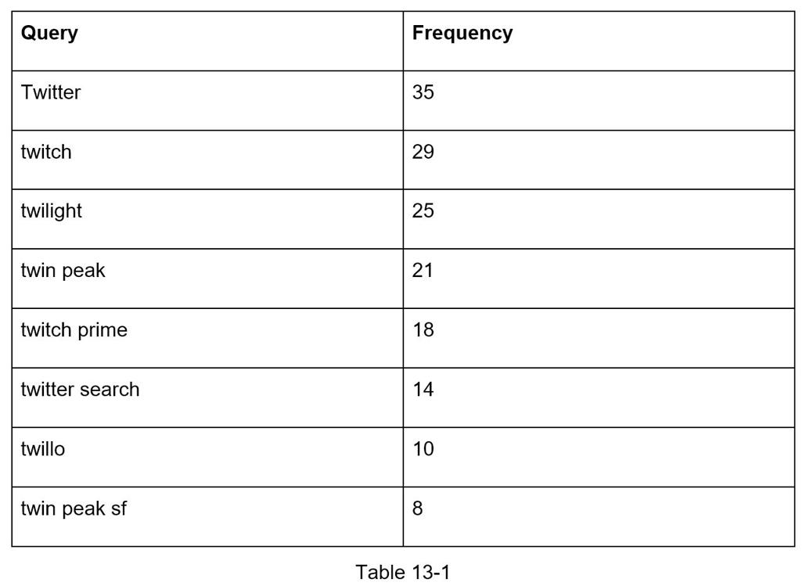

## 设计一个搜索自动完成系统
在 Google 上搜索或在 Amazon 上购物时，当你在搜索框中键入时，会向你显示一个或多个与搜索词匹配的内容。 此功能称为自动完成、预输入、按输入搜索或增量搜索。 图 13-1 展示了一个谷歌搜索示例，当在搜索框中输入“dinner”时，它会显示一个自动完成的结果列表。 搜索自动完成是许多产品的重要功能。 这将我们引向面试问题：设计一个搜索自动完成系统，也称为“design top k”或“design top k most searched queries”。


### 第1步 - 了解问题并确定设计范围
解决任何系统设计面试问题的第一步是提出足够多的问题来阐明需求。以下是候选人与面试官互动的示例：

候选人：匹配只支持在搜索查询的开头还是中间？
面试官：仅在搜索查询的开头。

候选人：系统应该返回多少条自动完成建议？
面试官：5

候选人：系统怎么知道返回哪5条建议？
面试官：这是由人气决定的，由历史查询频率决定。

候选人：系统支持拼写检查吗？
面试官：不，不支持拼写检查或自动更正。

候选人：搜索查询是英文的吗？
面试官：是的。如果最后时间允许，我们可以讨论多语言支持。

候选人：我们允许大写和特殊字符吗？
面试官：不，我们假设所有搜索查询都有小写字母字符。

候选人：有多少用户使用该产品？
面试官：1000万DAU。

#### 要求

以下是要求的摘要：

- 快速响应：当用户键入搜索查询时，自动完成建议必须足够快地显示出来。一篇关于 Facebook 的自动完成系统 [1] 的文章揭示了系统需要在 100 毫秒内返回结果。否则会导致卡顿。
- 相关：自动完成建议应该与搜索词相关。
- 排序：系统返回的结果必须按照流行度或其他排名模型排序。
- 可扩展：系统可以处理高流量。
- 高可用性：当系统的一部分脱机、变慢或遇到意外的网络错误时，系统应该保持可用和可访问。

#### 背景估计

- 假设每天有1000 万活跃用户(DAU)。
- 一个普通人每天执行 10 次搜索。
- 每个查询字符串20字节的数据：
  - 假设我们使用ASCII 字符编码。 1 个字符 = 1 个字节
  - 假设一个查询包含 4 个单词，每个单词平均包含 5 个字符。
  - 即每个查询 4 x 5 = 20 个字节。
  - 对于输入到搜索框中的每个字符，客户端都会向后端发送请求以获取自动完成建议。每个搜索查询平均发送 20 个请求。例如，以下 6 个请求在你完成输入“晚餐”时发送到后端。
    - search?q=d
    - search?q=di
    - search?q=din
    - search?q=dinn
    - search?q=dinne
    - search?q=dinner
- 每秒约 24,000 次查询 (QPS) = 10,000,000 名用户 * 10 次查询/天 * 20 个字符/24 小时/3600 秒。
- 峰值 QPS = QPS * 2 = ~48,000
- 假设20% 的每日查询是新的。 1000 万 * 10 次查询/天 * 20 字节/查询 * 20% = 0.4 GB。这意味着每天有 0.4GB 的新数据被添加到存储中。

### 第2步 - 提出高级设计并获得支持
在高层，系统分为两个：

- 数据收集服务：收集用户输入查询并实时汇总。 实时处理对大数据集不实用； 但是，这是一个很好的起点。 我们将在深潜中探索更现实的解决方案。
- 查询服务：给定一个搜索查询或前缀，返回5个最常搜索的词。

#### 数据采集服务

让我们用一个简化的例子来看看数据收集服务是如何工作的。 假设我们有一个存储查询字符串及其频率的频率表，如图 13-2 所示。 一开始，频率表是空的。 随后，用户依次输入查询“twitch”、“twitter”、“twitter”和“twillo”。 图 13-2 显示了频率表是如何更新的。


#### 查询服务
假设我们有一个如表 13-1 所示的频率表。 它有两个字段。

- Query：存储查询字符串。
- Frequency：它表示查询已被搜索的次数。



当用户在搜索框中键入“tw”时，将显示以下前 5 个搜索查询（图 13-3），假设频率表基于表 13-1。


要获得前 5 个经常搜索的查询，请执行以下 SQL 查询：

```sql
SELECT * from frequency_table WHERE query like `prefix%` ORDER BY frequency DESC LIMIT 5;
```

当数据集较小时，这是一个可接受的解决方案。 当它很大时，访问数据库成为一个瓶颈。 我们将深入探讨优化。

### 第3步 - 设计深入研究
在高层设计中，我们讨论了数据收集服务和查询服务。高层设计不是最优的，但它是一个很好的起点。在本节中，我们将深入研究一些组件并探索如下优化：

- Trie 数据结构
- 数据收集服务
- 查询服务
- 扩展存储
- Trie 操作

#### Trie数据结构
关系数据库用于高级设计中的存储。但是，从关系数据库中获取前 5 个搜索查询是低效的。数据结构trie（前缀树）就是用来解决这个问题的。由于 trie 数据结构对系统至关重要，我们将花费大量时间来设计定制的 trie。请注意，其中一些想法来自文章 [2] 和 [3]。

了解基本的 trie 数据结构对于这个面试问题至关重要。然而，这更像是一个数据结构问题而不是系统设计问题。此外，许多在线资料都解释了这个概念。在本章中，我们将只讨论 trie 数据结构的概述，重点讨论如何优化基本 trie 以提高响应时间。

Trie（读作“try”）是一种树状数据结构，可以紧凑地存储字符串。该名称来自于单词检索，这表明它是为字符串检索操作而设计的。 trie的主要思想包括以下内容：

- Trie 是一种树状数据结构。
- 根代表一个空字符串。
- 每个节点存储一个字符并有 26 个子节点，每个节点对应一个可能的字符。为了节省空间，我们没有画空链接。
- 每个树节点代表一个单词或前缀字符串。

图 13-5 显示了一个带有搜索查询“tree”、“try”、“true”、“toy”、“wish”、“win”的 trie。搜索查询以较粗的边框突出显示。


基本的 trie 数据结构将字符存储在节点中。为了支持按频率排序，频率信息需要包含在节点中。假设我们有以下频率表。


向节点添加频率信息后，更新后的 trie 数据结构如图 13-6 所示。


自动完成如何与 trie 一起使用？在深入研究算法之前，让我们定义一些术语。

- p：前缀的长度
- n：trie 中的节点总数
- c：给定节点的子节点数

下面列出了获取前 k 个搜索次数最多的查询的步骤：
1. 找到前缀。时间复杂度：O(p)。
2. 从前缀节点开始遍历子树，得到所有有效子节点。如果一个子节点可以形成一个有效的查询字符串，那么它就是有效的。时间复杂度：O(c)
3. 对子节点进行排序，得到top k。时间复杂度：O(clogc)

让我们用一个如图 13-7 所示的例子来解释这个算法。假设 k 等于 2，并且用户在搜索框中键入“tr”。该算法的工作原理如下：

- 第一步：找到前缀节点“tr”。
- 第二步：遍历子树得到所有有效的子节点。在这种情况下，节点 [tree: 10]、[true: 35]、[try: 29] 是有效的。
- 第三步：对子节点进行排序并获得前2个。[true：35]和[try：29]是带有前缀“tr”的前2个查询。


这个算法的时间复杂度是上面提到的每一步花费的时间之和：```O(p) + O(c) + O(clogc)```

上面的算法很简单。但是，它太慢了，因为我们需要遍历整个 trie 才能在最坏的情况下获得前 k 个结果。下面是两个优化：

1. 限制前缀的最大长度
2. 在每个节点缓存热门搜索查询

让我们一一看看这些优化。

##### 限制前缀的最大长度

用户很少在搜索框中输入长搜索查询。因此，可以肯定地说 p 是一个小整数，比如 50。如果我们限制前缀的长度，“查找前缀”的时间复杂度可以从 O(p) 降低到 O(small constant)，又名 O(1)。

##### 在每个节点缓存热门搜索查询

为了避免遍历整个树，我们在每个节点存储前 k 个最常用的查询。由于 5 到 10 个自动完成建议对用户来说已经足够了，所以 k 是一个相对较小的数字。在我们的具体案例中，仅缓存前 5 个搜索查询。

通过在每个节点缓存热门搜索查询，我们显着降低了检索前 5 个查询的时间复杂度。但是，这种设计需要大量空间来存储每个节点的热门查询。以时间换空间是值得的，因为快速响应时间非常重要。

图 13-8 显示了更新后的 trie 数据结构。前 5 个查询存储在每个节点上。例如，前缀为“be”的节点存储以下内容：[best: 35, bet: 29, bee: 20, be: 15, beer: 10]。


在应用这两个优化之后，让我们重新审视算法的时间复杂度：
1. 找到前缀节点。时间复杂度：O(1)
2. 返回前k。由于前 k 个查询被缓存，因此这一步的时间复杂度为 O(1)。

由于每个步骤的时间复杂度降低到 O(1)，我们的算法只需要 O(1) 来获取前 k 个查询。

#### 数据采集服务

在我们之前的设计中，每当用户键入搜索查询时，数据都会实时更新。由于以下两个原因，这种方法不实用：

- 用户每天可以输入数十亿条查询。更新每个查询的 trie 会显着降低查询服务的速度。
- 构建树后，热门建议可能不会有太大变化。因此，没有必要频繁更新 trie。

为了设计可扩展的数据收集服务，我们检查数据的来源以及数据的使用方式。 Twitter 等实时应用程序需要最新的自动完成建议。但是，许多 Google 关键字的自动完成建议每天可能不会有太大变化。

尽管用例有所不同，但数据收集服务的底层基础保持不变，因为用于构建 trie 的数据通常来自分析或日志服务。

图 13-9 显示了重新设计的数据收集服务。每个组件都被逐一检查。


**分析日志**。它存储有关搜索查询的原始数据。日志是仅附加的，没有索引。表 13-3 显示了日志文件的示例。


**聚合器**。分析日志的大小通常非常大，并且数据格式不正确。我们需要汇总数据，以便我们的系统可以轻松处理它。

根据用例，我们可能会以不同的方式聚合数据。对于 Twitter 等实时应用程序，我们会在更短的时间间隔内汇总数据，因为实时结果很重要。另一方面，不那么频繁地聚合数据，比如每周一次，对于许多用例来说可能就足够了。在面试过程中，验证实时结果是否重要。我们假设 trie 每周重建一次。

##### 汇总数据
表 13-4 显示了每周汇总数据的示例。 “时间”字段表示一周的开始时间。 “频率”字段是该周相应查询的出现次数之和。


**工作人员**: Worker 是一组定期执行异步作业的服务器。他们构建了 trie 数据结构并将其存储在 Trie DB 中。

**Trie缓存**: Trie Cache 是一个分布式缓存系统，将 trie 保存在内存中以便快速读取。它每周对数据库进行一次快照。

**尝试数据库**: Trie DB 是持久存储。有两个选项可用于存储数据：

1. 文档存储：由于每周都会构建一个新的trie，我们可以定期对其进行快照，序列化，并将序列化后的数据存储在数据库中。像 MongoDB [4] 这样的文档存储非常适合序列化数据。
2. 键值存储：通过应用以下逻辑，可以用哈希表形式[4]表示trie：
   1. trie 中的每个前缀都映射到哈希表中的一个键。
   2. 每个trie 节点上的数据都映射到哈希表中的一个值。

图 13-10 显示了 trie 和哈希表之间的映射。


在图 13-10 中，左侧的每个 trie 节点都映射到右侧的 <key, value> 对。如果你不清楚键值存储是如何工作的，请参阅第 6 章：设计键值存储。

#### 查询服务
在高级设计中，查询服务直接调用数据库来获取前 5 个结果。图 13-11 显示了改进的设计，因为以前的设计效率低下。


1. 向负载均衡器发送搜索查询。
1. 负载均衡器将请求路由到 API 服务器。
1. API 服务器从 Trie Cache 中获取 trie 数据并为客户端构建自动完成建议。
4. 如果数据不在Trie Cache中，我们将数据补充回缓存中。这样，对相同前缀的所有后续请求都会从缓存中返回。当缓存服务器内存不足或脱机时，可能会发生缓存未命中。

查询服务需要闪电般的速度。我们提出以下优化：

- AJAX 请求。对于 Web 应用程序，浏览器通常会发送 AJAX 请求来获取自动完成结果。 AJAX 的主要好处是发送/接收请求/响应不会刷新整个网页。
- 浏览器缓存。对于许多应用程序，自动完成搜索建议可能不会在短时间内发生太大变化。因此，自动完成建议可以保存在浏览器缓存中，以允许后续请求直接从缓存中获取结果。谷歌搜索引擎使用相同的缓存机制。图 13-12 显示了当你在 Google 搜索引擎上输入“system design interview”时的响应头。如你所见，Google 将结果在浏览器中缓存了 1 小时。请注意：缓存控制中的“私有”意味着结果仅供单个用户使用，不得由共享缓存缓存。 “max-age=3600”表示缓存的有效期为 3600 秒，也就是一个小时。
  
- 数据采样：对于大型系统，记录每个搜索查询需要大量的处理能力和存储。数据采样很重要。例如，每 N 个请求中只有 1 个被系统记录。

#### Trie操作
Trie 是自动完成系统的核心组件。让我们看看 trie 操作（创建、更新和删除）是如何工作的。

##### 创建
Trie 是由工作人员使用聚合数据创建的。数据来源来自 Analytics Log/DB。

##### 更新
有两种方法可以更新 trie。

选项 1：每周更新 trie。创建新的 trie 后，新的 trie 将替换旧的 trie。

选项 2：直接更新单个 trie 节点。我们尽量避免这种操作，因为它很慢。但是，如果 trie 的大小很小，这是一个可以接受的解决方案。当我们更新一个 trie 节点时，它的祖先一直到根都必须更新，因为祖先存储了子节点的顶部查询。图 13-13 显示了更新操作如何工作的示例。在左侧，搜索查询“beer”的原始值为 10。在右侧，它更新为 30。如你所见，节点及其祖先的“beer”值更新为 30。


##### 删除
我们必须删除仇恨、暴力、露骨或危险的自动填充建议。我们在 Trie Cache 前面添加了一个过滤层（图 13-14）来过滤掉不需要的建议。拥有过滤器层使我们可以灵活地根据不同的过滤器规则删除结果。不需要的建议会异步从数据库中物理删除，因此正确的数据集将用于在下一个更新周期中构建 trie。


#### 扩展存储
既然我们已经开发了一个系统来为用户带来自动完成查询，那么当 trie 变得太大而无法容纳在一个服务器中时，是时候解决可伸缩性问题了。

由于英语是唯一受支持的语言，一种简单的分片方式是基于第一个字符。这里有些例子。

- 如果我们需要两台服务器进行存储，我们可以在第一台服务器上存储以“a”到“m”开头的查询，在第二台服务器上存储从“n”到“z”的查询。
- 如果我们需要三台服务器，我们可以将查询拆分为“a”到“i”、“j”到“r”和“s”到“z”。

按照这个逻辑，我们最多可以将查询拆分为 26 个服务器，因为英文中有 26 个字母字符。让我们将基于第一个字符的分片定义为一级分片。要存储超过 26 台服务器的数据，我们可以在第二级甚至第三级进行分片。例如，以“a”开头的数据查询可以拆分为 4 个服务器：“aa-ag”、“ah-an”、“ao-au”和“av-az”。

乍一看，这种方法似乎是合理的，直到你意识到以字母“c”开头的单词比“x”多得多。这会造成分布不均。

为了缓解数据不平衡问题，我们分析了历史数据分布模式并应用了更智能的分片逻辑，如图 13-15 所示。分片映射管理器维护一个查找数据库，用于识别应存储行的位置。例如，如果“s”和“u”、“v”、“w”、“x”、“y”和“z”组合的历史查询数量相似，我们可以维护两个分片：一个用于“s”，一个用于“u”到“z”。


### 第4步 - 总结
在你完成深度研究后，你的面试官可能会问你一些后续问题。

面试官：你如何扩展你的设计以支持多种语言？
为了支持其他非英语查询，我们将 Unicode 字符存储在 trie 节点中。如果你不熟悉 Unicode，以下是定义：“一个编码标准涵盖了世界上所有书写系统的所有字符，包括现代和古代”[5]。

面试官：如果一个国家的热门搜索查询与其他国家不同怎么办？
在这种情况下，我们可能会为不同的国家建立不同的尝试。为了提高响应时间，我们可以将尝试存储在 CDN 中。

面试官：我们如何支持趋势（实时）搜索查询？
假设发生新闻事件，搜索查询突然变得流行。我们的原始设计将不起作用，因为：

- 离线工作人员还没有计划更新trie，因为它计划每周运行一次。
- 即使安排好了，构建trie 也需要很长时间。

构建实时搜索自动完成功能很复杂，超出了本书的范围，所以我们只给出几个想法：

- 通过分片减少工作数据集。
- 更改排名模型并为最近的搜索查询分配更多权重。
- 数据可能以流的形式出现，因此我们无法一次访问所有数据。流数据意味着数据是连续生成的。流处理需要一组不同的系统：Apache Hadoop MapReduce [6]、Apache Spark Streaming [7]、Apache Storm [8]、Apache Kafka [9] 等。因为所有这些主题都需要特定的领域知识，所以我们不会去在这里详细介绍。

恭喜你走到这一步！现在拍拍自己的后背。好样的！

### 参考资料
1. Typeahead 查询的生命周期：https://www.facebook.com/notes/facebook-engineering/the-life-of-a-typeahead-query/389105248919/
2. 我们如何构建前缀：用于支持自动完成的可扩展前缀搜索服务：https://medium.com/@prefixyteam/how-we-built-prefixy-a-scalable-prefix-search-service-for-powering- 自动完成-c20f98e2eff1
3. Prefix Hash Tree An Indexing Data Structure over Distributed Hash Tables: https://people.eecs.berkeley.edu/~sylvia/papers/pht.pdf
4. MongoDB 维基百科：https://en.wikipedia.org/wiki/MongoDB
5. Unicode 常见问题：https://www.unicode.org/faq/basic_q.html
6. Apache hadoop：https://hadoop.apache.org/
7. Spark streaming：https://spark.apache.org/streaming/
8. Apache storm：https://storm.apache.org/
9. Apache kafka：https://kafka.apache.org/documentation/
