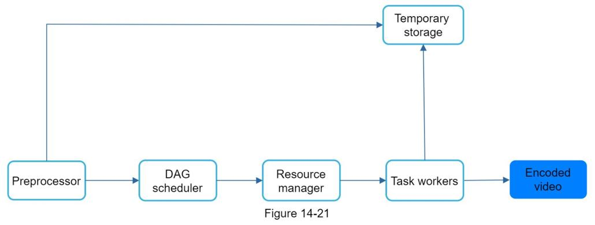

## 设计 YouTube
在本章中，你将被要求设计 YouTube。 这个问题的解决方案可以应用于其他面试问题，比如设计一个视频共享平台，如 Netflix 和 Hulu。 图 14-1 显示了 YouTube 主页。

YouTube 看起来很简单：内容创作者上传视频，观众点击播放。 真的那么简单吗？ 并不是。 简单的背后隐藏着许多复杂的技术。 让我们看看 2020 年 YouTube [^1] [^2] 的一些令人印象深刻的统计数据、人口统计数据和有趣的事实。

- 月活跃用户总数：20亿。
- 每天观看的视频数量：50 亿。
- 73% 的美国成年人使用 YouTube。
- YouTube 上有 5000 万创作者。
- YouTube 2019 年全年的广告收入为 151 亿美元，比 2018 年增长 36%。
- YouTube 负责所有移动互联网流量的 37%。
- YouTube 有80 种不同的语言版本。

从这些统计数据中，我们知道 YouTube 是巨大的、全球化的并且赚了很多钱。

### 第1步 - 了解问题并确定设计范围
如图 14-1 所示，除了观看视频之外，你还可以在 YouTube 上做更多的事情。例如，评论、分享或喜欢视频、将视频保存到播放列表、订阅频道等。在 45 或 60 分钟的采访中设计所有内容是不可能的。因此，提出问题以缩小范围很重要。

候选人：哪些特征很重要？
面试官：能够上传视频和观看视频。

候选人：我们需要支持哪些客户？
面试官：移动应用、网络浏览器和智能电视。

候选人：我们有多少日活跃用户？
面试官：500万

候选人：平均每天花在产品上的时间是多少？
面试官：30分钟。

候选人：我们需要支持国际用户吗？
面试官：是的，很大一部分用户是国际用户。

候选人：支持的视频分辨率是多少？
面试官：系统接受大部分视频分辨率和格式。

候选人：需要加密吗？
面试官：是的

候选人：对视频文件大小有要求吗？
面试官：我们的平台专注于中小视频。允许的最大视频大小为 1GB。

候选人：我们可以利用亚马逊、谷歌或微软提供的一些现有的云基础设施吗？
面试官：这是一个很好的问题。对于大多数公司来说，从头开始构建一切是不现实的，建议利用一些现有的云服务。

在本章中，我们专注于设计具有以下功能的视频流服务：

- 能够快速上传视频
- 流畅的视频流
- 能够改变视频质量
- 基础设施成本低
- 高可用性、可扩展性和可靠性要求
- 支持的客户端：移动应用程序、网络浏览器和智能电视

#### 估算

以下估计基于许多假设，因此与面试官沟通以确保她在同一页面上很重要。

- 假设产品有500 万日活跃用户（DAU）。
- 用户每天观看5 个视频。
- 10% 的用户每天上传1 个视频。
- 假设平均视频大小为300 MB。
- 每日所需的总存储空间：500 万 * 10% * 300 MB = 150TB
- CDN 费用：
  - 当云CDN 提供视频时，你需要为从CDN 传输的数据付费。
  - 让我们使用 Amazon 的 CDN CloudFront 进行成本估算（图 14-2）[^3]。假设 100% 的流量来自美国。每 GB 的平均成本为 0.02 美元。为简单起见，我们只计算视频流的成本。
  - 500 万 * 5 个视频 * 0.3GB * 0.02 美元 = 每天 150,000 美元。

根据粗略的成本估算，我们知道从 CDN 提供视频需要花费大量资金。尽管云提供商愿意为大客户大幅降低 CDN 成本，但成本仍然很高。我们将深入探讨降低 CDN 成本的方法。

### 第2步 - 提出高级设计并获得支持
如前所述，面试官建议利用现有的云服务，而不是从头开始构建一切。 CDN 和 blob 存储是我们将利用的云服务。有些读者可能会问，为什么不自己构建所有东西呢？原因如下：

- 系统设计面试不是要从头开始构建所有东西。在有限的时间范围内，选择正确的技术来做正确的工作比详细解释技术如何工作更重要。例如，提到用于存储源视频的 blob 存储对于采访来说就足够了。谈论 Blob 存储的详细设计可能有点矫枉过正。
- 构建可扩展的blob 存储或CDN 极其复杂且成本高昂。即使是像 Netflix 或 Facebook 这样的大公司也不会自己构建一切。 Netflix 利用 Amazon 的云服务 [^4]，Facebook 使用 Akamai 的 CDN [^5]。

在高层次上，该系统包括三个组件（图 14-3）。

**客户端**：你可以在电脑、手机、智能电视上观看YouTube。

**CDN**：视频存储在 CDN 中。当你按下播放时，视频将从 CDN 流式传输。

**API 服务器**：除视频流之外的所有其他内容都通过 API 服务器。这包括提要推荐、生成视频上传 URL、更新元数据数据库和缓存、用户注册等。

在问答环节，面试官对两个流程表现出兴趣：

- 视频上传流程
- 视频流

我们将探索他们每个人的高级设计。

#### 视频上传流程
图 14-4 显示了视频上传的高级设计。

它由以下组件组成：

- 用户：用户在电脑、手机或智能电视等设备上观看YouTube。
- 负载均衡器：负载均衡器在API 服务器之间平均分配请求。
- API 服务器：所有用户请求都通过API 服务器，视频流除外。
- 元数据数据库：视频元数据存储在元数据数据库中。它被分片和复制以满足性能和高可用性要求。
- 元数据缓存：为了获得更好的性能，缓存了视频元数据和用户对象。
- 原始存储：一个blob存储系统用于存储原始视频。维基百科中关于 blob 存储的引用表明：“二进制大对象 (BLOB) 是在数据库管理系统中存储为单个实体的二进制数据的集合”[^6]。
- 转码服务器：视频转码也称为视频编码。这是将视频格式转换为其他格式（MPEG、HLS 等）的过程，可为不同的设备和带宽能力提供可能的最佳视频流。
  •转码存储：它是一种存储转码视频文件的blob 存储。
- CDN：视频缓存在CDN 中。单击播放按钮时，视频将从 CDN 流式传输。
- 完成队列：它是一个消息队列，存储有关视频转码完成事件的信息。
- 完成处理程序：这包括从完成队列中提取事件数据并更新元数据缓存和数据库的工作人员列表。

现在我们分别了解了每个组件，让我们来看看视频上传流程是如何工作的。流程被分解为两个并行运行的进程。

1. 上传实际视频。
2. 更新视频元数据。元数据包含有关视频 URL、大小、分辨率、格式、用户信息等的信息。

流程一：上传实际视频

图 14-5 显示了如何上传实际视频。解释如下图：
1. 视频上传到原始存储。
2. 转码服务器从原始存储中获取视频并开始转码。
3. 转码完成后，并行执行以下两个步骤：
  1. 转码后的视频被发送到转码存储。
  2. 转码完成事件在完成队列中排队。

4. 转码后的视频分发到 CDN。
5. 完成处理程序包含一堆工作人员，它们不断地从队列中提取事件数据。
6. 完成处理程序在视频转码完成时更新元数据数据库和缓存。
7. API 服务器通知客户端视频已成功上传并准备好进行流式传输。

#### 流程 b：更新元数据
当文件上传到原始存储时，客户端并行发送更新视频元数据的请求，如图 14-6 所示。该请求包含视频元数据，包括文件名、大小、格式等。API 服务器更新元数据缓存和数据库。

#### 视频流
每当你在 YouTube 上观看视频时，它通常会立即开始流式传输，你不必等到整个视频下载完毕。下载意味着将整个视频复制到你的设备，而流式传输意味着你的设备连续接收来自远程源视频的视频流。当你观看流媒体视频时，你的客户端一次会加载一点数据，因此你可以立即连续观看视频。

在讨论视频流之前，让我们先看一个重要的概念：流协议。这是一种控制视频流数据传输的标准化方法。流行的流媒体协议有：

- MPEG-DASH。 MPEG 代表“Moving Picture Experts Group”，而 DASH 代表“Dynamic Adaptive Streaming over HTTP”。
- 苹果HLS。 HLS 代表“HTTP Live Streaming”。
- 微软平滑流媒体。
- Adobe HTTP 动态流 (HDS)。

你不需要完全理解甚至记住这些流协议名称，因为它们是需要特定领域知识的低级细节。这里重要的是要了解不同的流协议支持不同的视频编码和播放播放器。当我们设计视频流服务时，我们必须选择正确的流协议来支持我们的用例。要了解有关流协议的更多信息，请参阅一篇优秀的文章 [^7]。

视频直接从 CDN 流式传输。离你最近的边缘服务器将传送视频。因此，延迟非常小。图 14-7 显示了视频流的高级设计。

### 第3步 - 设计深入研究
在高层设计中，整个系统分为两部分：视频上传流程和视频流流程。在本节中，我们将通过重要的优化来完善这两个流程，并介绍错误处理机制。

#### 视频转码
当你录制视频时，设备（通常是手机或相机）会为视频文件提供某种格式。如果你希望视频在其他设备上流畅播放，则必须将视频编码为兼容的比特率和格式。比特率是随着时间的推移处理比特的速率。更高的比特率通常意味着更高的视频质量。高比特率流需要更多的处理能力和更快的互联网速度。

视频转码很重要，原因如下：

- 原始视频占用大量存储空间。以每秒 60 帧的速度录制的长达一小时的高清视频可能会占用数百 GB 的空间。
- 许多设备和浏览器只支持某些类型的视频格式。因此，出于兼容性原因，将视频编码为不同格式很重要。
- 为确保用户在观看高质量视频的同时保持流畅播放，最好将较高分辨率的视频提供给网络带宽较高的用户，将较低分辨率的视频提供给网络带宽较低的用户。
- 网络状况可能会发生变化，尤其是在移动设备上。为确保视频连续播放，根据网络状况自动或手动切换视频质量对于流畅的用户体验至关重要。

有多种编码格式可供选择；但是，它们中的大多数包含两个部分：

- 容器：这就像一个包含视频文件、音频和元数据的篮子。你可以通过文件扩展名来判断容器格式，例如 .avi、.mov 或 .mp4。
- 编解码器：这些是压缩和解压缩算法，旨在减少视频大小，同时保持视频质量。最常用的视频编解码器是 H.264、VP9 和 HEVC。

#### 有向无环图 (DAG) 模型
对视频进行转码计算成本高且耗时。此外，不同的内容创作者可能有不同的视频处理要求。例如，一些内容创建者需要在他们的视频顶部添加水印，一些自己提供缩略图，还有一些上传高清视频，而另一些则不需要。

为了支持不同的视频处理流水线并保持高并行性，添加一定程度的抽象并让客户端程序员定义要执行的任务非常重要。例如，Facebook 的流视频引擎使用有向无环图 (DAG) 编程模型，该模型分阶段定义任务，以便它们可以按顺序或并行执行 [^8]。在我们的设计中，我们采用了类似的 DAG 模型来实现灵活性和并行性。图 14-8 表示用于视频转码的 DAG。

在图 14-8 中，原始视频被拆分为视频、音频和元数据。以下是可应用于视频文件的一些任务：

- 检查：确保视频具有良好的质量并且没有畸形。
- 视频编码：视频被转换以支持不同的分辨率、编解码器、比特率等。图 14-9 显示了视频编码文件的示例。
- 缩略图：缩略图既可以由用户上传，也可以由系统自动生成。
- 水印：视频顶部的图像叠加层包含有关视频的识别信息。

#### 视频转码架构
建议的利用云服务的视频转码架构如图 14-10 所示。

该架构有六个主要组件：预处理器、DAG 调度器、资源管理器、任务工作者、临时存储和作为输出的编码视频。让我们仔细看看每个组件。

#### 预处理器

预处理器有4个职责：

1. 视频分割。视频流被分割或进一步分割成更小的图片组 (GOP) 对齐。 GOP 是按特定顺序排列的一组/组帧。每个块都是一个可独立播放的单元，通常有几秒钟的长度。
2. 一些旧的移动设备或浏览器可能不支持视频分割。预处理器按 GOP 对齐方式为旧客户端分割视频。
3. DAG 生成。处理器根据客户端程序员编写的配置文件生成 DAG。图 14-12 是一个简化的 DAG 表示，它有 2 个节点和 1 条边：

这个 DAG 表示是从下面的两个配置文件中生成的（图 14-13）：

4. 缓存数据。预处理器是分段视频的缓存。为了获得更好的可靠性，预处理器将 GOP 和元数据存储在临时存储中。如果视频编码失败，系统可以使用持久数据进行重试操作。

#### DAG 调度器

DAG 调度器将 DAG 图拆分为任务阶段，并将它们放入资源管理器的任务队列中。图 14-15 显示了 DAG 调度程序如何工作的示例。

如图 14-15 所示，原始视频分为 2 个阶段： 

1. 视频、音频和元数据。
2. 阶段进一步分为两个任务：
   1. 视频编码(音频文件需要音频编码作为第 2 阶段任务的一部分)
   2. 缩略图。

#### 资源管理器

资源管理者负责管理资源分配的效率。它包含 3 个队列和一个任务调度器，如图 14-17 所示。

- 任务队列：它是一个优先级队列，包含要执行的任务。
- Worker queue：它是一个包含worker利用率信息的优先级队列。
- 运行队列：它包含有关当前运行的任务和运行任务的工人的信息。
- 任务调度器：它选择最佳任务/工作者，并指示选择的任务工作者执行作业。

资源管理器的工作方式如下：

- 任务调度程序从任务队列中获取最高优先级的任务。
- 任务调度程序从工作队列中获取最佳任务工作人员来运行任务。
- 任务调度程序指示选定的任务工作者运行任务。
- 任务调度器绑定任务/工作者信息并将其放入运行队列。
- 一旦作业完成，任务调度程序就会从运行队列中删除作业。

#### 任务workers

任务工作者运行 DAG 中定义的任务。如图 14-19 所示，不同的任务工作者可能运行不同的任务。

#### 临时存储

这里使用了多个存储系统。存储系统的选择取决于数据类型、数据大小、访问频率、数据寿命等因素。例如，元数据是工作人员经常访问的，数据大小通常很小。因此，在内存中缓存元数据是一个好主意。对于视频或音频数据，我们将它们放在 blob 存储中。一旦相应的视频处理完成，临时存储中的数据就会被释放。

#### 编码视频

编码视频是编码管道的最终输出。这是一个输出示例：funny_720p.mp4。

#### 系统优化
至此，你应该对视频上传流程、视频流流程和视频转码有了很好的了解。接下来，我们将对系统进行优化，包括速度、安全性和成本节约。

#### 速度优化：并行视频上传
将视频作为一个整体上传是低效的。我们可以通过 GOP 对齐将视频分割成更小的块，如图 14-22 所示。

这允许在上一次上传失败时快速恢复上传。如图14-23所示，客户端可以实现通过GOP分割视频文件以提高上传速度。

#### 速度优化：上传中心靠近用户
另一种提高上传速度的方法是在全球范围内建立多个上传中心（图 14-24）。美国人可以上传视频到北美上传中心，中国人可以上传视频到亚洲上传中心。为此，我们使用 CDN 作为上传中心。

#### 速度优化：处处并行
实现低延迟需要认真努力。另一个优化是构建一个松耦合的系统并启用高并行性。

我们的设计需要一些修改来实现高并行度。让我们放大视频从原始存储传输到 CDN 的流程。流程如图 14-25 所示，表明输出取决于上一步的输入。这种依赖性使并行性变得困难。

为了使系统更松耦合，我们引入了消息队列，如图 14-26 所示。让我们用一个例子来解释消息队列如何使系统更松耦合。

- 在引入消息队列之前，编码模块必须等待下载模块的输出。
- 引入消息队列后，编码模块不再需要等待下载模块的输出。如果消息队列中有事件，编码模块可以并行执行这些作业。

#### 安全优化：预签名上传URL
安全是任何产品最重要的方面之一。为了确保只有授权用户将视频上传到正确的位置，我们引入了预签名 URL，如图 14-27 所示。

上传流程更新如下：
1. 客户端向 API 服务器发出 HTTP 请求以获取预签名 URL，从而授予对 URL 中标识的对象的访问权限。通过将文件上传到 Amazon S3 使用术语预签名 URL。其他云服务提供商可能使用不同的名称。例如，Microsoft Azure blob 存储支持相同的功能，但将其称为“共享访问签名”[10]。
2. API 服务器响应一个预签名的 URL。
3. 客户端收到响应后，使用预签名的 URL 上传视频。

#### 安全优化：保护你的视频

许多内容制作者不愿在网上发布视频，因为他们担心他们的原创视频会被盗。为了保护受版权保护的视频，我们可以采用以下三种安全选项之一：

- 数字版权管理 (DRM) 系统：三个主要的 DRM 系统是 Apple FairPlay、Google Widevine 和 Microsoft PlayReady。
- AES 加密：你可以加密视频并配置授权策略。加密的视频将在播放时被解密。这确保只有授权用户才能观看加密视频。
- 视觉水印：这是覆盖在视频顶部的图像，其中包含视频的识别信息。它可以是你的公司徽标或公司名称。

#### 节省成本的优化
CDN 是我们系统的重要组成部分。它确保在全球范围内快速传输视频。但是，从包络计算的后面，我们知道 CDN 很昂贵，尤其是在数据量很大的情况下。我们怎样才能降低成本？

先前的研究表明，YouTube 视频流遵循长尾分布 [11] [12]。这意味着经常访问一些热门视频，但许多其他视频的观众很少或根本没有。基于这一观察，我们实施了一些优化：
1. 仅提供来自 CDN 的最受欢迎的视频和来自我们的大容量存储视频服务器的其他视频（图 14-28）。

2. 对于不太受欢迎的内容，我们可能不需要存储很多编码的视频版本。短视频可以按需编码。
3. 某些视频仅在某些地区流行。无需将这些视频分发到其他地区。
4. 像 Netflix 一样构建自己的 CDN，并与互联网服务提供商 (ISP) 合作。构建你的 CDN 是一个巨大的项目；然而，这对大型流媒体公司来说可能是有意义的。 ISP 可以是 Comcast、AT&T、Verizon 或其他互联网提供商。 ISP 遍布世界各地，并且靠近用户。通过与 ISP 合作，你可以改善观看体验并降低带宽费用。

所有这些优化都基于内容流行度、用户访问模式、视频大小等。在进行任何优化之前分析历史观看模式非常重要。以下是关于这个主题的一些有趣的文章：[12] [13]。

#### 错误处理
对于大型系统，系统错误是不可避免的。要构建一个高度容错的系统，我们必须优雅地处理错误并快速从错误中恢复。存在两种类型的错误：

- 可恢复的错误。对于视频片段转码失败等可恢复的错误，一般的思路是重试几次操作。如果任务继续失败并且系统认为它不可恢复，它会向客户端返回正确的错误代码。
- 不可恢复的错误。对于视频格式错误等不可恢复的错误，系统会停止与视频相关的正在运行的任务，并将正确的错误代码返回给客户端。

以下剧本涵盖了每个系统组件的典型错误：

- 上传错误：重试几次。
- 分割视频错误：如果旧版本的客户端无法通过 GOP 对齐分割视频，则将整个视频传递给服务器。分割视频的工作是在服务器端完成的。
- 转码错误：重试。
- 预处理器错误：重新生成DAG 图。
- DAG 调度程序错误：重新调度任务。
- 资源管理器排队：使用副本。
- Task worker down：在新的worker上重试任务。
- API 服务器停机：API 服务器是无状态的，因此请求将被定向到不同的API 服务器。
- 元数据缓存服务器停机：数据被多次复制。如果一个节点出现故障，你仍然可以访问其他节点以获取数据。我们可以启动一个新的缓存服务器来替换死掉的缓存服务器。
- 元数据数据库服务器停机：
  - 主人倒下了。如果主服务器宕机，提升其中一个从服务器作为新主服务器。
  - 从机停机。如果一个从服务器出现故障，你可以使用另一个从服务器进行读取，并启动另一台数据库服务器来替换死机。

### 第 4 步 - 总结
在本章中，我们介绍了 YouTube 等视频流服务的架构设计。如果在面试结束时有额外的时间，这里有几点补充：

- 扩展API 层：因为API 服务器是无状态的，所以很容易横向扩展API 层。
- 扩展数据库：你可以谈论数据库复制和分片。
- 直播：指视频如何实时录制和播放的过程。虽然我们的系统不是专门为直播而设计的，但直播和非直播有一些相似之处：都需要上传、编码和流式传输。显着的区别是：
  - 实时流媒体具有更高的延迟要求，因此可能需要不同的流媒体协议。
  - 实时流媒体对并行性的要求较低，因为已经实时处理了小块数据。
  - 实时流媒体需要不同的错误处理集。任何花费太多时间的错误处理都是不可接受的。
  - 视频删除：侵犯版权、色情或其他违法行为的视频将被删除。有些可以在上传过程中被系统发现，而有些则可能通过用户标记发现。

恭喜你走到这一步！现在鼓励一下自己， 非常棒！

### 参考资料

[1] YouTube 的数字：https://www.omnicoreagency.com/youtube-statistics/
[2] 2019 年 YouTube 受众特征：https://blog.hubspot.com/marketing/youtube-demographics
[3] Cloudfront 定价：https://aws.amazon.com/cloudfront/pricing/
[4] AWS 上的 Netflix：https://aws.amazon.com/solutions/case-studies/netflix/
[5] Akamai 主页：https://www.akamai.com/
[6] 二进制大对象：https://en.wikipedia.org/wiki/Binary_large_object
[7] 以下是你需要了解的有关流协议的内容：https://www.dacast.com/blog/streaming-protocols/
[8] SVE：Facebook 规模的分布式视频处理：https://www.cs.princeton.edu/~wlloyd/papers/sve-sosp17.pdf
[9] 微博视频处理架构（中文）：https://www.upyun.com/opentalk/399.html
[10] 使用共享访问签名委托访问：https://docs.microsoft.com/en-us/rest/api/storageservices/delegate-access-with-shared-access-signature
[11] YouTube 早期员工的 YouTube 可扩展性演讲：https://www.youtube.com/watch?v=w5WVu624fY8
[12] 了解互联网短视频分享的特点：基于 youtube 的测量研究。 https://arxiv.org/pdf/0707.3670.pdf
[13] Open Connect 的内容流行度：https://netflixtechblog.com/content-popularity-for-open-connect-b86d56f613b
