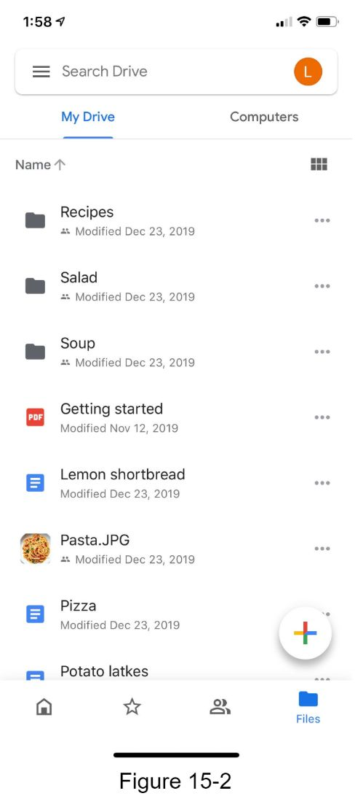
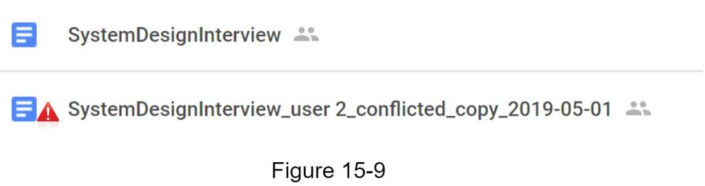

## 设计Google Drive
近年来，Google Drive、Dropbox、Microsoft OneDrive、Apple iCloud 等云存储服务非常流行。 在本章中，你将被要求设计 Google Drive。

在开始设计之前，让我们花点时间了解一下 Google Drive。 Google Drive 是一种文件存储和同步服务，可帮助你将文档、照片、视频和其他文件存储在云中。 你可以从任何计算机、智能手机和平板电脑访问你的文件。 你可以轻松地与朋友、家人和同事共享这些文件 [^1]。 图 15-1 和 15-2 分别显示了 Google Drive 在浏览器和移动应用程序上的样子。




### 第 1 步 - 了解问题并确定设计范围
设计 Google 驱动器是一个大项目，因此提出问题以缩小范围很重要。

应聘者：最重要的特点是什么？
面试官：上传下载文件，文件同步，通知。

候选人：这是一个移动应用程序，一个网络应用程序，还是两者兼而有之？
面试官：两者都有。

候选人：支持的文件格式有哪些？
面试官：任何文件类型。

候选人：文件需要加密吗？
面试官：是的，存储中的文件必须加密。

候选人：有文件大小限制吗？
面试官：是的，文件必须是 10 GB 或更小。

候选人：产品有多少用户？
面试官：10M DAU。

在本章中，我们将重点介绍以下功能：

- 添加文件。添加文件的最简单方法是将文件拖放到 Google 驱动器中。
- 下载文件。
- 跨多个设备同步文件。将文件添加到一台设备后，它会自动同步到其他设备。
- 查看文件修订。
- 与你的朋友、家人和同事共享文件
- 当文件被编辑、删除或与你共享时发送通知。

本章未讨论的功能包括：

- 谷歌文档编辑和协作。 Google doc 允许多人同时编辑同一个文档。这超出了我们的设计范围。

除了阐明需求之外，了解非功能性需求也很重要：

- 可靠性。可靠性对于存储系统来说极其重要。数据丢失是不可接受的。
- 快速同步速度。如果文件同步时间过长，用户会变得不耐烦而放弃产品。
- 带宽使用。如果一个产品占用了大量不必要的网络带宽，用户会很不高兴，尤其是当他们使用移动数据计划时。
- 可扩展性。该系统应该能够处理大量流量。
- 高可用性。当某些服务器离线、速度变慢或出现意外的网络错误时，用户应该仍然能够使用系统。

#### 估算

- 假设应用程序有5000 万注册用户和1000 万DAU。
- 用户获得10 GB 的可用空间。
- 假设用户每天上传2 个文件。平均文件大小为 500 KB。
- 1:1 读写比率。
- 分配的总空间：5000 万 * 10 GB = 500 PB
- 上传 API 的 QPS：1000 万 * 2 次上传 / 24 小时 / 3600 秒 = ~ 240
- 峰值QPS = QPS * 2 = 480

### 第2步 - 提出高级设计并获得支持
我们将使用稍微不同的方法，而不是从一开始就展示高级设计图。我们将从简单的事情开始：在单个服务器中构建所有内容。然后，逐步扩大规模以支持数百万用户。通过做这个练习，它将刷新你对本书中一些重要主题的记忆。

让我们从如下所列的单个服务器设置开始：

- 用于上传和下载文件的网络服务器。
- 用于跟踪用户数据、登录信息、文件信息等元数据的数据库。
- 存储文件的存储系统。我们分配 1TB 的存储空间来存储文件。

我们花了几个小时设置了一个 Apache Web 服务器、一个 MySql 数据库和一个名为 drive/ 的目录作为根目录来存储上传的文件。在 drive/ 目录下，有一个目录列表，称为命名空间。每个命名空间都包含该用户的所有上传文件。服务器上的文件名与原始文件名保持一致。每个文件或文件夹都可以通过加入命名空间和相对路径来唯一标识。

图 15-3 显示了 /drive 目录在左侧的外观示例以及其扩展视图在右侧的示例。


#### API
API 是什么样的？ 我们主要需要 3 个 API：上传文件、下载文件和获取文件修订版。

1. 将文件上传到 Google Drive
   支持两种类型的上传：
    - 简单的上传。 当文件较小时使用此上传类型。
    - 可恢复上传。 当文件较大且网络中断的可能性很高时，请使用此上传类型。

    以下是可恢复上传 API 的示例：```https://api.example.com/files/upload?uploadType=resumable```
   
    参数：
    - uploadType=resumable
    - data：要上传的本地文件。
   
    可恢复上传通过以下 3 个步骤实现 [^2]：
   
    - 发送初始请求以检索可恢复的 URL。
    - 上传数据并监控上传状态。
    - 如果上传受到干扰，请继续上传。
   
2. 从 Google Drive 下载文件
    示例 API：```https://api.example.com/files/download```

    参数：
    - path：下载文件路径。
    示例参数：
    ```json
    {
        "path": "/recipes/soup/best_soup.txt"
    }
    ```

3. 获取文件修订
    示例 API：```https://api.example.com/files/list_revisions```

    参数：
    - path：要获取修订历史的文件的路径。
    - limit：要返回的最大修订数。
      示例参数：
      ```json
      {
          "path": "/recipes/soup/best_soup.txt",
          "limit": 20
      }
      ```

所有 API 都需要用户身份验证并使用 HTTPS。 安全套接字层 (SSL) 保护客户端和后端服务器之间的数据传输。

#### 远离单一服务器
随着更多文件的上传，最终你会收到空间已满警报，如图 15-4 所示。


仅剩 10 MB 的存储空间！ 这是紧急情况，因为用户无法再上传文件。 想到的第一个解决方案是将数据分片，因此它存储在多个存储服务器上。 图 15-5 显示了基于 user_id 的分片示例。


你通宵达旦地设置数据库分片并密切监视它。一切都再次顺利进行。你已经停止了火灾，但你仍然担心存储服务器中断时可能会丢失数据。你四处打听，你的后端大师朋友弗兰克告诉你，许多领先的公司，如 Netflix 和 Airbnb 都使用 Amazon S3 进行存储。 “Amazon Simple Storage Service (Amazon S3) 是一种对象存储服务，可提供行业领先的可扩展性、数据可用性、安全性和性能”[^3]。你决定做一些研究，看看它是否合适。

经过大量阅读，你对 S3 存储系统有了很好的了解，并决定将文件存储在 S3 中。 Amazon S3 支持同区域和跨区域复制。区域是亚马逊网络服务 (AWS) 拥有数据中心的地理区域。如图 15-6 所示，数据可以在同区（左侧）和跨区（右侧）进行复制。冗余文件存储在多个区域，以防止数据丢失并确保可用性。存储桶就像文件系统中的文件夹。


将文件放入S3后，终于可以睡个好觉了，不用担心数据丢失。为了防止将来发生类似问题，你决定对可以改进的领域进行进一步研究。以下是你可以找到的几个领域：

- 负载均衡器：添加负载均衡器来分配网络流量。负载均衡器可确保流量均匀分布，如果 Web 服务器出现故障，它将重新分配流量。
- Web 服务器：添加负载均衡器后，可以根据流量负载轻松添加/删除更多Web 服务器。
- 元数据数据库：将数据库移出服务器以避免单点故障。同时，设置数据复制和分片以满足可用性和可扩展性要求。
- 文件存储：Amazon S3 用于文件存储。为了确保可用性和持久性，文件被复制到两个不同的地理区域。

应用上述改进后，你已成功将 Web 服务器、元数据数据库和文件存储从单个服务器中解耦。更新后的设计如图 15-7 所示。


#### 同步冲突
对于像 Google Drive 这样的大型存储系统，同步冲突时有发生。当两个用户同时修改同一个文件或文件夹时，就会发生冲突。我们如何解决冲突？这是我们的策略：第一个处理的版本获胜，稍后处理的版本收到冲突。图 15-8 显示了一个同步冲突的示例。


在图 15-8 中，用户 1 和用户 2 尝试同时更新同一个文件，但用户 1 的文件首先由我们的系统处理。用户 1 的更新操作通过，但用户 2 发生同步冲突。我们如何解决用户 2 的冲突？我们的系统显示了同一个文件的两个副本：用户 2 的本地副本和来自服务器的最新版本（图 15-9）。用户 2 可以选择合并两个文件或用另一个版本覆盖一个版本。



当多个用户同时编辑同一个文档时，保持文档同步是一项挑战。有兴趣的读者可以参考参考资料 [^4] [^5]。

#### 高级设计
图 15-10 说明了建议的高级设计。让我们检查系统的每个组件。


**用户**：用户通过浏览器或移动应用程序使用应用程序。

**块服务器**：块服务器将块上传到云存储。块存储，简称块级存储，是一种在基于云的环境中存储数据文件的技术。一个文件可以分成几个块，每个块都有一个唯一的哈希值，存储在我们的元数据数据库中。每个块都被视为一个独立的对象并存储在我们的存储系统（S3）中。为了重建文件，块以特定顺序连接。至于块大小，我们使用 Dropbox 作为参考：它将块的最大大小设置为 4MB [6]。

**云存储**：将文件拆分为更小的块并存储在云存储中。

**冷存储**：冷存储是为存储非活动数据而设计的计算机系统，这意味着文件很长时间没有被访问。

**负载均衡器**：负载均衡器在 API 服务器之间平均分配请求。

**API 服务器**：这些服务器负责除了上传流程之外的几乎所有事情。 API 服务器用于用户认证、管理用户配置文件、更新文件元数据等。

**元数据数据库**：存储用户、文件、块、版本等元数据。请注意，文件存储在云端，元数据数据库只包含元数据。

**元数据缓存**：一些元数据被缓存以便快速检索。

**通知服务**：它是一个发布者/订阅者系统，允许在某些事件发生时将数据从通知服务传输到客户端。在我们的特定情况下，通知服务会在文件在其他地方添加/编辑/删除时通知相关客户端，以便他们可以提取最新更改。

**离线备份队列**：如果客户端离线并且无法提取最新的文件更改，则离线备份队列会存储信息，以便在客户端在线时同步更改。

我们已经从高层次讨论了 Google Drive 的设计。有些组件很复杂，值得仔细检查；我们将在深入讨论中详细讨论这些。

### 第3步 - 设计深入研究
在本节中，我们将仔细研究以下内容：块服务器、元数据数据库、上传流程、下载流程、通知服务、节省存储空间和故障处理。

#### 块服务器

对于定期更新的大文件，每次更新时发送整个文件会消耗大量带宽。提出了两个优化来最小化正在传输的网络流量：

- 三角洲同步。当文件被修改时，只同步修改的块而不是使用同步算法[^7] [^8]的整个文件。
- 压缩。对块应用压缩可以显着减小数据大小。因此，根据文件类型使用压缩算法压缩块。例如，gzip 和 bzip2 用于压缩文本文件。需要不同的压缩算法来压缩图像和视频。

在我们的系统中，块服务器负责上传文件的繁重工作。块服务器通过将文件分割成块、压缩每个块并加密它们来处理从客户端传递的文件。不是将整个文件上传到存储系统，而是只传输修改过的块。

图 15-11 显示了添加新文件时块服务器的工作方式。


- 文件被分割成更小的块。
- 每个块都使用压缩算法进行压缩。
- 为确保安全，每个块在发送到云存储之前都经过加密。
- 块上传到云存储。

图 15-12 说明了增量同步，这意味着只有修改过的块才会传输到云存储。突出显示的块“块 2”和“块 5”表示已更改的块。使用增量同步，只有这两个块被上传到云存储。


块服务器允许我们通过提供增量同步和压缩来节省网络流量。

#### 高一致性要求
我们的系统默认要求强一致性。不同客户端同时以不同方式显示文件是不可接受的。系统需要为元数据缓存和数据库层提供强一致性。

内存缓存默认采用最终一致性模型，这意味着不同的副本可能有不同的数据。为了实现强一致性，我们必须确保以下几点：

- 缓存副本和主副本中的数据是一致的。
- 在数据库写入时使缓存无效，以确保缓存和数据库保持相同的值。

在关系数据库中实现强一致性很容易，因为它维护了 ACID（原子性、一致性、隔离性、持久性）属性 [^9]。但是，NoSQL 数据库默认不支持 ACID 属性。 ACID 属性必须以编程方式并入同步逻辑中。在我们的设计中，我们选择关系数据库，因为 ACID 是原生支持的。

#### 元数据数据库
图 15-13 显示了数据库模式设计。请注意，这是一个高度简化的版本，因为它只包含最重要的表格和有趣的字段。


**用户**：用户表包含用户的基本信息，例如用户名、电子邮件、头像等。

**设备**：设备表存储设备信息。 Push_id 用于发送和接收移动推送通知。请注意，一个用户可以拥有多个设备。

**命名空间**：命名空间是用户的根目录。

**文件**：文件表存储与最新文件相关的所有内容。

**文件版本**：它存储文件的版本历史。现有行是只读的，以保持文件修订历史的完整性。

**块**：它存储与文件块相关的所有内容。任何版本的文件都可以通过以正确的顺序连接所有块来重建。

#### 上传流程
让我们讨论当客户端上传文件时会发生什么。为了更好地理解流程，我们绘制了如图 15-14 所示的序列图。


在图 15-14 中，两个请求并行发送：添加文件元数据和上传文件到云存储。两个请求都来自客户端 1。

- 添加文件元数据。
  - 客户端 1 发送添加新文件元数据的请求。
  - 将新文件元数据存储在元数据数据库中，并将文件上传状态更改为“待定”。
  - 通知通知服务正在添加新文件。
  - 通知服务通知相关客户端（客户端 2）正在上传文件。
- 上传文件到云存储。
  - 客户端1将文件内容上传到块服务器。
  - 块服务器将文件分块，压缩，加密块，然后上传到云存储。
  - 文件上传后，云存储触发上传完成回调。请求被发送到 API 服务器。
  - 元数据数据库中的文件状态更改为“已上传”。
  - 通知通知服务文件状态变为“已上传”。
  - 通知服务通知相关客户端（客户端2）一个文件已完全上传。

编辑文件时，流程类似，不再赘述。

#### 下载流程
当在别处添加或编辑文件时会触发下载流程。客户端如何知道文件是否被其他客户端添加或编辑？客户可以通过两种方式知道：

- 如果客户端A 在线而文件被另一个客户端更改，通知服务将通知客户端A 在某处进行了更改，因此它需要提取最新数据。
- 如果客户端A 在另一个客户端更改文件时处于脱机状态，则数据将保存到缓存中。当离线客户端再次在线时，它会拉取最新的更改。

一旦客户端知道文件被更改，它首先通过 API 服务器请求元数据，然后下载块来构建文件。图 15-15 显示了详细的流程。请注意，由于空间限制，图中仅显示了最重要的组件。


1. 通知服务通知客户端 2 文件在其他地方被更改。
2. 一旦客户端 2 知道有新的更新可用，它就会发送请求以获取元数据。
3. API 服务器调用元数据数据库来获取更改的元数据。
4. 元数据返回到 API 服务器。
5. 客户端 2 获取元数据。
6. 客户端收到元数据后，向块服务器发送请求以下载块。
7. 区块服务器首先从云存储中下载区块。
8. 云存储将块返回给块服务器。
9. 客户端 2 下载所有新块以重建文件。

#### 通知服务

为了保持文件一致性，本地执行的文件的任何突变都需要通知其他客户端以减少冲突。通知服务就是为此目的而构建的。在高层，通知服务允许在事件发生时将数据传输给客户端。这里有几个选项：

- 长轮询。 Dropbox 使用长轮询 [^10]。
- WebSocket。 WebSocket 提供客户端和服务器之间的持久连接。沟通是双向的。

尽管这两个选项都运行良好，但我们选择长轮询的原因有以下两个：

- 通知服务的通信不是双向的。服务器向客户端发送有关文件更改的信息，但反之则不然。
- WebSocket 适用于实时双向通信，例如聊天应用程序。对于 Google 云端硬盘，通知的发送频率很低，不会产生大量数据。

使用长轮询，每个客户端都会建立到通知服务的长轮询连接。如果检测到文件更改，客户端将关闭长轮询连接。关闭连接意味着客户端必须连接到元数据服务器才能下载最新的更改。收到响应或达到连接超时后，客户端立即发送新请求以保持连接打开。

#### 节省存储空间

为了支持文件版本历史并确保可靠性，同一文件的多个版本存储在多个数据中心。频繁备份所有文件修订版可以快速填满存储空间。提出了三种技术来降低存储成本：

- 重复数据块。在帐户级别消除冗余块是节省空间的简单方法。如果两个块具有相同的哈希值，则它们是相同的。
- 采用智能数据备份策略。可以应用两种优化策略：
- 设置限制：我们可以设置要存储的版本数量限制。如果达到限制，最旧的版本将被新版本替换。
- 仅保留有价值的版本：某些文件可能会经常编辑。例如，保存一个经过大量修改的文档的每个编辑版本可能意味着该文件在短时间内保存了 1000 多次。为了避免不必要的副本，我们可以限制保存版本的数量。我们更重视最近的版本。实验有助于找出要保存的最佳版本数。
- 将不经常使用的数据移至冷存储。冷数据是几个月或几年没有活跃的数据。像 Amazon S3 glacier [^11] 这样的冷存储比 S3 便宜得多。

#### 故障处理
大型系统中可能会发生故障，我们必须采用设计策略来解决这些故障。你的面试官可能有兴趣了解你如何处理以下系统故障：

- 负载均衡器故障：如果负载均衡器发生故障，辅助将变为活动状态并接收流量。负载均衡器通常使用心跳来相互监控，心跳是负载均衡器之间发送的周期性信号。如果负载均衡器有一段时间没有发送心跳，则认为它失败了。
- 块服务器故障：如果一个块服务器出现故障，其他服务器将接手未完成或挂起的作业。
- 云存储故障：S3 存储桶在不同区域被多次复制。如果文件在一个区域不可用，则可以从不同区域获取它们。
- API 服务器故障：它是一种无状态服务。如果 API 服务器出现故障，负载均衡器会将流量重定向到其他 API 服务器。
- 元数据缓存失败：元数据缓存服务器被多次复制。如果一个节点出现故障，你仍然可以访问其他节点以获取数据。我们将启动一个新的缓存服务器来替换失败的缓存服务器。
- 元数据数据库故障：
  - 主节点宕机：如果主节点宕机，则提升其中一个从节点作为新主节点，并启动一个新的从节点。
  - 从服务器宕机：如果一个从服务器宕机，你可以使用另一台从服务器进行读取操作，并使用另一台数据库服务器来替换发生故障的服务器。
- 通知服务失败：每个在线用户都与通知服务器保持长轮询连接。因此，每个通知服务器都与许多用户相连。根据 2012 年 Dropbox 的演讲 [^6]，每台机器打开了超过 100 万个连接。如果服务器出现故障，所有长轮询连接都将丢失，因此客户端必须重新连接到不同的服务器。即使一台服务器可以保持许多打开的连接，它也不能一次重新连接所有丢失的连接。与所有丢失的客户端重新连接是一个相对缓慢的过程。
- 脱机备份队列故障：队列被多次复制。如果一个队列出现故障，队列的消费者可能需要重新订阅备份队列。

### 第 4 步 - 总结
在本章中，我们提出了一种支持 Google Drive 的系统设计。强一致性、低网络带宽和快速同步的结合使设计变得有趣。我们的设计包含两个流程：管理文件元数据和文件同步。通知服务是系统的另一个重要组成部分。它使用长轮询来使客户端及时了解文件更改。

像任何系统设计面试问题一样，没有完美的解决方案。每家公司都有其独特的限制条件，你必须设计一个系统来适应这些限制条件。了解设计和技术选择的权衡很重要。如果还剩几分钟，你可以讨论不同的设计选择。

例如，我们可以从客户端直接将文件上传到云存储，而不是通过块服务器。这种方法的优点是文件上传速度更快，因为文件只需传输一次到云存储。在我们的设计中，文件首先传输到块服务器，然后传输到云存储。但是，新方法有一些缺点：

- 首先，必须在不同的平台（iOS、Android、Web）上实现相同的分块、压缩和加密逻辑。它容易出错并且需要大量的工程工作。在我们的设计中，所有这些逻辑都在一个集中的地方实现：块服务器。
- 其次，由于客户端很容易被黑客攻击或操纵，在客户端实现加密逻辑并不理想。

该系统的另一个有趣的演变是将在线/离线逻辑转移到单独的服务中。让我们称之为存在服务。通过将在线状态服务移出通知服务器，在线/离线功能可以轻松地与其他服务集成。

恭喜你走到这一步！现在鼓励一下自己， 非常棒！

### 参考资料
[1] 谷歌云端硬盘：https://www.google.com/drive/
[2] 上传文件数据：https://developers.google.com/drive/api/v2/manage-uploads
[3] 亚马逊 S3：https://aws.amazon.com/s3
[4] 差分同步 https://neil.fraser.name/writing/sync/
[5] 差分同步 youtube talk https://www.youtube.com/watch?v=S2Hp_1jqpY8
[6] 我们如何扩展 Dropbox：https://youtu.be/PE4gwstWhmc
[7] Tridgell, A. 和 Mackerras, P. (1996)。 rsync 算法。
[8] Librsync（n.d.）。 检索于 2015 年 4 月 18 日，来自 https://github.com/librsync/librsync
[9] ACID：https://en.wikipedia.org/wiki/ACID
[10] Dropbox 安全白皮书：https://www.dropbox.com/static/business/resources/Security_Whitepaper.pdf
[11] 亚马逊 S3 冰川：https://aws.amazon.com/glacier/faqs/
