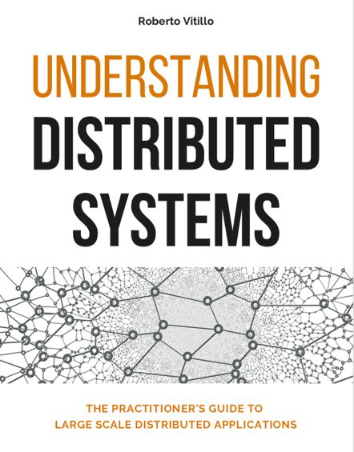
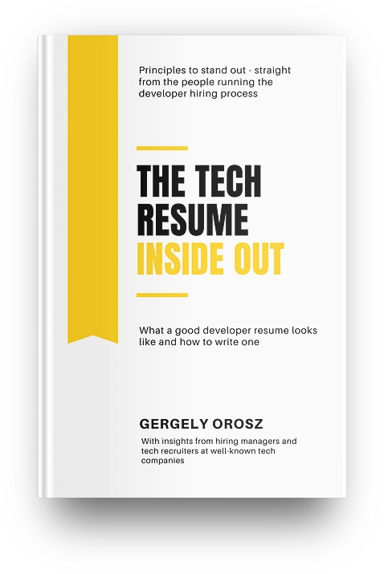
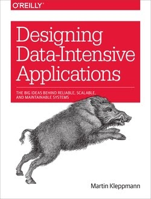

## 持续学习
设计好的系统需要多年的知识积累。 一种捷径是深入研究现实世界的系统架构。 以下是一组有用的阅读材料。 我们强烈建议你同时关注共享原则和底层技术。 研究每项技术并了解它解决的问题是加强知识库和改进设计过程的好方法。

### 现实世界的系统
下列资料可以帮助你了解不同公司背后真实系统架构的一般设计思路。

1. Facebook 时间线：通过非规范化的力量带给你：https://goo.gl/FCNrb
2. 在 Facebook 上扩展：https://goo.gl/NGTdCs
3. 构建时间表：扩大规模以保存你的人生故事：https://goo.gl/8p5wDV
4. Facebook 上的 Erlang（Facebook 聊天）：https://goo.gl/zSLHrj
5. 脸书聊天：https://goo.gl/qzSiWC
6. 在 Haystack 中找针：Facebook 的照片存储：https://goo.gl/edj4FL
7. 为 Facebook Multifeed 服务：通过重新设计提高效率和性能：https://goo.gl/adFVMQ
8. 在 Facebook 上扩展 Memcache：https://goo.gl/rZiAhX
9. TAO：Facebook 的社交图分布式数据存储：https://goo.gl/Tk1DyH
10. 亚马逊架构：https://goo.gl/k4feoW
11. Dynamo：亚马逊的高可用键值存储：https://goo.gl/C7zxDL
12. 整个 Netflix 堆栈的 360 度视图：https://goo.gl/rYSDTz
13. 全部是 A/B 测试：Netflix 实验平台：https://goo.gl/agbA4K
14. Netflix 推荐：超越 5 星（第 1 部分）：https://goo.gl/A4FkYi
15. Netflix 推荐：超越 5 星（第 2 部分）：https://goo.gl/XNPMXm
16. 谷歌架构：https://goo.gl/dvkDiY
17. 谷歌文件系统（谷歌文档）：https://goo.gl/xj5n9R
18. 差分同步（谷歌文档）：https://goo.gl/9zqG7x
19. YouTube 架构：https://goo.gl/mCPRUF
20. 西雅图可扩展性会议：YouTube 可扩展性：https://goo.gl/dH3zYq
21. Bigtable：结构化数据的分布式存储系统：https://goo.gl/6NaZca
22. Instagram 架构：1400 万用户、TB 级照片、100 多个实例、数十种技术：https://goo.gl/s1VcW5
23. Twitter 用于处理 1.5 亿活跃用户的架构：https://goo.gl/EwvfRd
24. 扩展 Twitter：使 Twitter 速度提高 10000%：https://goo.gl/nYGC1k
25. 宣布 Snowflake（Snowflake 是一种用于大规模生成唯一 ID 号的网络服务，并提供一些简单的保证）：https://goo.gl/GzVWYm
26. 大规模时间表：https://goo.gl/8KbqTy
27. 优步如何扩展他们的实时市场平台：https://goo.gl/kGZuVy
28. 缩放 Pinterest：https://goo.gl/KtmjW3
29. Pinterest 架构更新：https://goo.gl/w6rRsf
30. LinkedIn 扩容简史：https://goo.gl/8A1Pi8
31. Flickr 架构：https://goo.gl/dWtgYa
32. 我们如何扩展 Dropbox：https://goo.gl/NjBDtC
33. Facebook 以 190 亿美元收购 WhatsApp 架构：https://bit.ly/2AHJnFn

### 知名公司工程师博客
如果你要采访一家公司，最好阅读他们的工程博客并熟悉那里采用和实施的技术和系统。此外，工程博客提供了有关某些领域的宝贵见解。定期阅读它们可以帮助我们成为更好的工程师。

以下是知名大公司和初创公司的工程博客列表。

1. Airbnb：https://medium.com/airbnb-engineering
2. Amazon：https://developer.amazon.com/blogs
3. Asana：https://blog.asana.com/category/eng
4. Atlassian：https://developer.atlassian.com/blog
5. Bittorrent：http://engineering.bittorrent.com
6. Cloudera：https://blog.cloudera.com
7. Docker：https://blog.docker.com
8. Dropbox：https://blogs.dropbox.com/tech
9. eBay：http://www.ebaytechblog.com
10. Facebook：https://code.facebook.com/posts
11. GitHub：https://githubengineering.com
12. Google：https://developers.googleblog.com
13. Groupon：https://engineering.groupon.com
14. Highscalability：http://highscalability.com
15. Instacart：https://tech.instacart.com
16. Instagram：https://engineering.instagram.com
17. Linkedin：https://engineering.linkedin.com/blog
18. Mixpanel：https://mixpanel.com/blog
19. Netflix：https://medium.com/netflix-techblog
20. Nextdoor：https://engblog.nextdoor.com
21. PayPal：https://www.paypal-engineering.com
22. Pinterest：https://engineering.pinterest.com
23. Quora：https://engineering.quora.com
24. Reddit：https://redditblog.com
25. Salesforce：https://developer.salesforce.com/blogs/engineering
26. Shopify：https://engineering.shopify.com
27. Slack：https://slack.engineering
28. Soundcloud：https://developers.soundcloud.com/blog
29. Spotify：https://labs.spotify.com
30. Stripe：https://stripe.com/blog/engineering
31. System design primer：https://github.com/donnemartin/system-design-primer
32. Twitter：https://blog.twitter.com/engineering/en_us.html
33. Thumbtack：https://www.thumbtack.com/engineering
34. Uber：http://eng.uber.com
35. Yahoo：https://yahooeng.tumblr.com
36. Yelp：https://engineeringblog.yelp.com
37. Zoom：https://medium.com/zoom-developer-blog

### 推荐阅读

软件工程面试具有挑战性，但好消息是正确的准备可以产生很大的不同。技术面试通常涵盖以下领域之一：编码、系统设计或面向对象的设计。为了帮助你找到理想的工作，我们整理了一份可能有帮助的书籍清单。

1. Roberto Vitillo 理解分布式系统

这本书讲授了分布式系统的基础知识。作者在解释网络堆栈、数据一致性模型、弹性、可扩展性和可靠性模式等方面做得非常出色。链接：http://bit.ly/dissystems
2. Gergely Orosz 由内而外的技术简历

一份强大的简历是你在众多竞争候选人中脱颖而出的门票。这本书的内容经过充分研究，旨在帮助你制作一份具有专业外观的简历。最好的部分：作者联系了数十位经验丰富的技术招聘人员和实际操作的招聘经理，以确保这本书有用且事实正确。全面披露：我个人认识他。链接：https://bit.ly/3lRLWXh
3. Martin Kleppmann 设计数据密集型应用程序

这本 616 页的经典书籍被认为是从事分布式系统工作的有抱负的工程师的必读之书。最好的部分：这本书技术性很强，包含很多关于可扩展性、一致性、可靠性、效率和可维护性的深入讨论。链接：https://amzn.to/2K0PLfq
