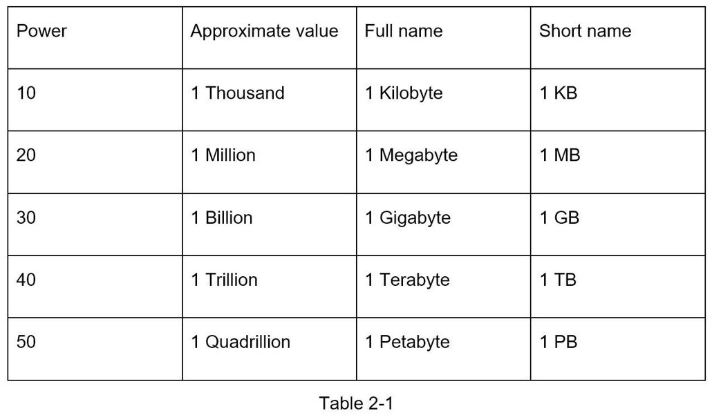
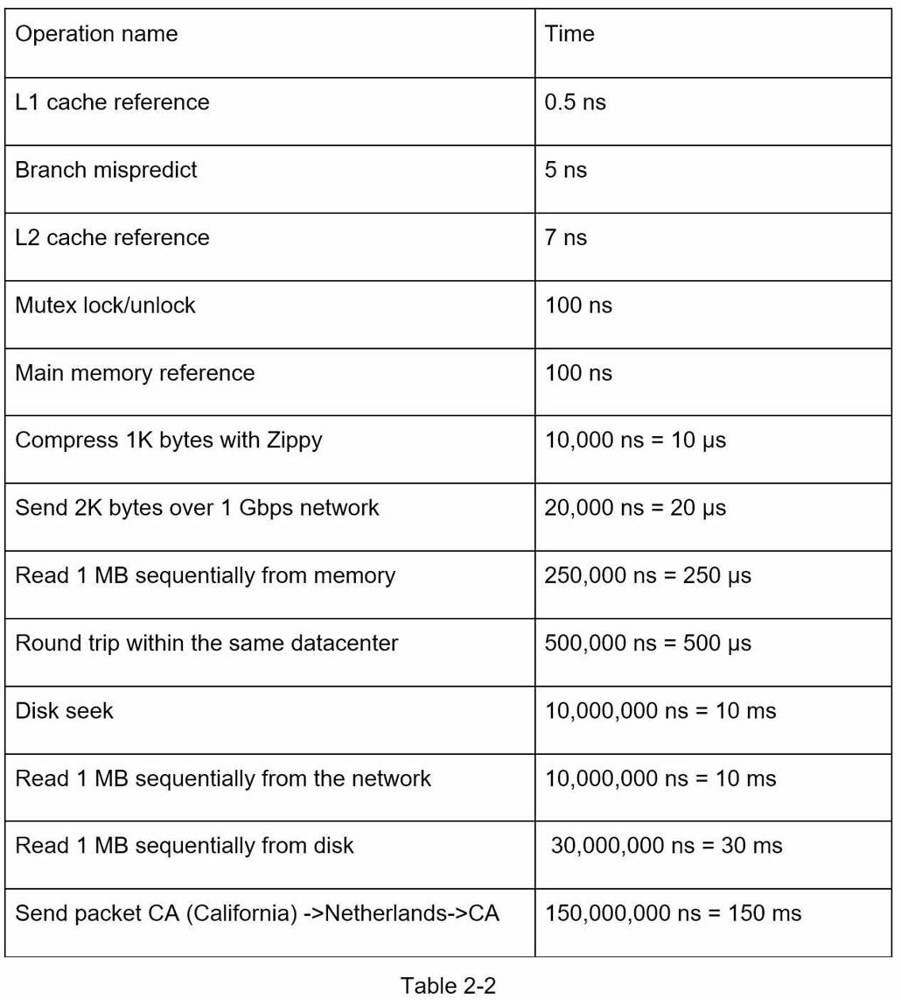
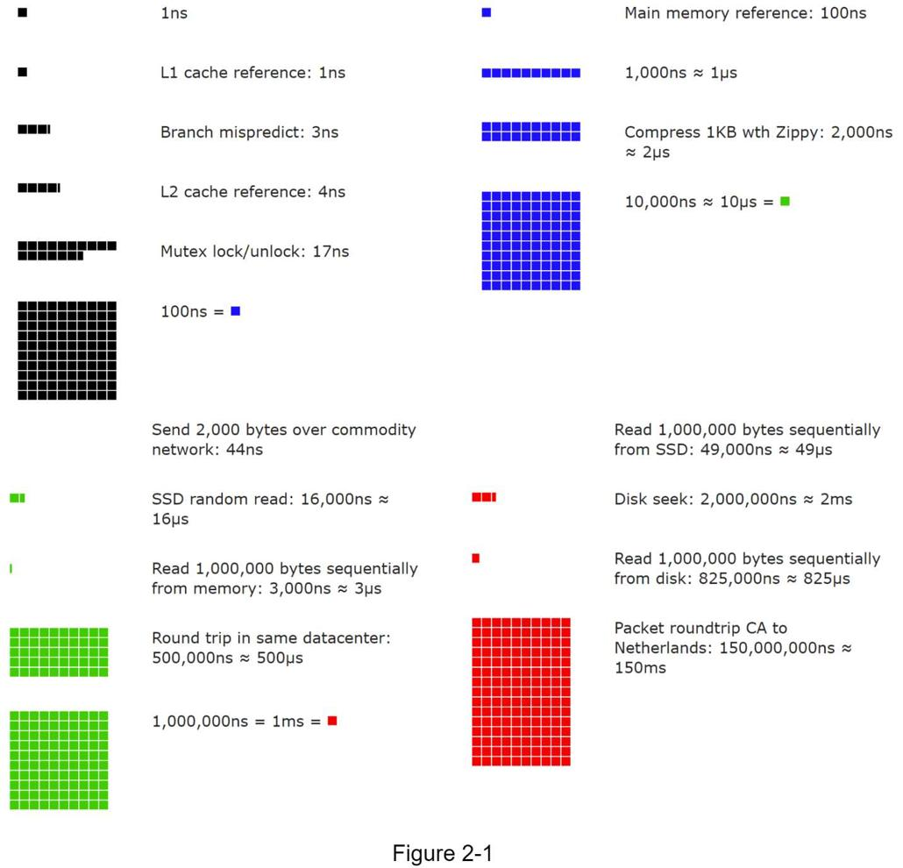
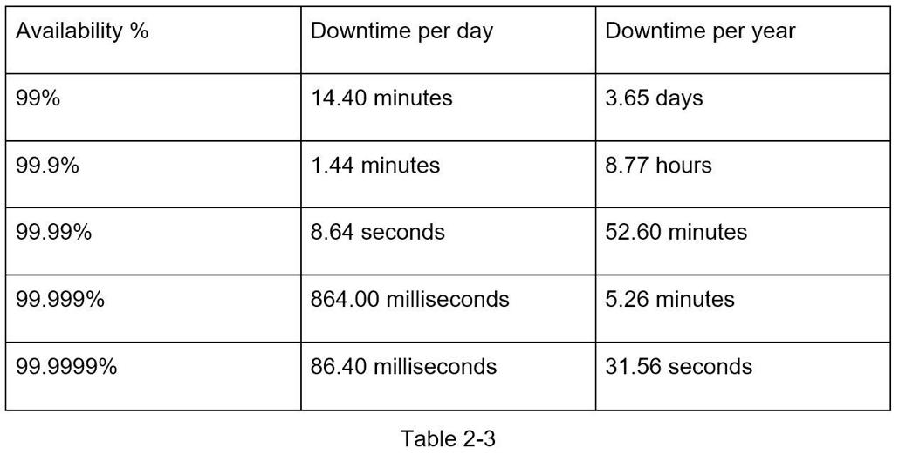

## 粗略估计
在系统设计面试中，有时会要求你使用粗略估计来估计系统容量或性能要求。 根据 Google 高级研究员 Jeff Dean 的说法，“粗略计算是你使用思想实验和常见性能数据的组合创建的估计值，以便更好地了解哪些设计可以满足你的要求”[1]。
你需要具备良好的可扩展性基础知识才能有效地进行粗略估计。 以下概念应该很好理解：2 的幂 [2]、每个程序员都应该知道的延迟数以及可用性数。

### 二的幂
尽管在处理分布式系统时数据量可能会变得巨大，但计算都归结为基础。 为了获得正确的计算，使用 2 的幂来了解数据量单位是至关重要的。一个字节是 8 位的序列。 一个 ASCII 字符使用一个字节的内存（8 位）。 下表解释了数据量单位（表 2-1）。

### 每个程序员都应该知道的延迟数字
来自 Google 的 Dean 博士揭示了 2010 年典型计算机操作的长度 [1]。 随着计算机变得更快、更强大，一些数字已经过时。 但是，这些数字应该仍然能够让我们了解不同计算机操作的快慢。

> 注意：
>
> ns = 纳秒，µs = 微秒，ms = 毫秒
> 1 ns = 10^-9 秒
> 1 µs= 10^-6 秒 = 1,000 ns
> 1 毫秒 = 10^-3 秒 = 1,000 µs = 1,000,000 ns

一位 Google 软件工程师构建了一个工具来可视化 Dean 博士的数字。 该工具还考虑了时间因素。 图 2-1 显示了截至 2020 年的可视化延迟数字（数据来源：参考资料~ [3]）。

通过分析图 2-1 中的数字，我们得到以下结论：

- 内存快，但磁盘慢。
- 尽可能避免磁盘寻道。
- 简单的压缩算法很快。
- 如果可能，在通过互联网发送数据之前压缩数据。
- 数据中心通常分布在不同的区域，数据中心之间的数据传输需要时间。

### 可用性编号
高可用性是系统在所需的较长时间内连续运行的能力。 高可用性以百分比来衡量，100% 表示服务的停机时间为 0。 大多数服务都在 99% 到 100% 之间。

服务水平协议 (SLA) 是服务提供商的常用术语。 这是你（服务提供商）和你的客户之间的协议，该协议正式定义了你的服务将提供的正常运行时间水平。 云提供商亚马逊 [4]、谷歌 [5] 和微软 [6] 将他们的 SLA 设置为 99.9% 或更高。 正常运行时间传统上以九为单位来衡量。 九点越多越好。 如表 2-3 所示，9 的数量与预期的系统停机时间相关。

### 示例：估计 Twitter QPS 和存储要求
请注意，以下数字仅用于此练习，因为它们不是来自 Twitter 的实数。

假设：

- 3 亿月活跃用户。
- 50% 的用户每天使用 Twitter。
- 用户平均每天发布 2 条推文。
- 10% 的推文包含媒体。
- 数据保存 5 年。

### 估计

每秒查询 (QPS) 估计：
- 每日活跃用户 (DAU) = 3 亿 * 50% = 1.5 亿
- 推文 QPS = 1.5 亿 * 2 条推文 / 24 小时 / 3600 秒 = ~3500
- 峰值 QPS = 2 * QPS = ~7000

我们将在这里只估计媒体存储。
- 平均推文大小：
  - tweet_id 64 字节
  - 文本           140 字节
  - 媒体       1 MB
- 媒体存储：1.5 亿 * 2 * 10% * 1 MB = 每天 30 TB
- 5 年媒体存储：30 TB * 365 * 5 = ~55 PB

### 提示
粗略估计是关于过程的。解决问题比获得结果更重要。面试官可能会测试你解决问题的能力。以下是一些需要遵循的提示：

- 舍入和近似。面试时很难进行复杂的数学运算。例如，“99987 / 9.1”的结果是什么？无需花费宝贵的时间来解决复杂的数学问题。精度不高。使用整数和近似值对你有利。除法问题可以简化为：“100,000 / 10”。
- 写下你的假设。写下你的假设以供以后参考是个好主意。
- 标记你的单位。当你写下“5”时，是指 5 KB 还是 5 MB？你可能会对此感到困惑。写下单位，因为“5 MB”有助于消除歧义。
- 常见的粗略估计：QPS、峰值QPS、存储、缓存、服务器数量等。你可以在准备面试时练习这些计算。熟能生巧。

恭喜你走到这一步！现在鼓励一下自己， 非常棒！

### 参考资料
1. J. Dean.Google 专业提示：使用 Back-Of-The-Envelope-Calculations 选择最佳设计：http://highscalability.com/blog/2011/1/26/google-pro-tip-use-back-of-the-envelope-calculations-to-choo.html
2. 系统设计入门：https://github.com/donnemartin/system-design-primer
3. 每个程序员都应该知道的延迟数字：https://colin-scott.github.io/personal_website/research/interactive_latency.html
4. 亚马逊计算服务水平协议：https://aws.amazon.com/compute/sla/
5. 计算引擎服务水平协议 (SLA)：https://cloud.google.com/compute/sla
6. Azure 服务的 SLA 摘要：https://azure.microsoft.com/en-us/support/legal/sla/summary/
