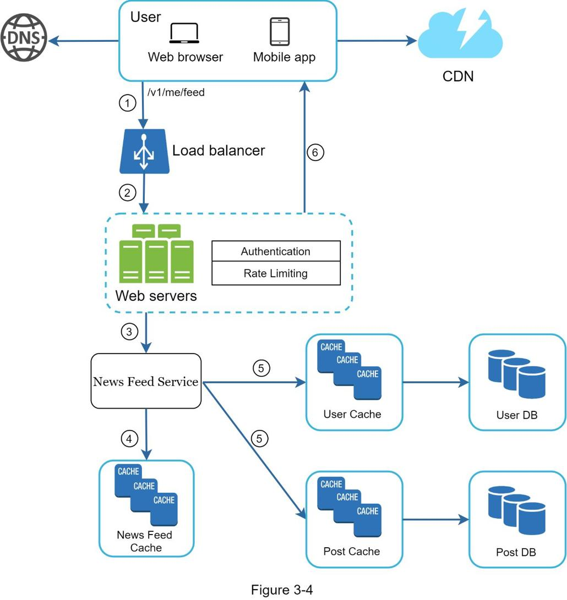

## 系统设计框架访谈
你刚刚在你梦寐以求的公司进行了梦寐以求的现场面试。招聘协调员会向你发送当天的日程安排。浏览列表，你对此感觉非常好，直到你的目光落在这个面试环节 - 系统设计面试。
系统设计面试通常令人生畏。它可能像“设计一个知名产品 X？”一样模糊。这些问题模棱两可，似乎过于宽泛。你的疲倦是可以理解的。毕竟，任何人怎么能在一个小时内设计出一款需要数百甚至数千名工程师才能完成的流行产品呢？
好消息是没有人期望你这样做。现实世界的系统设计极其复杂。例如，谷歌搜索看似简单；然而，支持这种简单性的技术数量确实令人惊讶。如果没有人希望你在一小时内设计出一个真实世界的系统，那么系统设计面试有什么好处？
系统设计面试模拟现实生活中的问题解决，两名同事合作解决一个模棱两可的问题，并提出满足他们目标的解决方案。这个问题是开放式的，没有完美的答案。与你在设计过程中所做的工作相比，最终的设计并不重要。这使你可以展示你的设计技巧，捍卫你的设计选择，并以建设性的方式回应反馈。
让我们翻转桌子，考虑一下当面试官走进会议室与你会面时，她的脑海中会发生什么。面试官的主要目标是准确评估你的能力。她想要做的最后一件事是给出一个不确定的评估，因为会话进行得很糟糕并且没有足够的信号。面试官在系统设计面试中寻找什么？
许多人认为系统设计面试完全是关于一个人的技术设计技能。它远不止于此。一次有效的系统设计面试会给出一个人的协作能力、在压力下工作以及建设性地解决歧义的能力的强烈信号。提出好问题的能力也是一项必不可少的技能，许多面试官专门寻找这项技能。
一个好的面试官也会寻找危险信号。过度工程是许多工程师的真正疾病，因为他们喜欢设计纯度而忽略权衡。他们通常不知道过度设计系统的复合成本，许多公司为这种无知付出了高昂的代价。你当然不想在系统设计面试中展示这种倾向。其他危险信号包括心胸狭窄、固执等。
在本章中，我们将介绍一些有用的技巧，并介绍一个简单有效的框架来解决系统设计面试问题。

### 有效系统设计面试的四步流程
每个系统设计面试都是不同的。出色的系统设计面试是开放式的，没有万能的解决方案。但是，在每次系统设计面试中都需要涵盖一些步骤和共同点。

#### 第1步 - 了解问题并确定设计范围
“老虎为什么咆哮？”
一只手从教室的后方举了起来。
“是的，吉米？”老师回答。
“因为他饿了”。
“很好的吉米。”

在他的整个童年时期，吉米一直是班上第一个回答问题的人。每当老师提出问题时，教室里总有一个孩子喜欢破解问题，无论他是否知道答案。那是吉米。

吉米是一名优秀的学生。他以快速知道所有答案而自豪。在考试中，他通常是第一个完成问题的人。在任何学术竞赛中，他都是教师的首选。

不要像吉米那样。

在系统设计面试中，不假思索地快速给出答案不会给你加分。在没有彻底了解要求的情况下回答是一个巨大的危险信号，因为面试不是琐事竞赛。没有正确的答案。

所以，不要直接跳进去给出解决方案。减速。深入思考并提出问题以澄清要求和假设。这是极其重要的。

作为工程师，我们喜欢解决难题并跳入最终设计；但是，这种方法很可能会导致你设计错误的系统。作为一名工程师，最重要的技能之一是提出正确的问题，做出正确的假设，并收集构建系统所需的所有信息。所以，不要害怕提问。

当你问一个问题时，面试官要么直接回答你的问题，要么要求你做出假设。如果发生后者，请在白板或纸上写下你的假设。你以后可能需要它们。

要问什么样的问题？提出问题以了解确切的要求。以下是帮助你入门的问题列表：

- 我们要构建哪些具体功能？
- 产品有多少用户？
- 公司预计扩大规模的速度有多快？ 3 个月、6 个月和一年的预期规模是多少？
- 公司的技术栈是什么？你可以利用哪些现有服务来简化设计？

##### 示例
如果你被要求设计一个新闻提要系统，你想问一些问题来帮助你澄清需求。你和面试官之间的对话可能是这样的：

候选人：这是一个移动应用程序吗？还是网络应用程序？或两者？
采访者：两者都有。
应聘者：产品最重要的特点是什么？
采访者：能够发帖和查看朋友的新闻提要。
候选人：新闻提要是按时间倒序排列还是按特定顺序排列？特定的顺序意味着每个帖子都有不同的权重。例如，来自密友的帖子比来自群组的帖子更重要。
采访者：为简单起见，让我们假设提要按时间倒序排序。
候选人：一个用户可以有多少个朋友？
面试官：5000
应聘者：交通量是多少？
面试官：1000万日活跃用户（DAU）
候选人：提要可以包含图像、视频或仅包含文本吗？
采访者：它可以包含媒体文件，包括图片和视频。

以上是一些你可以问面试官的示例问题。了解需求并澄清歧义很重要

#### 第2步 - 提出高级设计并获得支持
在这一步中，我们的目标是开发一个高层次的设计，并与面试官就设计达成一致。在此过程中与面试官合作是一个好主意。

- 提出设计的初始蓝图。征求反馈意见。把你的面试官当作队友，一起工作。许多优秀的面试官喜欢交谈和参与。
- 在白板或纸上绘制带有关键部件的箱形图。这可能包括客户端（移动/网络）、API、网络服务器、数据存储、缓存、CDN、消息队列等。
- 进行粗略计算以评估你的设计是否符合规模限制。大声思考。如果有必要在深入研究之前与你的面试官沟通。

如果可能，请查看一些具体的用例。这将帮助你构建高级设计。这些用例也可能会帮助你发现尚未考虑的边缘情况。

我们应该在这里包含 API 端点和数据库模式吗？这取决于问题。对于像“设计谷歌搜索引擎”这样的大型设计问题，这有点太低级了。对于像为多人扑克游戏设计后端这样的问题，这是一个公平的游戏。与你的面试官沟通。

##### 示例

让我们使用“设计新闻提要系统”来演示如何进行高级设计。在这里，你不需要了解系统的实际工作方式。所有细节将在第 11 章中解释。

在高层，设计分为两个流程：Feed 发布和新闻 Feed 构建。

- Feed发布：当用户发布一个帖子时，相应的数据会被写入缓存/数据库，该帖子将被填充到朋友的新闻Feed中。
- Newsfeed 构建：News Feed 是通过按时间倒序聚合朋友的帖子来构建的。

图 3-1 和图 3-2 分别展示了提要发布和新闻提要构建流程的高级设计。

#### 第3步 - 设计深入研究
在这一步，你和你的面试官应该已经实现了以下目标：

- 就总体目标和功能范围达成一致
- 勾勒出整体设计的高层次蓝图
- 从你的面试官那里获得关于高层设计的反馈
- 根据她的反馈，对深入研究重点关注的领域有一些初步想法

你应与面试官一起确定架构中的组件并确定其优先级。值得强调的是，每次面试都是不同的。有时，面试官可能会暗示她喜欢专注于高级设计。有时，对于高级候选人的面试，讨论可能是关于系统性能特征，可能集中在瓶颈和资源估计上。在大多数情况下，面试官可能希望你深入了解某些系统组件的细节。对于 URL 缩短器，深入研究将长 URL 转换为短 URL 的哈希函数设计是很有趣的。对于一个聊天系统来说，如何减少延迟和如何支持在线/离线状态是两个有趣的话题。

时间管理是必不可少的，因为很容易被那些不能证明你能力的微小细节冲昏头脑。你必须准备好信号来向你的面试官展示。尽量不要涉及不必要的细节。例如，在系统设计面试中详细谈论 Facebook 提要排名的 EdgeRank 算法并不理想，因为这会花费很多宝贵的时间，并且不能证明你设计可扩展系统的能力。

##### 示例
至此，我们已经讨论了新闻提要系统的高级设计，面试官对你的提议很满意。接下来，我们将研究两个最重要的用例：

- 提要发布
- 新闻提要检索

图 3-3 和图 3-4 显示了这两个用例的详细设计，这将在第 11 章中详细说明。

#### 第4步 - 总结
在这最后一步，面试官可能会问你一些后续问题，或者让你自由讨论其他附加点。以下是一些可以遵循的方向：

- 面试官可能希望你识别系统瓶颈并讨论潜在的改进。永远不要说你的设计是完美的，没有什么可以改进的。总有一些需要改进的地方。这是展示你的批判性思维并留下良好最终印象的绝佳机会。
- 让面试官回顾一下你的设计可能会很有用。如果你提出了一些解决方案，这一点尤其重要。经过长时间的会议后，刷新面试官的记忆会很有帮助。
- 错误情况（服务器故障、网络丢失等）很有趣。
- 运营问题值得一提。你如何监控指标和错误日志？如何推出系统？
- 如何处理下一个比例曲线也是一个有趣的话题。例如，如果你当前的设计支持 100 万用户，那么你需要进行哪些更改才能支持 1000 万用户？
- 如果你有更多时间，请提出你需要的其他改进。

最后，我们总结了一份注意事项列表。

##### 做什么
- 总是要求澄清。不要假设你的假设是正确的。
- 了解问题的要求。
- 既没有正确答案，也没有最佳答案。旨在解决年轻创业公司问题的解决方案与拥有数百万用户的成熟公司的解决方案不同。确保你了解要求。
- 让面试官知道你在想什么。与你的面试沟通。
- 如果可能，建议多种方法。
- 一旦你同意你的面试官对蓝图的看法，就详细了解每个组成部分。首先设计最关键的组件。
- 向面试官提出想法。一个好的面试官会和你一起工作。
- 永不放弃。

##### 不做什么

- 不要对典型的面试问题毫无准备。
- 不要在没有明确要求和假设的情况下跳入解决方案。
- 开始时不要对单个组件进行太多详细说明。先给出高层设计，然后再深入研究。
- 如果你遇到困难，请不要犹豫寻求提示。
- 再次，沟通。不要沉默地思考。
- 不要以为一旦你给出设计你的面试就完成了。直到你的面试官说你完成了，你才完成。尽早并经常寻求反馈。

##### 每一步的时间分配

系统设计面试问题通常很宽泛，45 分钟或一个小时不足以涵盖整个设计。时间管理是必不可少的。你应该在每个步骤上花费多少时间？以下是在 45 分钟的面试环节中分配时间的非常粗略的指南。请记住，这是一个粗略的估计，实际时间分布取决于问题的范围和面试官的要求。

- 步骤1了解问题并确定设计范围：3 - 10 分钟
- 步骤2提出高级设计并获得支持：10 - 15 分钟
- 步骤3设计深入研究：10 - 25 分钟
- 步骤4步包裹：3 - 5 分钟
