## 设计一个限速器
在网络系统中，限速器用于控制客户端或服务发送流量的速率。在 HTTP 世界中，限速器限制了在指定时间段内允许发送的客户端请求的数量。如果 API 请求计数超过限速器定义的阈值，则阻止所有超出的调用。这里有一些例子：

- 一个用户每秒可以写不超过 2 个帖子。
- 你每天最多可以从同一个IP 地址创建10 个帐户。
- 你每周可以通过同一设备领取奖励不超过 5 次。

在本章中，你被要求设计一个限速器。在开始设计之前，我们先看看使用 API 限速器的好处：

- 防止由拒绝服务(DoS) 攻击引起的资源匮乏~[1]~。几乎所有大型科技公司发布的 API 都会实施某种形式的速率限制。例如，Twitter 将推文数量限制为每 3 小时 300 条 ~[2]~。 Google docs API 具有以下默认限制：每个用户每 60 秒读取 300 个请求 ~[3]~。限速器通过阻止多余的呼叫来防止有意或无意的 DoS 攻击。
- 降低成本。限制过多的请求意味着更少的服务器并将更多的资源分配给高优先级的 API。速率限制对于使用付费第三方 API 的公司来说极为重要。例如，你需要为以下外部 API 按每次调用付费：检查信用、付款、检索健康记录等。限制调用次数对于降低成本至关重要。
- 防止服务器过载。为了减少服务器负载，限速器用于过滤掉由机器人或用户的不当行为引起的过多请求。

### 第1步 - 了解问题并确定设计范围
速率限制可以使用不同的算法来实现，每种算法都有其优缺点。面试官和候选人之间的互动有助于阐明我们正在尝试构建的限速器的类型。

候选人：我们要设计什么样的限速器？它是客户端限速器还是服务器端 API 限速器？
面试官：很好的问题。我们专注于服务器端 API 限速器。
候选人：限速器是否根据 IP、用户 ID 或其他属性限制 API 请求？
面试官：限速器应该足够灵活，以支持不同的限制规则集。
候选人：系统的规模是多少？它是为初创公司还是为拥有庞大用户群的大公司而构建的？
面试官：系统必须能够处理大量的请求。
候选人：系统会在分布式环境中工作吗？
面试官：是的。
候选人：限速器是一个单独的服务还是应该在应用程序代码中实现？
面试官：这是你的设计决定。
候选人：我们需要通知被限制的用户吗？
面试官：是的。

#### 要求
以下是系统要求的摘要：

- 准确限制过多的请求。
- 低延迟。限速器不应减慢 HTTP 响应时间。
- 使用尽可能少的内存。
- 分布式速率限制。限速器可以在多个服务器或进程之间共享。
- 异常处理。当用户的请求受到限制时，向用户显示明确的例外情况。
- 高容错性。如果限速器有任何问题（例如，缓存服务器离线），它不会影响整个系统。

### 第2步 - 提出高级设计并获得支持
让我们保持简单，并使用基本的客户端和服务器模型进行通信。

#### 限速器放在哪里？

直观地说，你可以在客户端或服务器端实现限速器。

- 客户端实施。 一般来说，客户端是实施速率限制的不可靠地方，因为客户端请求很容易被恶意行为者伪造。 此外，我们可能无法控制客户端的实现。
- 服务器端实施。 图 4-1 显示了一个放置在服务器端的限速器。

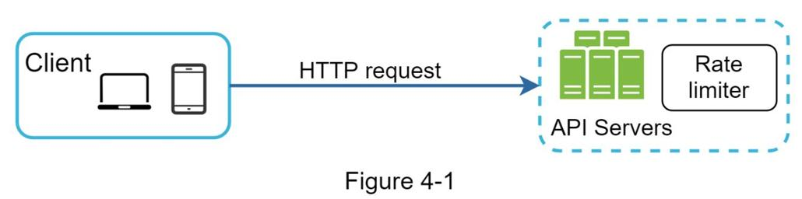

除了客户端和服务器端实现之外，还有另一种方法。我们没有在 API 服务器上放置限速器，而是创建了一个限速器中间件，它可以限制对 API 的请求，如图 4-2 所示。

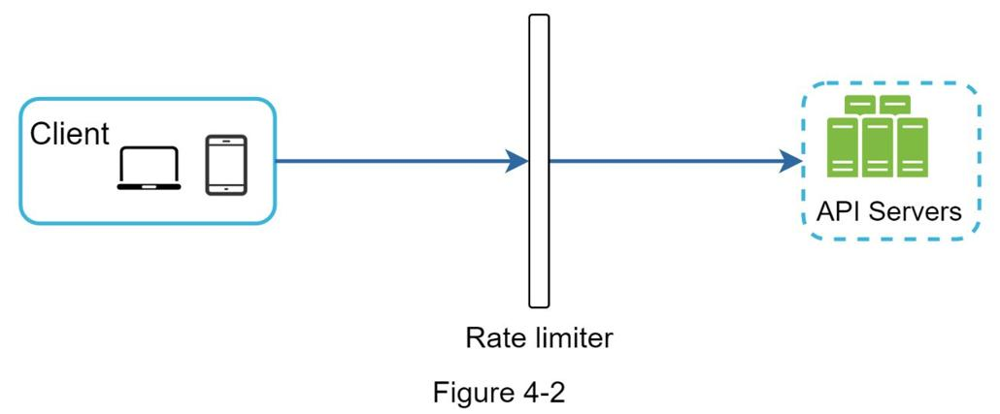

让我们使用图 4-3 中的示例来说明速率限制在此设计中的工作原理。假设我们的 API 每秒允许 2 个请求，并且客户端在一秒钟内向服务器发送 3 个请求。前两个请求被路由到 API 服务器。但是，限速器中间件会限制第三个请求并返回 HTTP 状态代码 429。HTTP 429 响应状态代码表示用户发送了太多请求。

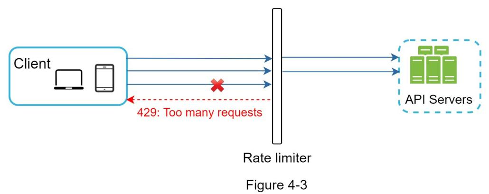

云微服务 ~[4]~ 已广受欢迎，速率限制通常在称为 API 网关的组件中实现。 API 网关是一个完全托管的服务，支持速率限制、SSL 终止、身份验证、IP 白名单、服务静态内容等。现在，我们只需要知道 API 网关是一个支持速率限制的中间件。

在设计限速器时，要问自己的一个重要问题是：应该在服务器端还是网关中实现限速器？没有绝对的答案。这取决于贵公司当前的技术堆栈、工程资源、优先级、目标等。以下是一些一般准则：

- 评估你当前的技术堆栈，例如编程语言、缓存服务等。确保你当前的编程语言能够有效地在服务器端实现速率限制。
- 确定适合你业务需求的速率限制算法。当你在服务器端实现所有内容时，你可以完全控制算法。但是，如果你使用第三方网关，你的选择可能会受到限制。
- 如果你已经使用微服务架构并在设计中包含API网关来执行身份验证、IP白名单等，你可以在API网关中添加限速器。
- 建立你自己的限速服务需要时间。如果你没有足够的工程资源来实现限速器，那么商业 API 网关是更好的选择。

#### 限速算法
速率限制可以使用不同的算法来实现，每种算法都有不同的优缺点。尽管本章不关注算法，但从高层次理解它们有助于选择正确的算法或算法组合以适应我们的用例。以下是流行算法的列表：

- 令牌桶
- 漏桶
- 固定窗口计数器
- 滑动窗口日志
- 滑动窗口柜台

##### 令牌桶算法
令牌桶算法被广泛用于速率限制。它简单易懂，被互联网公司普遍使用。 Amazon ~[5]~ 和 Stripe ~[6]~ 都使用这个算法来限制他们的 API 请求。

令牌桶算法的工作原理如下：

- 令牌桶是具有预定义容量的容器。令牌会定期以预设的速率放入桶中。桶装满后，不再添加令牌。如图 4-4 所示，令牌桶容量为 4 个，充币器每秒向桶中放入 2 个令牌。一旦桶满了，额外的令牌就会溢出。
    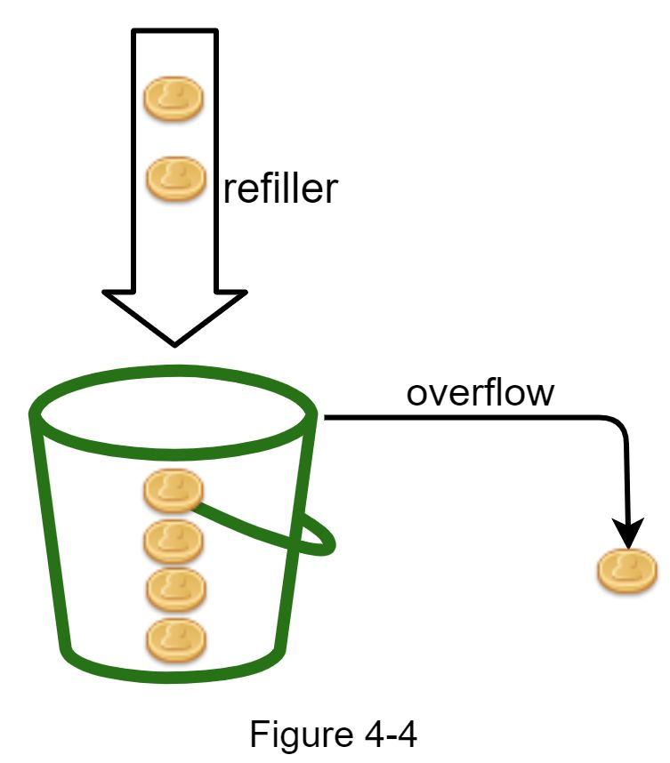
- 每个请求消耗一个令牌。 当请求到达时，我们检查桶中是否有足够的令牌。 图 4-5 解释了它是如何工作的。
- 如果有足够的令牌，我们为每个请求取出一个令牌，请求通过。
- 如果没有足够的令牌，请求将被丢弃。

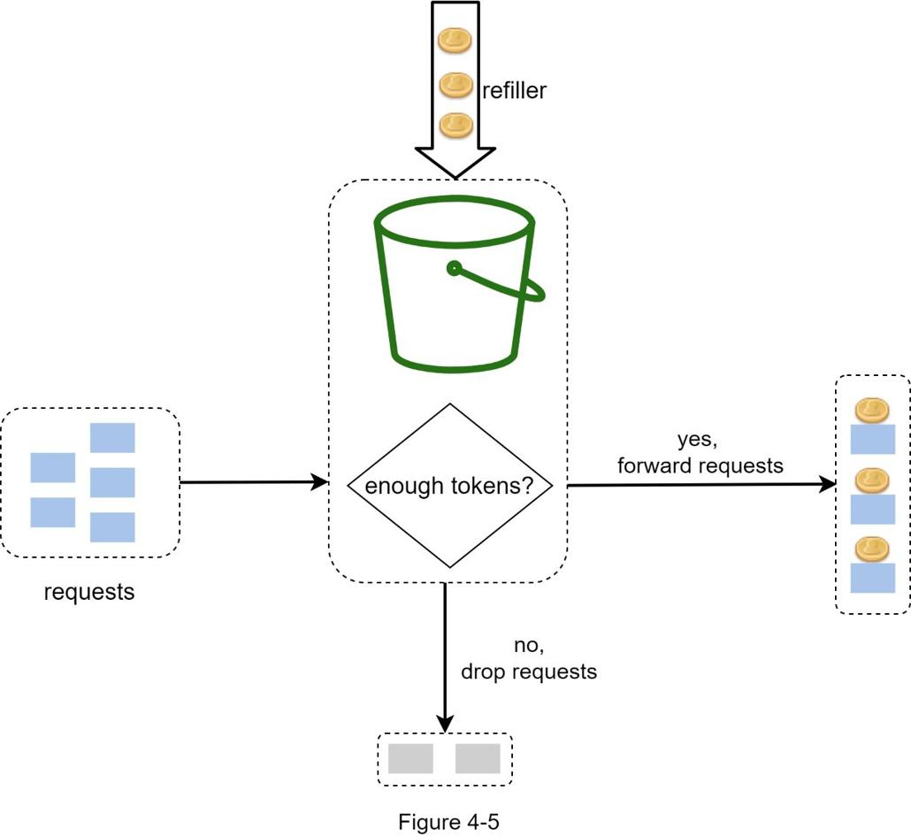

图 4-6 说明了令牌消耗、重新填充和速率限制逻辑是如何工作的。 在本例中，令牌桶大小为 4，补充速率为每 1 分钟 4 次。

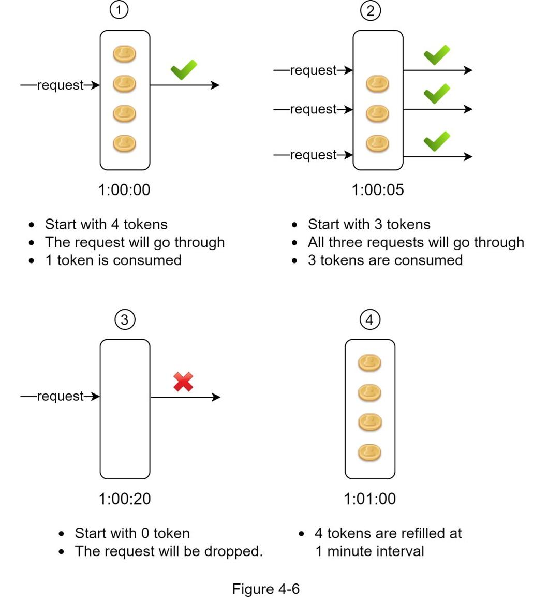

令牌桶算法有两个参数：
- 桶大小：桶中允许的最大令牌数
- 充值率：每秒放入桶中的令牌数

我们需要多少桶？这会有所不同，并且取决于速率限制规则。这里有一些例子。

- 通常需要为不同的 API 端点提供不同的存储桶。例如，如果允许用户每秒发 1 个帖子，每天添加 150 个朋友，并且每秒发 5 个帖子，则每个用户需要 3 个桶。
- 如果我们需要根据IP 地址限制请求，每个IP 地址都需要一个桶。
- 如果系统允许每秒最多 10,000 个请求，则让所有请求共享一个全局存储桶是有意义的。

优点：
- 算法易于实现。
- 内存效率。
- 令牌桶允许短时间的流量突发。只要还有令牌，请求就可以通过。

缺点：
- 算法中的两个参数是桶大小和令牌填充率。但是，正确调整它们可能具有挑战性。

##### 漏桶算法
漏桶算法类似于令牌桶，只是请求以固定速率处理。 它通常使用先进先出 (FIFO) 队列来实现。 该算法的工作原理如下：

- 当请求到达时，系统检查队列是否已满。 如果未满，则将请求添加到队列中。
- 否则，请求将被丢弃。
- 请求从队列中拉出并定期处理。

图 4-7 解释了该算法的工作原理。

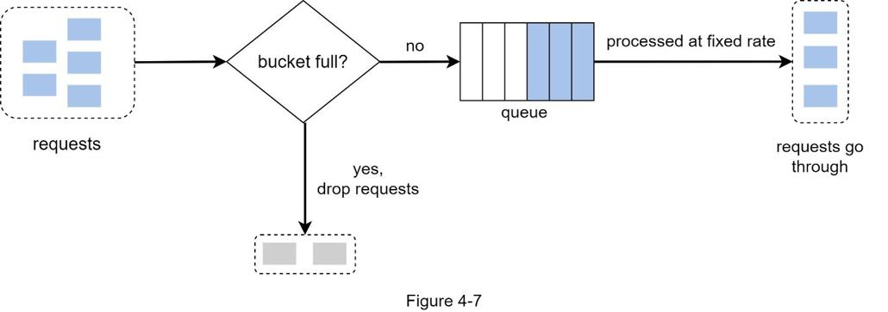

漏桶算法采用以下两个参数：

- Bucket size：等于队列大小。队列以固定速率保存要处理的请求。
- 流出率：它定义了可以以固定速率处理多少请求，通常以秒为单位。

电子商务公司 Shopify 使用漏桶来限制速率 ~[7]~。

优点：

- 考虑到有限的队列大小，内存效率很高。
- 请求以固定速率处理，因此适用于需要稳定流出速率的用例。

缺点：

- 突发流量将旧请求填满队列，如果未及时处理，最近的请求将受到速率限制。
- 算法中有两个参数。正确调整它们可能并不容易。

##### 固定窗口计数器算法

固定窗口计数器算法的工作原理如下：

- 该算法将时间线划分为固定大小的时间窗口，并为每个窗口分配一个计数器。
- 每个请求将计数器加一。
- 一旦计数器达到预定义的阈值，新的请求就会被丢弃，直到新的时间窗口开始。

让我们用一个具体的例子来看看它是如何工作的。在图 4-8 中，时间单位为 1 秒，系统每秒最多允许 3 个请求。在每个第二个窗口中，如果收到超过 3 个请求，则会丢弃额外的请求，如图 4-8 所示。

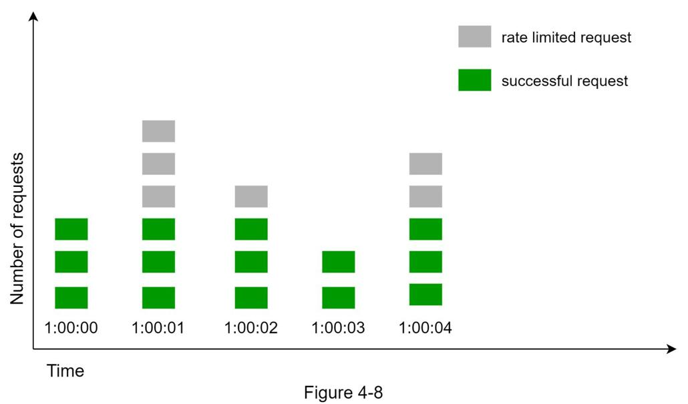

该算法的一个主要问题是时间窗口边缘的流量突发可能导致超过允许的配额通过的请求。 考虑以下情况：

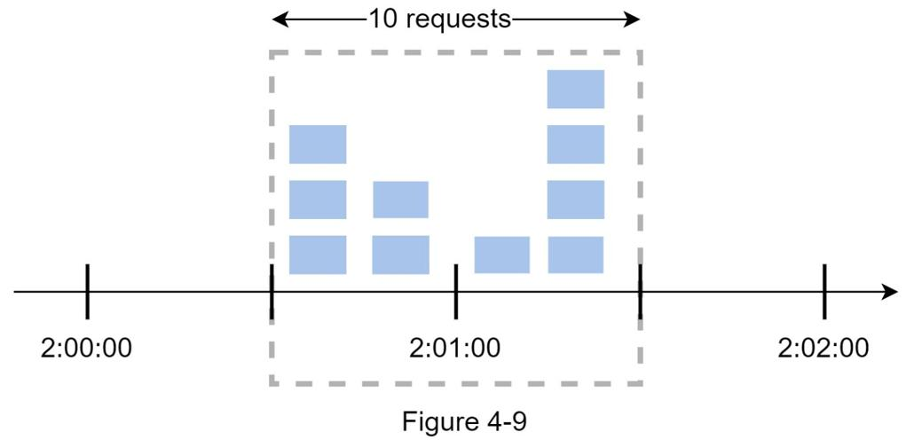

在图 4-9 中，系统每分钟最多允许 5 个请求，并且可用配额在人性化的每分钟重置一次。 如图所示，在 2:00:00 到 2:01:00 之间有五个请求，在 2:01:00 到 2:02:00 之间还有五个请求。 对于 2:00:30 和 2:01:30 之间的一分钟窗口，有 10 个请求通过。 这是允许请求的两倍。

优点：

- 内存效率。
- 容易理解。
- 在单位时间窗口结束时重置可用配额适合某些用例。

缺点：

- 窗口边缘的流量激增可能导致通过的请求数超过允许的配额。

##### 滑动窗口日志算法

如前所述，固定窗口计数器算法有一个主要问题：它允许更多请求在窗口边缘通过。滑动窗口日志算法解决了这个问题。它的工作原理如下：

- 算法跟踪请求时间戳。时间戳数据通常保存在缓存中，例如 Redis ~[8]~ 的排序集。
- 当有新请求进来时，删除所有过时的时间戳。过时的时间戳被定义为早于当前时间窗口开始的时间戳。
- 将新请求的时间戳添加到日志中。
- 如果日志大小等于或小于允许的计数，则接受请求。否则，它被拒绝。

我们用一个如图 4-10 所示的例子来解释这个算法。

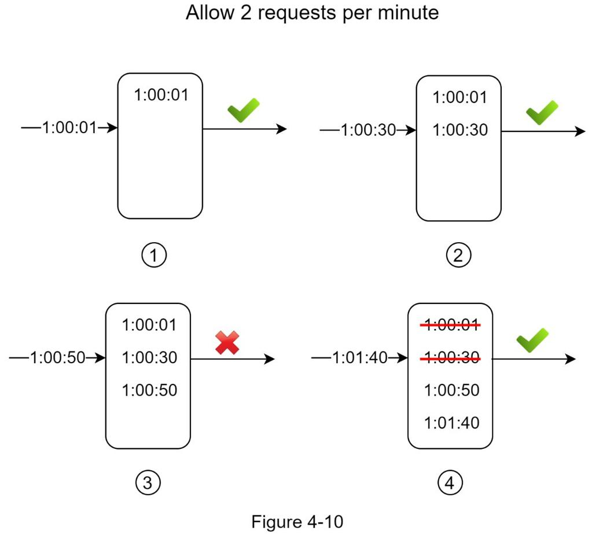

在此示例中，限速器允许每分钟 2 个请求。通常，Linux 时间戳存储在日志中。然而，为了更好的可读性，我们的示例中使用了人类可读的时间表示。

- 新请求在 1:00:01 到达时，日志为空。因此，该请求被允许。
- 一个新的请求在 1:00:30 到达，时间戳 1:00:30 被插入到日志中。插入后，日志大小为 2，不大于允许的计数。因此，该请求被允许。
- 一个新的请求在 1:00:50 到达，并且时间戳被插入到日志中。插入后，日志大小为 3，大于允许的大小 2。因此，即使时间戳保留在日志中，该请求也会被拒绝。
- 1:01:40 新请求到达。 [1:00:40,1:01:40) 范围内的请求在最新时间范围内，但在 1:00:40 之前发送的请求已过时。从日志中删除两个过时的时间戳，1:00:01 和 1:00:30。删除操作后，日志大小变为2；因此，该请求被接受。

优点：

- 该算法实现的速率限制非常准确。在任何滚动窗口中，请求都不会超过速率限制。

缺点：

- 该算法消耗大量内存，因为即使请求被拒绝，其时间戳仍可能存储在内存中。

##### 滑动窗口计数器算法

滑动窗口计数器算法是一种结合了固定窗口计数器和滑动窗口日志的混合方法。该算法可以通过两种不同的方法来实现。我们将在本节中解释一种实现，并在本节末尾提供另一种实现的参考。图 4-11 说明了该算法的工作原理。

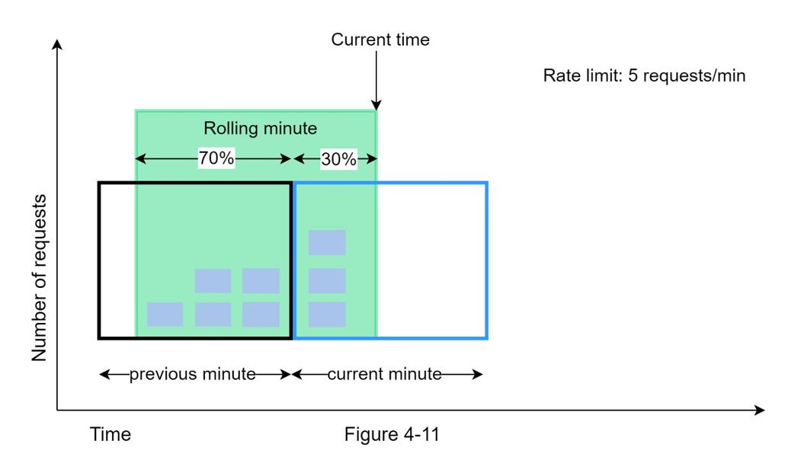

假设限速器每分钟最多允许 7 个请求，前一分钟有 5 个请求，当前分钟有 3 个请求。对于当前分钟到达 30% 位置的新请求，滚动窗口中的请求数使用以下公式计算：

- 当前窗口中的请求+上一个窗口中的请求*滚动窗口和上一个窗口的重叠百分比
- 使用这个公式，我们得到 3 + 5 * 0.7% = 6.5 个请求。根据用例，数字可以向上或向下舍入。在我们的示例中，它向下舍入为 6。

由于限速器每分钟最多允许 7 个请求，因此当前请求可以通过。但是，再收到一个请求后将达到限制。

限于篇幅，这里不再讨论其他实现。有兴趣的读者可以参考参考资料[9]。这个算法并不完美。它有优点和缺点。

优点

- 它消除了流量峰值，因为速率基于前一个窗口的平均速率。
- 内存效率。

缺点

- 它只适用于不那么严格的回溯窗口。这是实际速率的近似值，因为它假设前一个窗口中的请求是均匀分布的。然而，这个问题可能并不像看起来那么糟糕。根据 Cloudflare [10] 所做的实验，在 4 亿个请求中，只有 0.003% 的请求被错误地允许或速率限制。

##### 高层架构
速率限制算法的基本思想很简单。在高层，我们需要一个计数器来跟踪从同一用户、IP 地址等发送了多少请求。如果计数器大于限制，则不允许该请求。

我们应该在哪里存放柜台？由于磁盘访问速度较慢，使用数据库不是一个好主意。选择内存缓存是因为它速度快并且支持基于时间的过期策略。例如，Redis [11] 是实现速率限制的流行选项。它是一个内存存储，提供两个命令：INCR 和 EXPIRE。

- INCR：将存储的计数器加1。
- EXPIRE：设置计数器的超时时间。如果超时到期，计数器将被自动删除。
    图 4-12 显示了速率限制的高级架构，其工作原理如下：
    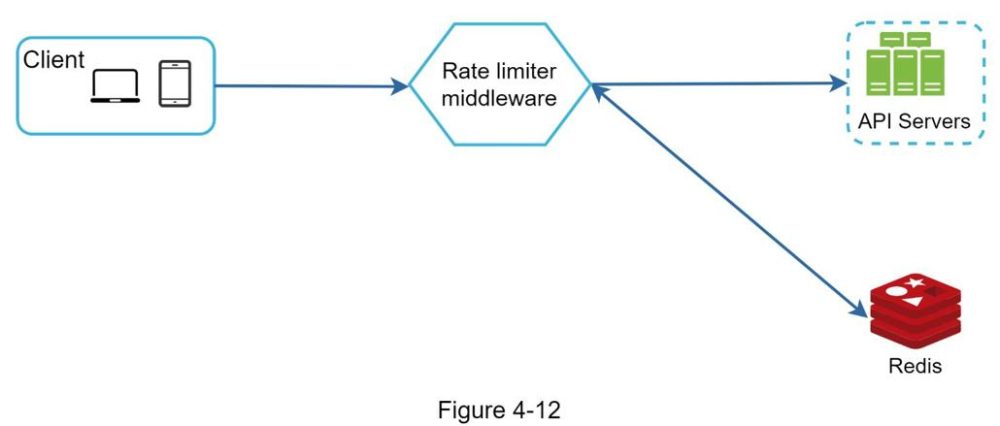
- 客户端向速率限制中间件发送请求。
- 限速中间件从Redis 中相应的bucket 中获取counter 并检查是否达到了限制。
    - 如果达到限制，请求将被拒绝。
    - 如果未达到限制，则将请求发送到 API 服务器。同时，系统增加计数器并将其保存回 Redis。

### 第3步 - 设计深入研究
图 4-12 中的高级设计没有回答以下问题：

- 限速规则是如何创建的？ 规则存储在哪里？
- 如何处理速率受限的请求？

在本节中，我们将首先回答有关限速规则的问题，然后介绍处理限速请求的策略。 最后，我们将讨论分布式环境中的速率限制、详细设计、性能优化和监控。

#### 限速规则
Lyft 开源了他们的限速组件~[12]~。 我们将窥视组件内部并查看一些速率限制规则的示例：

```yaml
domain: messaging
descriptors:
  - key: message_type
    Value: marketing
    rate_limit:
      unit: day
      requests_per_unit: 5
```

在上面的示例中，系统配置为每天最多允许 5 条营销消息。 这是另一个例子：

```yaml
domain: auth
descriptors:
  - key: auth_type
    Value: login
    rate_limit:
      unit: minute
      requests_per_unit: 5
```

该规则表明客户端在 1 分钟内登录次数不得超过 5 次。规则通常写在配置文件中并保存在磁盘上。

#### 超过速率限制
如果请求受到速率限制，API 会向客户端返回 HTTP 响应代码 429（请求过多）。根据用例，我们可能会将限速请求排入队列以待稍后处理。例如，如果某些订单由于系统过载而受到限价，我们可能会将这些订单留待以后处理。

#### 限速器标头
客户端如何知道它是否被限制？客户端如何知道在被限制之前允许的剩余请求数？答案在于 HTTP 响应标头。限速器向客户端返回以下 HTTP 标头：

X-Ratelimit-Remaining：窗口内允许的剩余请求数。

X-Ratelimit-Limit：表示客户端每个时间窗口可以进行多少次调用。

X-Ratelimit-Retry-After：等待的秒数，直到你可以再次发出请求而不会受到限制。

当用户发送的请求过多时，会向客户端返回 429 too many requests 错误和 X-Ratelimit-Retry-After 标头。

#### 详细设计
图 4-13 展示了系统的详细设计。


- 规则存储在磁盘上。 工作人员经常从磁盘中提取规则并将它们存储在缓存中。
- 当客户端向服务器发送请求时，请求首先被发送到限速器中间件。
- 限速器中间件从缓存中加载规则。 它从 Redis 缓存中获取计数器和上次请求时间戳。 根据响应，限速器决定：
  - 如果请求没有速率限制，它被转发到API服务器。
  - 如果请求是限速的，限速器向客户端返回 429 too many requests 错误。 同时，请求被丢弃或转发到队列。

#### 分布式环境中的限速器
构建一个在单服务器环境中工作的限速器并不困难。 但是，扩展系统以支持多个服务器和并发线程是另一回事。 有两个挑战：

- 竞态条件
- 同步问题

##### 竞态条件

如前所述，限速器在高级别的工作如下：

- 从Redis 读取计数器值。
- 检查（计数器+1）是否超过阈值。
- 如果不是，则在 Redis 中将计数器值增加 1。

竞态条件可能发生在高度并发的环境中，如图 4-14 所示。


假设 Redis 中的计数器值为 3。如果两个请求在其中任何一个写回该值之前同时读取计数器值，则每个请求都会将计数器加 1 并将其写回而不检查另一个线程。两个请求（线程）都认为它们具有正确的计数器值 4。但是，正确的计数器值应该是 5。

锁是解决竞争条件最明显的解决方案。但是，锁会显着降低系统速度。通常使用两种策略来解决该问题：Lua 脚本 ~[13]~ 和 Redis ~[8]~ 中的排序集数据结构。对这些策略感兴趣的读者，请参阅相应的参考资料 ~[8]~ ~[13]~。

##### 同步问题

同步是分布式环境中要考虑的另一个重要因素。要支持数百万用户，一台限速器服务器可能不足以处理流量。当使用多个限速器服务器时，需要同步。例如，在图 4-15 的左侧，客户端 1 向限速器 1 发送请求，客户端 2 向限速器 2 发送请求。由于 Web 层是无状态的，客户端可以向不同的限速器发送请求，如图所示在图 4-15 的右侧。如果没有同步发生，则限速器 1 不包含客户端 2 的任何数据。因此，限速器无法正常工作。


一种可能的解决方案是使用允许客户端将流量发送到相同限速器的粘性会话。 此解决方案不可取，因为它既不可扩展也不灵活。 更好的方法是使用像 Redis 这样的集中式数据存储。 设计如图 4-16 所示。


#### 性能优化
性能优化是系统设计面试中的一个常见话题。我们将涵盖两个需要改进的方面。

首先，多数据中心设置对于限速器至关重要，因为远离数据中心的用户延迟很高。大多数云服务提供商在世界各地建立了许多边缘服务器位置。例如，截至 2020 年 5 月 20 日，Cloudflare 拥有 194 台地理分布的边缘服务器~[14]~。流量会自动路由到最近的边缘服务器以减少延迟。


其次，将数据与最终一致性模型同步。如果你对最终一致性模型不清楚，请参阅“第 6 章：设计键值存储”中的“一致性”部分。

#### 监控

设置限速器后，收集分析数据以检查限速器是否有效非常重要。首先，我们要确保：

- 限速算法有效。
- 限速规则有效。

例如，如果速率限制规则过于严格，则会丢弃许多有效请求。在这种情况下，我们想稍微放宽规则。在另一个示例中，我们注意到限速器在流量突然增加（如限时抢购）时变得无效。在这种情况下，我们可能会更换算法来支持突发流量。令牌桶很适合这里。

### 第 4 步 - 总结
在本章中，我们讨论了不同的速率限制算法及其优缺点。讨论的算法包括：

- 令牌桶
- 漏桶
- 固定窗口
- 滑动窗口日志
- 滑动窗口柜台

然后，我们讨论了系统架构、分布式环境中的限速器、性能优化和监控。与任何系统设计面试问题类似，如果时间允许，你还可以提及其他谈话要点：

- 硬与软速率限制。
  - 硬件：请求数不能超过阈值。
  - 软件：请求可以在短时间内超过阈值。

- 不同级别的速率限制。在本章中，我们只讨论了应用程序级别（HTTP：第 7 层）的速率限制。可以在其他层应用速率限制。例如，你可以使用 Iptables [15]（IP：第 3 层）通过 IP 地址应用速率限制。注意：开放系统互连模型（OSI 模型）有 7 层 [16]：第 1 层：物理层，第 2 层：数据链路层，第 3 层：网络层，第 4 层：传输层，第 5 层：会话层，层6：表示层，第 7 层：应用层。
  - 避免受到速率限制。使用最佳实践设计你的客户：
    - 使用客户端缓存来避免频繁的API调用。
    - 了解限制，不要在短时间内发送太多请求。
    - 包含捕获异常或错误的代码，以便你的客户可以从异常中优雅地恢复。
    - 添加足够的回退时间来重试逻辑。


恭喜你走到这一步！现在拍拍自己的后背。好工作！

### 参考资料
[1] 限速策略和技术：https://cloud.google.com/solutions/rate-limiting-strategies-techniques
[2] Twitter 速率限制：https://developer.twitter.com/en/docs/basics/rate-limits
[3] 谷歌文档使用限制：https://developers.google.com/docs/api/limits
[4] IBM 微服务：https://www.ibm.com/cloud/learn/microservices
[5] 节流 API 请求以获得更好的吞吐量：https://docs.aws.amazon.com/apigateway/latest/developerguide/api-gateway-request-throttling.html
[6] 条带限速器：https://stripe.com/blog/rate-limiters
[7] Shopify REST Admin API 速率限制：https://help.shopify.com/en/api/reference/rest-admin-api-rate-limits
[8] Redis Sorted Sets 更好的速率限制：https://engineering.classdojo.com/blog/2015/02/06/rolling-rate-limiter/
[9] 系统设计——限速器和数据建模：https://medium.com/@saisandepmopuri/system-design-rate-limiter-and-data-modelling-9304b0d18250
[10] 我们如何构建能够扩展到数百万个域的速率限制：https://blog.cloudflare.com/counting-things-a-lot-of-different-things/
[11] Redis网站：https://redis.io/
[12] Lyft限速：https://github.com/lyft/ratelimit
[13] 使用限速器扩展 API：https://gist.github.com/ptarjan/e38f45f2dfe601419ca3af937fff574d#request-rate-limiter
[14] 什么是边缘计算：https://www.cloudflare.com/learning/serverless/glossary/what-is-edge-computing/
[15] 使用 Iptables 的速率限制请求：https://blog.programster.org/rate-limit-requests-with-iptables
[16] OSI 模型：https://en.wikipedia.org/wiki/OSI_model#Layer_architecture
