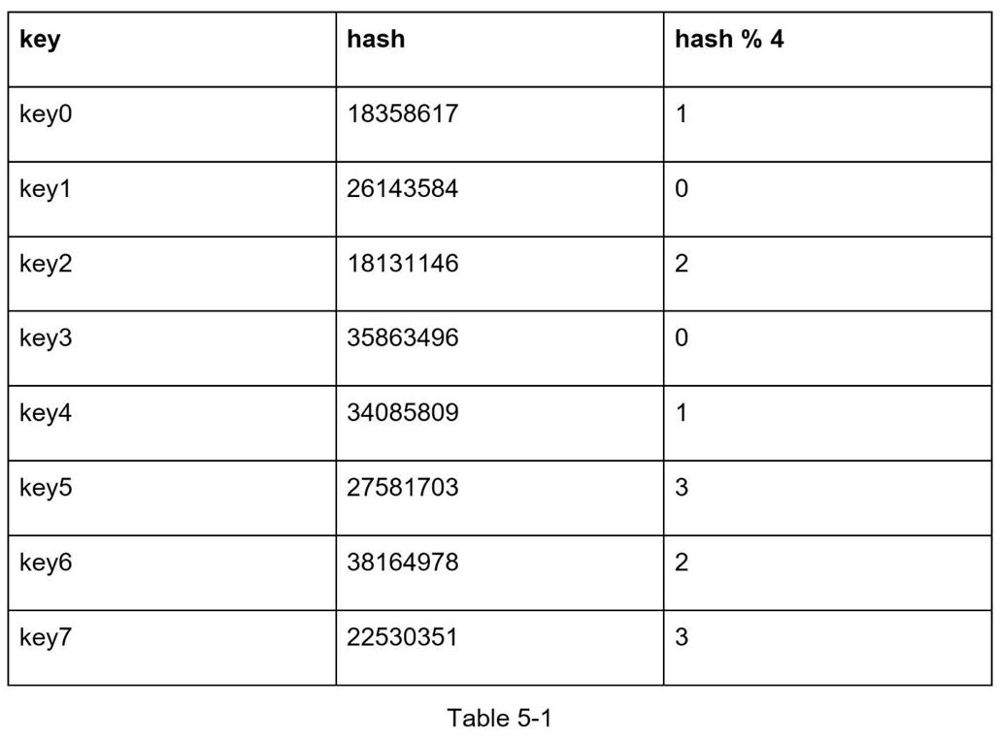
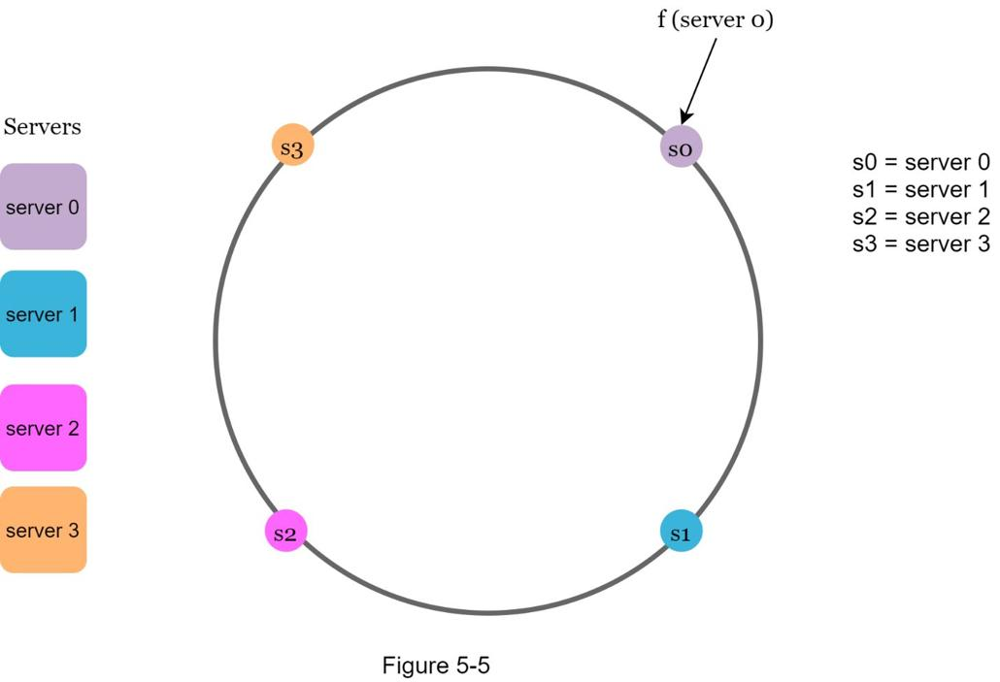

## 设计一致哈希
为了实现水平扩展，在服务器之间高效、均匀地分配请求/数据非常重要。 一致性哈希是实现此目标的常用技术。 但首先，让我们深入研究一下这个问题。

### 重散列问题
如果你有 n 个缓存服务器，平衡负载的常用方法是使用以下哈希方法：
```serverIndex = hash(key) % N```，其中 N 是服务器池的大小。
让我们用一个例子来说明它是如何工作的。 如表 5-1 所示，我们有 4 个服务器和 8 个字符串键及其哈希值。



要获取存储密钥的服务器，我们执行模块化操作 f(key) % 4。例如，```hash(key0) % 4 = 1``` 意味着客户端必须联系服务器 1 以获取缓存的数据。 图 5-1 显示了基于表 5-1 的密钥分布。


这种方式在服务器池大小固定、数据分布均匀的情况下效果很好。 但是，当添加新服务器或删除现有服务器时会出现问题。 例如，如果服务器 1 下线，则服务器池的大小变为 3。使用相同的哈希函数，我们得到一个键的相同哈希值。 但是应用模块化操作给了我们不同的服务器索引，因为服务器的数量减少了 1。我们通过应用 hash % 3 得到如表 5-2 所示的结果：


图 5-2 显示了基于表 5-2 的新密钥分配。

如图 5-2 所示，大多数密钥都被重新分配，而不仅仅是最初存储在离线服务器（服务器 1）中的密钥。 这意味着当服务器 1 离线时，大多数缓存客户端将连接到错误的服务器以获取数据。 这会导致缓存未命中风暴。 一致散列是缓解此问题的有效技术。

### 一致性哈希
> 引用自维基百科：“一致散列是一种特殊的散列，当重新调整散列表大小并使用一致散列时，平均只需要重新映射 k/n 个键，其中 k 是键的数量，并且 n 是槽数。相比之下，在大多数传统哈希表中，数组槽数的变化会导致几乎所有键都被重新映射 [1]”。

#### 哈希空间和哈希环

现在我们了解了一致性哈希的定义，让我们看看它是如何工作的。 假设使用SHA-1作为散列函数f，散列函数的输出范围为：```x0, x1, x2, x3, ..., xn```。 在密码学中，SHA-1 的散列空间从 0 到 2^160 - 1。这意味着 x0 对应于 0，xn 对应于 2^160 - 1，中间的所有其他散列值都在 0 到 2^160 之间 - 1. 图 5-3 显示了哈希空间。


通过连接两端，我们得到一个哈希环，如图 5-4 所示：


### 哈希服务器
使用相同的哈希函数 f，我们将基于服务器 IP 或名称的服务器映射到环上。 如图 5-5 所示，在哈希环上映射了 4 个服务器。



### 哈希键
值得一提的是，这里使用的散列函数与“重新散列问题”中的散列函数不同，没有模运算。 如图 5-6 所示，将 4 个缓存键（key0、key1、key2 和 key3）散列到散列环上


### 服务器查找
为了确定密钥存储在哪个服务器上，我们从环上的密钥位置顺时针移动，直到找到服务器。 图 5-7 解释了这个过程。 顺时针方向，key0 存储在服务器 0 上； key1 存储在服务器 1 上； key2 存储在服务器 2 上，而 key3 存储在服务器 3 上。


### 添加服务器
使用上述逻辑，添加新服务器只需要重新分配一小部分密钥。

图 5-8 中，添加新的服务器 4 后，只需要重新分配 key0。 k1、k2 和 k3 保留在相同的服务器上。 让我们仔细看看其中的逻辑。 在添加服务器 4 之前，key0 存储在服务器 0 上。现在，key0 将存储在服务器 4 上，因为服务器 4 是它遇到的第一个服务器，从 key0 在环上的位置顺时针移动。 其他密钥不会基于一致的散列算法重新分配。


### 删除服务器
移除服务器后，只有一小部分密钥需要使用一致的散列重新分配。在图 5-9 中，当服务器 1 被移除时，只有 key1 必须重新映射到服务器 2。其余的键不受影响。


### 基本方法中的两个问题

Karger 等人介绍了一致性哈希算法。在麻省理工学院[1]。基本步骤是：

- 使用均匀分布的散列函数将服务器和密钥映射到环上。
- 要找出密钥映射到哪个服务器，从密钥位置顺时针移动，直到找到环上的第一个服务器。

这种方法确定了两个问题。首先，考虑到可以添加或删除服务器，不可能为所有服务器在环上保持相同大小的分区。分区是相邻服务器之间的哈希空间。分配给每个服务器的环上的分区大小可能非常小或相当大。在图 5-10 中，如果 s1 被删除，s2 的分区（用双向箭头突出显示）是 s0 和 s3 的分区的两倍。


其次，环上的密钥分布可能不均匀。例如，如果服务器映射到图 5-11 中列出的位置，则大部分键都存储在服务器 2 上。但是，服务器 1 和服务器 3 没有数据。


一种称为虚拟节点或副本的技术用于解决这些问题。

### 虚拟节点
虚拟节点指的是真实节点，每台服务器由环上的多个虚拟节点表示。在图 5-12 中，服务器 0 和服务器 1 都有 3 个虚拟节点。 3是任意选择的；而在现实世界的系统中，虚拟节点的数量要大得多。我们没有使用 s0，而是使用 s0_0、s0_1 和 s0_2 来表示环上的服务器 0。同样，s1_0、s1_1 和 s1_2 代表环上的服务器 1。使用虚拟节点，每个服务器负责多个分区。标签为 s0 的分区（边）由服务器 0 管理。另一方面，标签为 s1 的分区由服务器 1 管理。


为了找到密钥存储在哪个服务器上，我们从密钥的位置顺时针移动，找到在环上遇到的第一个虚拟节点。在图 5-13 中，为了找出存储 k0 的服务器，我们从 k0 的位置顺时针方向找到虚拟节点 s1_1，它指的是服务器 1。


随着虚拟节点数量的增加，密钥的分布变得更加平衡。这是因为随着虚拟节点的增加，标准差会变小，从而导致数据分布平衡。标准差衡量数据的分布方式。在线研究 [2] 进行的一项实验结果表明，对于一两百个虚拟节点，标准差在平均值的 5%（200 个虚拟节点）和 10%（100 个虚拟节点）之间。当我们增加虚拟节点的数量时，标准偏差会更小。但是，需要更多空间来存储有关虚拟节点的数据。这是一个权衡，我们可以调整虚拟节点的数量以适应我们的系统要求。

### 查找受影响的键
添加或删除服务器时，需要重新分配一小部分数据。我们如何找到受影响的范围来重新分配密钥？
在图 5-14 中，服务器 4 被添加到环上。受影响的范围从 s4（新添加的节点）开始，沿环逆时针方向移动，直到找到服务器（s3）。因此，位于 s3 和 s4 之间的密钥需要重新分配给 s4。


当如图 5-15 所示移除服务器 (s1) 时，受影响的范围从 s1（移除的节点）开始，沿环逆时针方向移动，直到找到服务器 (s0)。因此，位于 s0 和 s1 之间的密钥必须重新分配给 s2。


### 总结
在本章中，我们深入讨论了一致性哈希，包括为什么需要它以及它是如何工作的。 一致散列的好处包括：

- 在添加或删除服务器时重新分配最小化的密钥。
- 易于横向扩展，因为数据分布更均匀。
- 缓解热点关键问题。 对特定分片的过度访问可能会导致服务器过载。 想象一下 Katy Perry、Justin Bieber 和 Lady Gaga 的数据最终都在同一个分片上。 一致的散列有助于通过更均匀地分布数据来缓解问题。

一致性哈希在现实世界的系统中被广泛使用，包括一些值得注意的：

- Amazon Dynamo 数据库的分区组件[3]
- Apache Cassandra [4] 中跨集群的数据分区
- Discord 聊天应用程序 [5]
- Akamai 内容交付网络 [6]
- 磁悬浮网络负载均衡器 [7]

恭喜你走到这一步！ 现在鼓励一下自己， 非常棒！

### 参考资料
1. 一致性哈希：https://en.wikipedia.org/wiki/Consistent_hashing
2. 一致哈希：https://tom-e-white.com/2007/11/consistent-hashing.html
3. Dynamo：亚马逊的高可用键值存储：https://www.allthingsdistributed.com/files/amazon-dynamo-sosp2007.pdf
4. Cassandra - 去中心化结构化存储系统：http://www.cs.cornell.edu/Projects/ladis2009/papers/Lakshman-ladis2009.PDF
5. Discord 如何将 Elixir 扩展到 5,000,000 个并发用户：https://blog.discord.com/scaling-elixir-f9b8e1e7c29b
6. CS168：现代算法工具箱讲座#1：介绍和一致性哈希：http://theory.stanford.edu/~tim/s16/l/l1.pdf
7. Maglev：快速可靠的软件网络负载均衡器：https://static.googleusercontent.com/media/research.google.com/en//pubs/archive/44824.pdf
