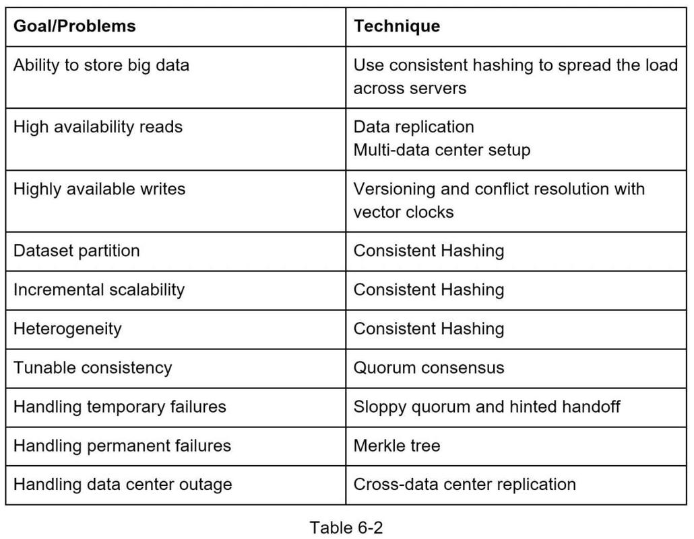

## 设计一个键值数据库
键值存储，也称为键值数据库，是一种非关系型数据库。 每个唯一标识符都存储为与其关联值的键。 这种数据对被称为“键值”对。

在键值对中，键必须是唯一的，并且可以通过键访问与键关联的值。 键可以是纯文本或散列值。 出于性能原因，短键效果更好。 钥匙长什么样？ 这里有一些例子：

- 纯文本键："last_logged_in_at"
- 散列键：253DDEC4

键值对中的值可以是字符串、列表、对象等。该值通常在键值存储中被视为不透明对象，例如 Amazon dynamo [1]、Memcached [2]、Redis [3] ， 等等。

这是键值存储中的数据片段：


在本章中，你被要求设计一个支持以下操作的键值存储：

- ```put(key, value)``` // 插入与“key”关联的“value”

- ```get(key)``` // 获取与“key”关联的“value”

### 了解问题并确定设计范围
没有完美的设计。 每个设计都在读取、写入和内存使用的权衡方面实现了特定的平衡。 另一个需要权衡的是一致性和可用性。 在本章中，我们设计了一个包含以下特征的键值对存储：

- 键值对的大小很小：小于 10 KB。
- 存储大数据的能力。
- 高可用性：系统响应迅速，即使在发生故障时也是如此。
- 高扩展性：系统可以扩展以支持大数据集。
- 自动扩展：服务器的添加/删除应该是基于流量自动的。
- 可调一致性。
- 低延迟。

### 单服务器键值存储
开发驻留在单个服务器中的键值存储很容易。 一种直观的方法是将键值对存储在哈希表中，它将所有内容都保存在内存中。 尽管内存访问速度很快，但由于空间限制，将所有内容都放入内存中可能是不可能的。 可以进行两项优化以在单个服务器中容纳更多数据：
- 数据压缩
- 仅将常用数据存储在内存中，其余数据存储在磁盘中

即使进行了这些优化，单个服务器也可以很快达到其容量。 需要分布式键值存储来支持大数据。

### 分布式键值存储
分布式键值存储也称为分布式哈希表，它将键值对分布在多个服务器上。在设计分布式系统时，了解 CAP（一致性、可用性、分区容错性）定理很重要。

#### CAP定理
CAP 定理指出，分布式系统不可能同时提供这三个保证中的两个以上：一致性、可用性和分区容错性。让我们建立一些定义。

- 一致性：一致性意味着所有客户端在同一时间看到相同的数据，无论他们连接到哪个节点。
- 可用性：可用性意味着任何请求数据的客户端都会得到响应，即使某些节点已关闭。
- 分区容错性：分区表示两个节点之间的通信中断。分区容错性意味着尽管存在网络分区，系统仍可继续运行。

CAP 定理指出，必须牺牲三个属性之一来支持 3 个属性中的 2 个，如图 6-1 所示。


如今，键值存储基于它们支持的两个 CAP 特征进行分类：

- CP（一致性和分区容错）系统：CP键值存储支持一致性和分区容错，同时牺牲可用性。
- AP（可用性和分区容错）系统：AP键值存储支持可用性和分区容错，同时牺牲一致性。
- CA（一致性和可用性）系统：CA 键值存储支持一致性和可用性，同时牺牲分区容错。由于网络故障是不可避免的，分布式系统必须容忍网络分区。因此，CA 系统不能存在于现实世界的应用程序中。

你在上面阅读的内容主要是定义部分。为了更容易理解，让我们看一些具体的例子。在分布式系统中，数据通常被复制多次。假设数据在三个副本节点n1、n2 和n3 上复制，如图6-2 所示。

#### 理想情况
在理想世界中，网络分区永远不会发生。写入 n1 的数据会自动复制到 n2 和 n3。实现了一致性和可用性。


#### 真实世界的分布式系统
在分布式系统中，分区是无法避免的，当分区发生时，我们必须在一致性和可用性之间做出选择。在图 6-3 中，n3 出现故障，无法与 n1 和 n2 通信。如果客户端将数据写入 n1 或 n2，则数据无法传播到 n3。如果数据写入 n3 但尚未传播到 n1 和 n2，则 n1 和 n2 将具有陈旧数据。


如果我们选择一致性优于可用性（CP系统），我们必须阻止所有对n1和n2的写操作，以避免这三个服务器之间的数据不一致，从而导致系统不可用。银行系统通常具有极高的一致性要求。例如，银行系统显示最新的余额信息至关重要。如果由于网络分区导致不一致，银行系统会在不一致解决之前返回错误。

但是，如果我们选择可用性而不是一致性（AP 系统），系统会继续接受读取，即使它可能会返回陈旧的数据。对于写入，n1 和 n2 将继续接受写入，当网络分区解决时，数据将同步到 n3。

选择正确的 CAP 保证适合你的用例是构建分布式键值存储的重要一步。你可以与面试官讨论这个问题并相应地设计系统。

### 系统组件

在本节中，我们将讨论以下用于构建键值存储的核心组件和技术：

- 数据分区
- 数据复制
- 一致性
- 不一致的解决方案
- 处理故障
- 系统架构图
- 写入路径
- 读取路径

以下内容主要基于三个流行的键值存储系统：Dynamo [4]、Cassandra [5] 和 BigTable [6]。

#### 数据分区

对于大型应用程序，将完整的数据集放在单个服务器中是不可行的。实现这一点的最简单方法是将数据拆分为更小的分区并将它们存储在多个服务器中。对数据进行分区时有两个挑战：

- 在多台服务器上均匀分布数据。
- 在添加或删除节点时最小化数据移动。

第 5 章中讨论的一致散列是解决这些问题的一个很好的技术。让我们从高层次重新审视一致性哈希的工作原理。

- 首先，服务器被放置在一个哈希环上。在图 6-4 中，由 s0、s1、...、s7 表示的八个服务器被放置在哈希环上。
- 接下来，将一个密钥散列到同一个环上，并将其存储在顺时针方向移动时遇到的第一个服务器上。例如，key0 使用此逻辑存储在 s1 中。


使用一致性哈希对数据进行分区具有以下优点：

- 自动扩展：可以根据负载自动添加和删除服务器。
- 异构性：服务器的虚拟节点数量与服务器容量成正比。例如，容量更高的服务器分配有更多的虚拟节点。

#### 数据复制
为了实现高可用性和可靠性，必须在 N 个服务器上异步复制数据，其中 N 是一个可配置参数。这 N 个服务器的选择使用以下逻辑：在一个 key 映射到哈希环上的一个位置后，从该位置顺时针走，并选择环上的前 N 个服务器来存储数据副本。在图 6-5 (N = 3) 中，key0 在 s1、s2 和 s3 处复制。


对于虚拟节点，环上的前 N 个节点可能由少于 N 个物理服务器拥有。为了避免这个问题，我们只在执行顺时针走逻辑时选择唯一的服务器。

由于停电、网络问题、自然灾害等原因，同一数据中心的节点经常会同时出现故障。为了更好的可靠性，副本被放置在不同的数据中心，数据中心通过高速网络连接。

#### 一致性
由于数据在多个节点上复制，因此必须跨副本同步。 Quorum 共识可以保证读写操作的一致性。 让我们首先建立一些定义。

N = 副本数

W = 大小为 W 的写入仲裁。要使写入操作被视为成功，必须从 W 个副本确认写入操作。

R = 大小为 R 的读取仲裁。要使读取操作被视为成功，读取操作必须等待至少 R 个副本的响应。

考虑下图 6-6 中 N = 3 的示例。


W = 1 并不意味着数据写入一台服务器。例如，使用图 6-6 中的配置，数据在 s0、s1 和 s2 处复制。 W = 1 意味着在写操作被认为成功之前，协调器必须至少收到一个确认。例如，如果我们从 s1 得到确认，我们不再需要等待来自 s0 和 s2 的确认。协调器充当客户端和节点之间的代理。

W、R 和 N 的配置是延迟和一致性之间的典型权衡。如果 W = 1 或 R = 1，则操作会很快返回，因为协调器只需要等待任何副本的响应。如果 W 或 R > 1，则系统提供更好的一致性；但是，查询会变慢，因为协调器必须等待最慢副本的响应。

如果 W + R > N，则保证强一致性，因为必须至少有一个重叠节点有最新的数据才能保证一致性。

如何配置 N、W 和 R 以适应我们的用例？以下是一些可能的设置：

如果 R = 1 且 W = N，则系统针对快速读取进行了优化。

如果 W = 1 且 R = N，则系统针对快速写入进行了优化。

如果 W + R > N，则保证强一致性（通常 N = 3，W = R = 2）。

如果 W + R <= N，则无法保证强一致性。

根据要求，我们可以调整 W、R、N 的值以达到所需的一致性水平。

##### 一致性模型

一致性模型是设计键值存储时要考虑的另一个重要因素。一致性模型定义了数据一致性的程度，并且存在多种可能的一致性模型：

- 强一致性：任何读操作都返回一个与最近更新的写数据项的结果相对应的值。客户永远不会看到过时的数据。
- 弱一致性：后续的读取操作可能看不到最新的值。
- 最终一致性：这是弱一致性的一种特殊形式。给定足够的时间，所有更新都会传播，并且所有副本都是一致的。

强一致性通常通过强制副本不接受新的读/写来实现，直到每个副本都同意当前的写入。这种方法对于高可用性系统并不理想，因为它可能会阻止新操作。 Dynamo 和 Cassandra 采用最终一致性，这是我们推荐的键值存储一致性模型。从并发写入，最终一致性允许不一致的值进入系统并强制客户端读取值以进行协调。下一节将解释协调如何与版本控制一起工作。

#### 不一致的解决方案：版本控制
复制提供了高可用性，但会导致副本之间的不一致。 版本控制和矢量时钟用于解决不一致问题。 版本控制意味着将每个数据修改视为新的不可变数据版本。 在讨论版本控制之前，让我们用一个例子来解释不一致是如何发生的：

如图 6-7 所示，副本节点 n1 和 n2 具有相同的值。 让我们将此值称为原始值。 服务器 1 和服务器 2 获得相同的 get(“name”) 操作值。


接下来，服务器 1 将名称更改为“johnSanFrancisco”，服务器 2 将名称更改为“johnNewYork”，如图 6-8 所示。这两个变化是同时进行的。现在，我们有冲突的值，称为版本 v1 和 v2。


在此示例中，可以忽略原始值，因为修改是基于它的。但是，没有明确的方法可以解决最后两个版本的冲突。为了解决这个问题，我们需要一个可以检测冲突和协调冲突的版本控制系统。矢量时钟是解决此问题的常用技术。让我们看看矢量时钟是如何工作的。

矢量时钟是与数据项关联的 [server, version] 对。它可用于检查一个版本是否先于、成功或与其他版本冲突。

假设向量时钟由 D([S1, v1], [S2, v2], ..., [Sn, vn]) 表示，其中 D 是数据项，v1 是版本计数器，s1 是服务器编号，等等，如果数据项 D 被写入服务器 Si，系统必须执行以下任务之一。

- 如果[Si, vi] 存在，则增加vi。
- 否则，创建一个新条目[Si, 1]。

上面的抽象逻辑用一个具体的例子来解释，如图 6-9 所示。


1. 客户端向系统写入数据项 D1，写入由服务器 Sx 处理，服务器 Sx 现在具有矢量时钟 D1[(Sx, 1)]。
2. 另一个客户端读取最新的 D1，将其更新为 D2，然后将其写回。 D2 从 D1 降级，因此它会覆盖 D1。假设写入由同一个服务器 Sx 处理，该服务器现在具有矢量时钟 D2([Sx, 2])。
3. 另一个客户端读取最新的 D2，将其更新为 D3，然后将其写回。假设写入由服务器 Sy 处理，它现在具有矢量时钟 D3([Sx, 2], [Sy, 1]))。
4. 另一个客户端读取最新的 D2，将其更新为 D4，然后将其写回。假设写入由服务器 Sz 处理，它现在具有 D4([Sx, 2], [Sz, 1]))。
5. 另一个客户端在读取D3和D4时发现冲突，这是由于数据项D2被Sy和Sz修改造成的。冲突由客户端解决并将更新的数据发送到服务器。假设写入由 Sx 处理，它现在具有 D5([Sx, 3], [Sy, 1], [Sz, 1])。我们将很快解释如何检测冲突。

使用矢量时钟，如果 Y 的矢量时钟中每个参与者的版本计数器大于或等于版本 X 中的版本计数器，则很容易判断版本 X 是版本 Y 的祖先（即没有冲突）。例如，向量时钟 D([s0, 1], [s1, 1])] 是 D([s0, 1], [s1, 2]) 的祖先。因此，不会记录冲突。

类似地，如果 Y 的向量时钟中有任何参与者的计数器小于其在 X 中的对应计数器，则可以判断版本 X 是 Y 的兄弟（即存在冲突）。例如，以下两个矢量时钟指示存在冲突：D([s0, 1], [s1, 2]) 和 D([s0, 2], [s1, 1])。

即使矢量时钟可以解决冲突，也有两个明显的缺点:

- 首先，向量时钟增加了客户端的复杂性，因为它需要实现冲突解决逻辑。
- 其次，向量时钟中的 [server:version] 可能快速增长。为了解决这个问题，我们为长度设置了一个阈值，如果超过限制，最旧的对将被删除。这会导致协调效率低下，因为无法准确确定后代关系。但是，基于 Dynamo 论文 [4]，亚马逊在生产中还没有遇到过这个问题；因此，对于大多数公司来说，这可能是一个可以接受的解决方案。

#### 处理故障
与任何大规模的大型系统一样，故障不仅不可避免，而且很常见。处理故障场景非常重要。在本节中，我们首先介绍检测故障的技术。然后，我们将讨论常见的故障解决策略。

##### 故障检测
在分布式系统中，仅仅因为另一台服务器这样说而相信一台服务器已关闭是不够的。通常，它需要至少两个独立的信息源来标记服务器。

如图 6-10 所示，all-to-all 组播是一种简单的解决方案。但是，当系统中有许多服务器时，这种方式非常低效。


更好的解决方案是使用分散式故障检测方法，如 gossip 协议。 Gossip 协议的工作原理如下：

- 每个节点维护一个节点成员列表，其中包含成员ID 和心跳计数器。
- 每个节点周期性地增加它的心跳计数器。
- 每个节点周期性地向一组随机节点发送心跳，这些节点依次传播到另一组节点。
- 一旦节点收到心跳，成员列表将更新为最新信息。
- 如果心跳没有在预定义时间内增加，则认为该成员离线。


如图 6-11 所示：

- 节点s0 维护一个显示在左侧的节点成员列表。
- 节点s0 注意到节点s2（成员ID = 2）的心跳计数器很长时间没有增加。
- 节点 s0 向一组随机节点发送包含 s2 信息的心跳。一旦其他节点确认s2的心跳计数器长时间没有更新，节点s2就被标记为down，并将这个信息传播给其他节点。

##### 处理临时故障
通过 gossip 协议检测到故障后，系统需要部署一定的机制来保证可用性。在严格的仲裁方法中，可以阻止读取和写入操作，如仲裁共识部分所示。

一种称为“sloppy quorum”[4] 的技术用于提高可用性。系统没有强制执行法定人数要求，而是选择前 W 个健康的服务器进行写入，并选择前 R 个健康的服务器进行哈希环上的读取。离线服务器被忽略。

如果由于网络或服务器故障导致服务器不可用，另一台服务器将临时处理请求。当宕机的服务器启动时，更改将被推回以实现数据一致性。这个过程称为提示切换。由于图 6-12 中 s2 不可用，读写操作将暂时由 s3 处理。当 s2 重新上线时，s3 会将数据交还给 s2。


##### 处理永久性故障
提示切换用于处理临时故障。 如果副本永久不可用怎么办？ 为了处理这种情况，我们实现了一个反熵协议来保持副本同步。 反熵涉及比较副本上的每条数据并将每个副本更新到最新版本。 Merkle 树用于不一致检测和最小化传输的数据量。

引用自 Wikipedia [7]：“哈希树或 Merkle 树是一棵树，其中每个非叶子节点都用其子节点的标签或值（如果是叶子）的哈希值进行标记。 哈希树允许对大型数据结构的内容进行有效和安全的验证”。

假设密钥空间从 1 到 12，以下步骤展示了如何构建 Merkle 树。 突出显示的框表示不一致。

第 1 步：将密钥空间划分为桶（在我们的示例中为 4 个），如图 6-13 所示。桶用作根级节点以保持树的有限深度。


第 2 步：创建桶后，使用统一散列方法对桶中的每个键进行散列（图 6-14）。


第 3 步：为每个桶创建一个哈希节点（图 6-15）。


第 4 步：通过计算子节点的哈希值向上构建树直到根节点（图 6-16）。


要比较两个 Merkle 树，首先要比较根哈希。如果根哈希匹配，则两台服务器具有相同的数据。如果根哈希不一致，则比较左子哈希，然后是右子哈希。你可以遍历树以查找未同步的存储桶并仅同步这些存储桶。

使用 Merkle 树，需要同步的数据量与两个副本之间的差异成正比，而不是它们包含的数据量。在现实世界的系统中，桶的大小相当大。例如，一个可能的配置是每十亿个键有一百万个桶，所以每个桶只包含 1000 个键。

##### 处理数据中心中断
数据中心中断可能由于停电、网络中断、自然灾害等原因发生。要构建能够处理数据中心中断的系统，跨多个数据中心复制数据非常重要。即使一个数据中心完全离线，用户仍然可以通过其他数据中心访问数据。

#### 系统架构图
既然我们已经讨论了设计键值对存储的不同技术考虑，我们可以将注意力转移到架构图上，如图 6-17 所示。


该架构的主要特点如下：

- 客户端通过简单的 API 与键值存储进行通信：```get(key)``` 和 ```put(key, value)```。
- 协调器是充当客户端和键值存储之间的代理的节点。
- 节点使用一致的散列分布在一个环上。
- 系统完全分散，因此添加和移动节点可以是自动的。
- 数据在多个节点上复制。
- 没有单点故障，因为每个节点都有相同的职责。

由于设计是分散的，每个节点执行许多任务，如图 6-18 所示。


#### 写入路径
图 6-19 解释了写请求被定向到特定节点后会发生什么。请注意，建议的写/读路径设计主要基于 Cassandra [8] 的架构。


1. 写请求被持久化在一个提交日志文件中。
2. 数据保存在内存缓存中。
3. 当内存缓存已满或达到预定义阈值时，数据被刷新到磁盘上的 SSTable [9]。 注意：排序字符串表 (SSTable) 是 <key, value> 对的排序列表。 对于有兴趣了解更多关于 SStable 的读者，请参阅参考资料 [9]。

#### 读取路径
在读取请求被定向到特定节点后，它首先检查数据是否在内存缓存中。 如果是，则将数据返回给客户端，如图 6-20 所示。


如果数据不在内存中，则会从磁盘中检索。 我们需要一种有效的方法来找出哪个 SSTable 包含密钥。 布隆过滤器[10]通常用于解决这个问题。

当数据不在内存中时，读取路径如图 6-21 所示。


1. 系统首先检查数据是否在内存中。 如果没有，请转到步骤 2。
2. 如果内存中没有数据，系统会检查布隆过滤器。
3. 布隆过滤器用于找出哪些 SSTables 可能包含密钥。
4. SSTables 返回数据集的结果。
5. 将数据集的结果返回给客户端。

### 概括
本章涵盖了许多概念和技术。 为了刷新你的记忆，下表总结了用于分布式键值存储的功能和相应的技术。



### 参考资料
1. 亚马逊 DynamoDB：https://aws.amazon.com/dynamodb/
2. 内存缓存：https://memcached.org/
3. Redis：https://redis.io/
4. Dynamo：亚马逊的高可用键值存储：https://www.allthingsdistributed.com/files/amazon-dynamo-sosp2007.pdf
5. 卡桑德拉：https://cassandra.apache.org/
6. Bigtable：结构化数据的分布式存储系统：https://static.googleusercontent.com/media/research.google.com/en//archive/bigtable-osdi06.pdf
7. 默克尔树：https://en.wikipedia.org/wiki/Merkle_tree
8. Cassandra架构：https://cassandra.apache.org/doc/latest/architecture/
9. SStable：https://www.igvita.com/2012/02/06/sstable-and-log-structured-storage-leveldb/
10. 布隆过滤器 https://en.wikipedia.org/wiki/Bloom_filter
