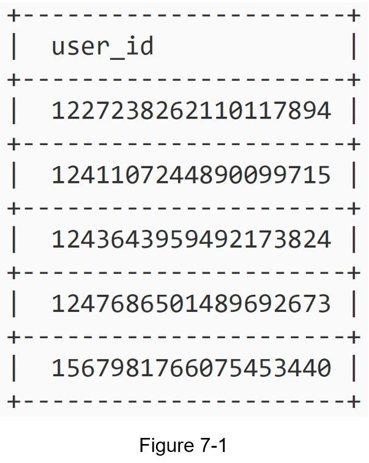
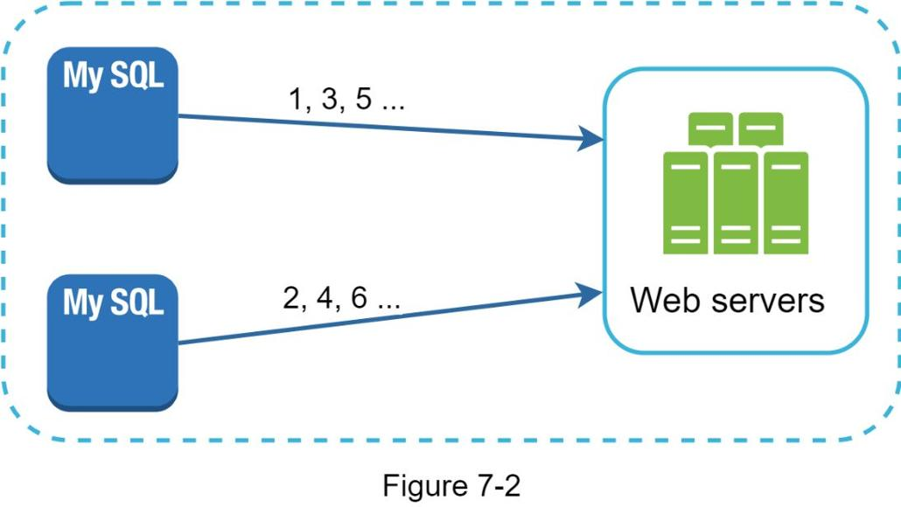
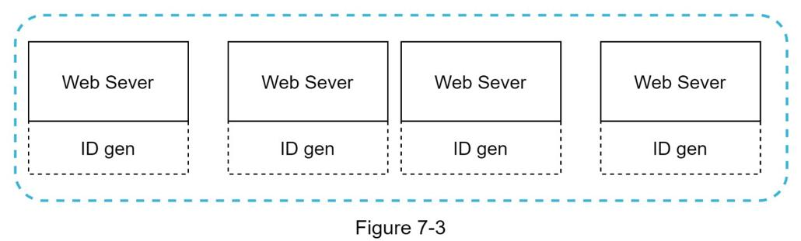
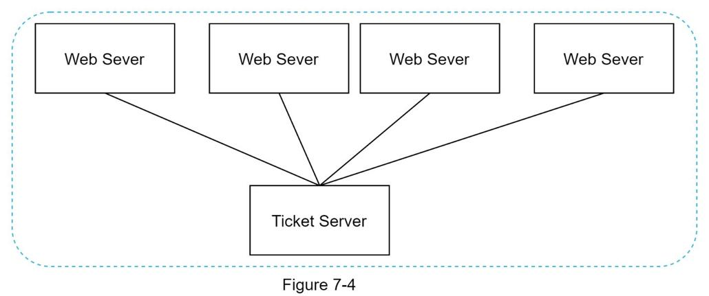
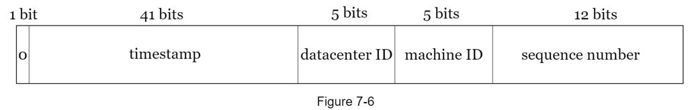
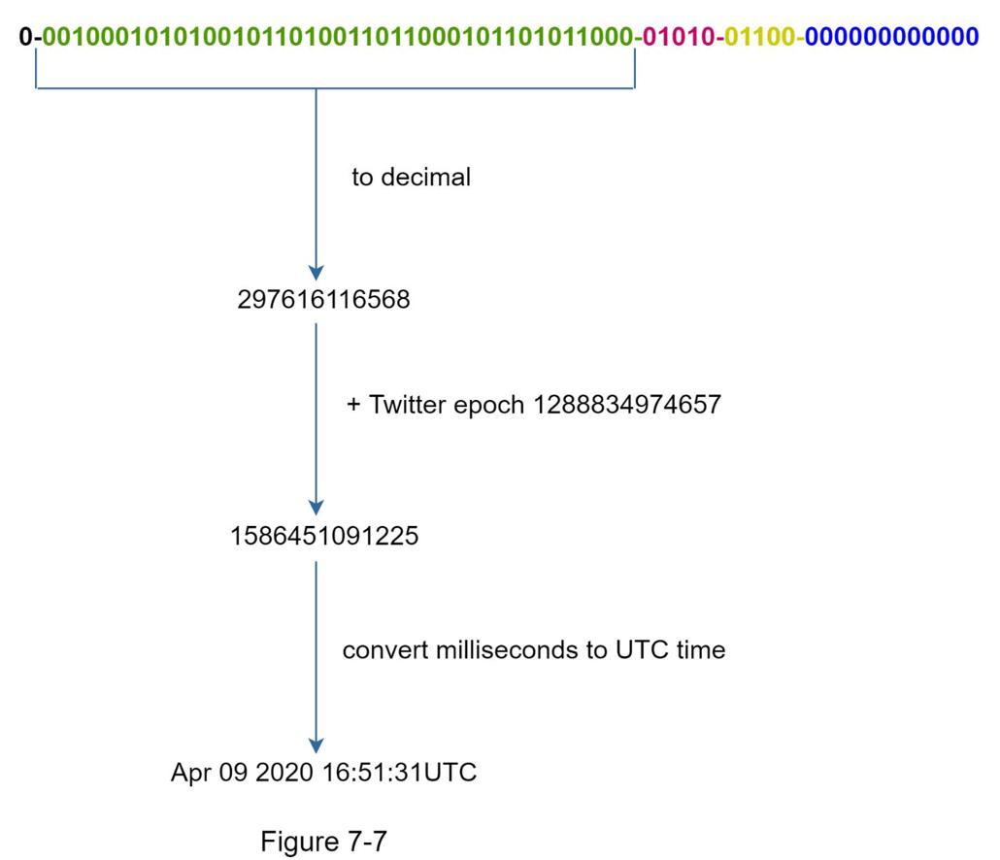

## 在分布式系统中设计唯一ID生成器
在本章中，你被要求在分布式系统中设计一个唯一的 ID 生成器。 你的第一个想法可能是在传统数据库中使用具有 auto_increment 属性的主键。 但是，auto_increment 在分布式环境中不起作用，因为单个数据库服务器不够大，并且以最小的延迟跨多个数据库生成唯一 ID 具有挑战性。

以下是一些唯一 ID 的示例：



### 第1步 - 了解问题并确定设计范围
提出澄清问题是解决任何系统设计面试问题的第一步。以下是候选人与面试官互动的示例：

候选人：唯一ID的特点是什么？
面试官：ID 必须是唯一且可排序的。
候选人：对于每条新记录，ID 是否会增加 1？
面试官：ID是按时间递增的，但不一定只递增1。晚上创建的ID比当天早上创建的要大。
候选人：ID是否只包含数值？
面试官：是的，没错。
候选人：身份证长度要求是多少？
面试官：ID 应该适合 64 位。
候选人：系统的规模是多少？
面试官：系统应该能够每秒生成 10000 个 ID。

以上是你可以向面试官提出的一些示例问题。了解需求并澄清歧义非常重要。对于本次面试问题，要求如下：

- ID 必须是唯一的。
- ID 只是数值。
- ID 适合64 位。
- ID 按日期排序。
- 每秒生成超过10,000 个唯一ID 的能力。

### 第2步 - 提出高级设计并获得支持
多个选项可用于在分布式系统中生成唯一 ID。我们考虑的选项是：

- 多主复制
- 通用唯一标识符（UUID）
- 售票服务器
- Twitter雪花方法

让我们看看它们中的每一个，它们是如何工作的，以及每个选项的优缺点。

#### 多主复制
如图 7-2 所示，第一种方法是多主复制。



这种方法使用数据库的 auto_increment 特性。我们不是将下一个 ID 增加 1，而是将其增加 k，其中 k 是正在使用的数据库服务器的数量。如图 7-2 所示，要生成的下一个 ID 等于同一服务器中的前一个 ID 加 2。这解决了一些可伸缩性问题，因为 ID 可以随着数据库服务器的数量而扩展。但是，这种策略有一些主要缺点：
•难以与多个数据中心一起扩展
• 跨多个服务器的ID 不会随时间增加。
• 添加或删除服务器时，它不能很好地扩展。

#### UUID
UUID 是另一种获取唯一 ID 的简单方法。 UUID 是一个 128 位的数字，用于识别计算机系统中的信息。 UUID 被勾结的概率非常低。引自维基百科，“在大约 100 年内每秒生成 10 亿个 UUID 后，创建单个副本的概率将达到 50%”[1]。

这是 UUID 的示例：09c93e62-50b4-468d-bf8a-c07e1040bfb2。 UUID 可以独立生成，无需服务器之间的协调。图 7-3 展示了 UUID 设计。



在本设计中，每个 Web 服务器都包含一个 ID 生成器，一个 Web 服务器负责独立生成 ID。

优点：

- 生成UUID 很简单。服务器之间不需要协调，因此不会有任何同步问题。
- 该系统易于扩展，因为每个 Web 服务器都负责生成它们使用的 ID。 ID 生成器可以轻松地与 Web 服务器一起扩展。

缺点：

- ID 的长度为128 位，但我们的要求是64 位。
- ID 不会随着时间而增加。
- ID 可以是非数字的。

#### 票务服务器

票务服务器是另一种生成唯一 ID 的有趣方式。 Flicker 开发票务服务器来生成分布式主键 [2]。值得一提的是系统是如何工作的。



这个想法是在单个数据库服务器（票务服务器）中使用集中的自动增量功能。要了解更多信息，请参阅 flicker 的工程博客文章 [2]。

优点：

- 数字ID。
- 易于实施，适用于中小型应用。

缺点：

- 单点故障。单票服务器意味着如果票服务器出现故障，所有依赖它的系统都将面临问题。为了避免单点故障，我们可以设置多个票务服务器。但是，这将带来新的挑战，例如数据同步。

#### Twitter雪花方法
上面提到的方法为我们提供了一些关于不同 ID 生成系统如何工作的想法。但是，它们都不符合我们的具体要求；因此，我们需要另一种方法。 Twitter 独特的 ID 生成系统称为“雪花”[3]，非常鼓舞人心，可以满足我们的要求。

分而治之是我们的朋友。我们不是直接生成 ID，而是将 ID 划分为不同的部分。图 7-5 显示了 64 位 ID 的布局。


下面对每个部分进行说明。

- 符号位：1位。 它将始终为 0。这是为将来使用而保留的。 它可以潜在地用于区分有符号数和无符号数。
- 时间戳：41 位。 自纪元或自定义纪元以来的毫秒数。 我们使用 Twitter 雪花默认纪元 1288834974657，相当于 2010 年 11 月 4 日 01:42:54 UTC。
- 数据中心 ID：5 位，即 2 ^ 5 = 32 个数据中心。
- 机器 ID：5 位，每个数据中心有 2 ^ 5 = 32 台机器。
- 序列号：12 位。 对于在该机器/进程上生成的每个 ID，序列号都会增加 1。该数字每毫秒重置为 0。

### 第3步 - 设计深入研究
在高级设计中，我们讨论了在分布式系统中设计唯一 ID 生成器的各种选项。 我们决定采用一种基于 Twitter 雪花 ID 生成器的方法。 让我们深入了解设计。 为了刷新我们的记忆，下面重新列出了设计图。



数据中心 ID 和机器 ID 在启动时选择，通常在系统启动后固定。 数据中心 ID 和机器 ID 的任何更改都需要仔细检查，因为这些值的意外更改可能导致 ID 冲突。 ID 生成器运行时会生成时间戳和序列号。

#### 时间戳
最重要的 41 位组成了时间戳部分。 随着时间戳随时间增长，ID 可以按时间排序。 图 7-7 显示了如何将二进制表示转换为 UTC 的示例。 你还可以使用类似的方法将 UTC 转换回二进制表示。



可以用 41 位表示的最大时间戳为

```2 ^ 41 - 1 = 2199023255551 毫秒 (ms)，这给了我们：~ 69 年 =```

2199023255551 毫秒/1000 秒/365 天/24 小时/3600 秒。 这意味着 ID 生成器将工作 69 年，并且自定义纪元时间接近今天的日期会延迟溢出时间。 69年后，我们将需要一个新的时代或采用其他技术来迁移ID。

#### 序列号
序列号是 12 位，这给了我们 ```2 ^ 12 = 4096``` 种组合。 除非在同一服务器上在一毫秒内生成多个 ID，否则该字段为 0。 理论上，一台机器每毫秒最多可以支持 4096 个新 ID。

### 第4步 - 总结
在本章中，我们讨论了设计唯一 ID 生成器的不同方法：多主复制、UUID、票证服务器和 Twitter 雪花状唯一 ID 生成器。我们选择雪花，因为它支持我们所有的用例并且在分布式环境中是可扩展的。

如果在采访结束时有额外的时间，这里有一些额外的谈话要点：

- 时钟同步。在我们的设计中，我们假设 ID 生成服务器具有相同的时钟。当服务器在多个内核上运行时，此假设可能不成立。同样的挑战也存在于多机场景中。时钟同步的解决方案超出了本书的范围；但是，重要的是要了解问题的存在。网络时间协议是这个问题最流行的解决方案。感兴趣的读者请参阅参考资料 ~[4]~。
- 部分长度调整。例如，更少的序列号但更多的时间戳位对于低并发和长期应用程序是有效的。
- 高可用性。由于 ID 生成器是任务关键型系统，因此它必须具有高可用性。

恭喜你走到这一步！现在拍拍自己的后背。好样的！

### 参考资料
[1] 通用唯一标识符：https://en.wikipedia.org/wiki/Universally_unique_identifier
[2] 票务服务器：廉价的分布式唯一主键：https://code.flickr.net/2010/02/08/ticket-servers-distributed-unique-primary-keys-on-the-cheap/
[3] 宣布雪花：https://blog.twitter.com/engineering/en_us/a/2010/announcing-snowflake.html
[4] 网络时间协议：https://en.wikipedia.org/wiki/Network_Time_Protocol
