## 设计 URL 缩短服务
在本章中，我们将解决一个有趣且经典的系统设计面试问题：设计像 tinyurl 这样的 URL 缩短服务。

### 第1步 - 了解问题并确定设计范围
系统设计面试问题是有意留下开放式的。要设计一个精心设计的系统，提出澄清性问题至关重要。

候选人：你能举个例子说明 URL 缩短器是如何工作的吗？
面试官：假设 URL https://www.systeminterview.com/q=chatsystem&c=loggedin&v=v3&l=long 是原始 URL。你的服务会创建一个长度较短的别名：https://tinyurl.com/y7keocwj. 如果你单击别名，它会将你重定向到原始 URL。

应聘者：交通量是多少？
采访者：每天产生1亿个URL。
应聘者：缩短的 URL 有多长？
采访者：尽可能短。
应聘者：缩短的 URL 中允许使用哪些字符？
采访者：短网址可以是数字（0-9）和字符（a-z、A-Z）的组合。
候选人：缩短的网址可以删除或更新吗？
采访者：为简单起见，我们假设缩短的 URL 不能删除或更新。

以下是基本用例：

1. URL缩短：给定一个长URL =>返回一个更短的URL
2. URL 重定向：给定一个较短的 URL => 重定向到原始 URL
3. 高可用性、可扩展性和容错考虑

#### 信封估计的背面

- 写操作：每天产生1亿个URL。
- 每秒写操作：1亿/24/3600 = 1160
- 读操作：假设读操作与写操作的比例为10:1，每秒读操作：1160 * 10 = 11,600
- 假设 URL 缩短服务将运行 10 年，这意味着我们必须支持 1 亿 * 365 = 365 亿条记录。
- 假设平均 URL 长度为 100。
- 10 年以上的存储需求：3650 亿 * 100 字节 * 10 年 = 365 TB

对你来说，与面试官一起完成假设和计算很重要，这样你们两个就在同一页面上。

### 第2步 - 提出高级设计并获得支持
在本节中，我们将讨论 API 端点、URL 重定向和 URL 缩短流程。

#### API 端点

API 端点促进客户端和服务器之间的通信。我们将设计 API REST 样式。如果对restful API不熟悉，可以参考外部资料，比如参考资料[1]中的那个。 URL 缩短器主要需要两个 API 端点。
1. URL缩短。为了创建一个新的短 URL，客户端发送一个 POST 请求，其中包含一个参数：原始长 URL。 API 如下所示：
    POST api/v1/数据/缩短
  - 请求参数：{longUrl：longURLString}
  - 返回短网址
2. URL重定向。为了将短 URL 重定向到相应的长 URL，客户端发送 GET 请求。 API 如下所示：
    获取 api/v1/shortUrl
  - 返回longURL 进行HTTP 重定向

#### 网址重定向
图 8-1 显示了当你在浏览器上输入一个 tinyurl 时会发生什么。一旦服务器收到 tinyurl 请求，它会将短 URL 更改为具有 301 重定向的长 URL。

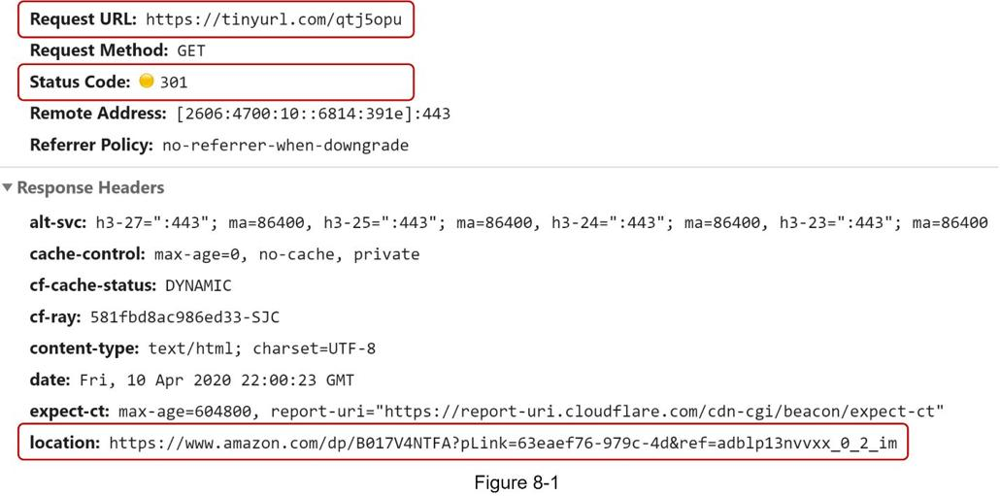

客户端和服务器之间的详细通信如图 8-2 所示。

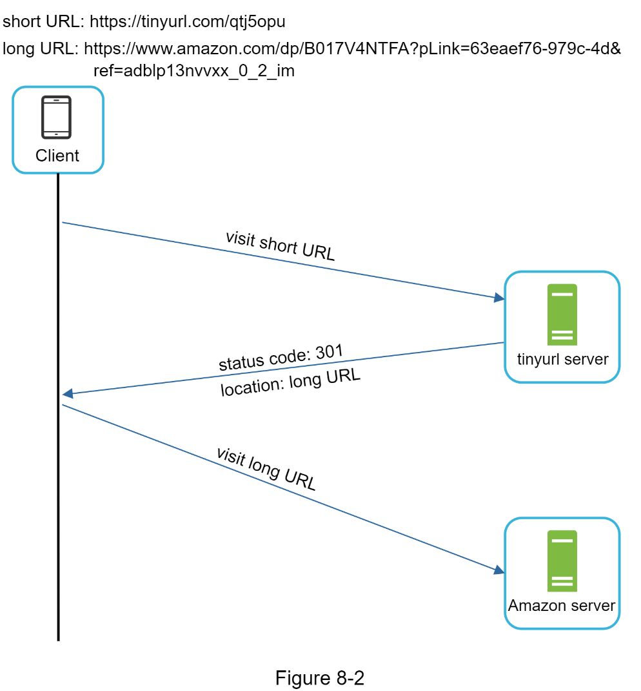

这里值得讨论的一件事是 301 重定向与 302 重定向。

**301重定向**。 301 重定向表明请求的 URL 被“永久”移动到长 URL。由于是永久重定向，浏览器会缓存响应，后续对同一 URL 的请求将不会发送到 URL 缩短服务。相反，请求被直接重定向到长 URL 服务器。

**302重定向**。 302 重定向意味着 URL 被“临时”移动到长 URL，这意味着对同一 URL 的后续请求将首先发送到 URL 缩短服务。然后，它们被重定向到长 URL 服务器。

每种重定向方法都有其优点和缺点。如果优先考虑减少服务器负载，则使用301重定向是有意义的，因为只有相同 URL 的第一个请求被发送到 URL 缩短服务器。但是，如果分析很重要，302 重定向是更好的选择，因为它可以更轻松地跟踪点击率和点击来源。
实现 URL 重定向最直观的方法是使用哈希表。假设哈希表存储 <shortURL, longURL> 对，则 URL 重定向可以通过以下方式实现：
- 获取longURL：longURL = hashTable.get(shortURL)
- 一旦你获得longURL，执行URL 重定向。

#### 网址缩短
让我们假设短 URL 如下所示：www.tinyurl.com/{hashValue}. 为了支持 URL 缩短用例，我们必须找到一个哈希函数 fx，它将长 URL 映射到 hashValue，如图 8-3 所示。

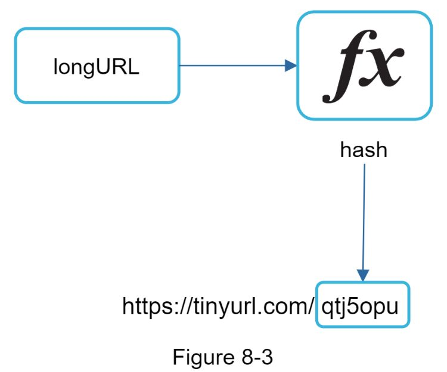

哈希函数必须满足以下要求：
- 每个longURL 必须散列为一个hashValue。
- 每个hashValue 都可以映射回longURL。

哈希函数的详细设计将在深入讨论。

### 第 3 步 - 设计深入研究
到目前为止，我们已经讨论了 URL 缩短和 URL 重定向的高级设计。在本节中，我们将深入探讨以下内容：数据模型、哈希函数、URL 缩短和 URL 重定向。

#### 数据模型
在高级设计中，所有内容都存储在哈希表中。这是一个很好的起点；然而，这种方法对于现实世界的系统是不可行的，因为内存资源有限且昂贵。更好的选择是将 <shortURL, longURL> 映射存储在关系数据库中。图 8-4 显示了一个简单的数据库表设计。该表的简化版本包含 3 列：id、shortURL、longURL。

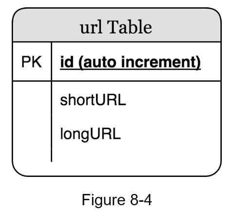

#### 哈希函数
哈希函数用于将长 URL 哈希为短 URL，也称为 hashValue。

#### 哈希值长度
hashValue 由 [0-9, a-z, A-Z] 中的字符组成，包含 10 + 26 + 26 = 62 个可能的字符。要计算 hashValue 的长度，请找到最小的 n，使得 62^n ≥ 3650 亿。根据信封背面估计，系统必须支持多达 3650 亿个 URL。表 8-1 显示了 hashValue 的长度以及它可以支持的对应的最大 URL 数。

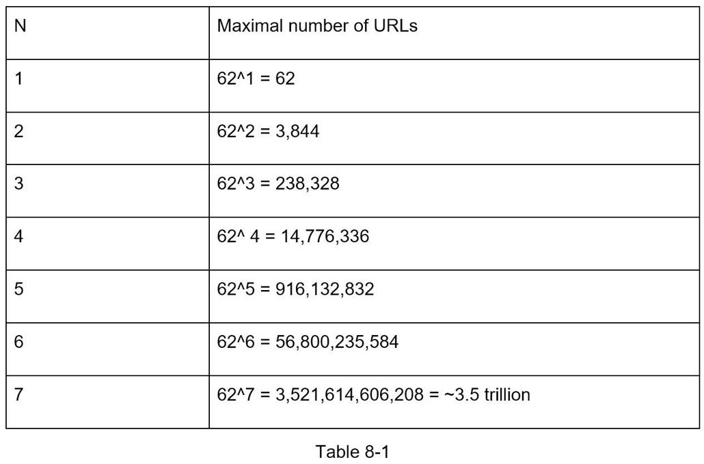

当 n = 7, 62 ^ n = ~3.5 万亿时，3.5 万亿足以容纳 3650 亿个 URL，因此 hashValue 的长度为 7。

我们将探索 URL 缩短器的两种类型的哈希函数。第一个是“哈希+冲突解决”，第二个是“base 62转换”。让我们一一看看。

#### 哈希+冲突解决
要缩短长 URL，我们应该实现一个散列函数，将长 URL 散列为 7 个字符的字符串。一个简单的解决方案是使用众所周知的散列函数，如 CRC32、MD5 或 SHA-1。下表比较了在此 URL 上应用不同哈希函数后的哈希结果：https://en.wikipedia.org/wiki/Systems_design。

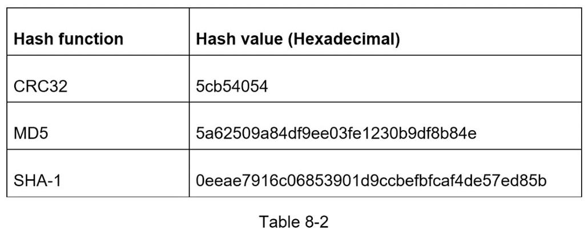

如表 8-2 所示，即使是最短的哈希值（来自 CRC32）也太长（超过 7 个字符）。我们怎样才能让它更短？

第一种方法是收集一个哈希值的前 7 个字符；但是，这种方法可能会导致哈希冲突。为了解决哈希冲突，我们可以递归地附加一个新的预定义字符串，直到不再发现冲突。图 8-5 解释了这个过程。

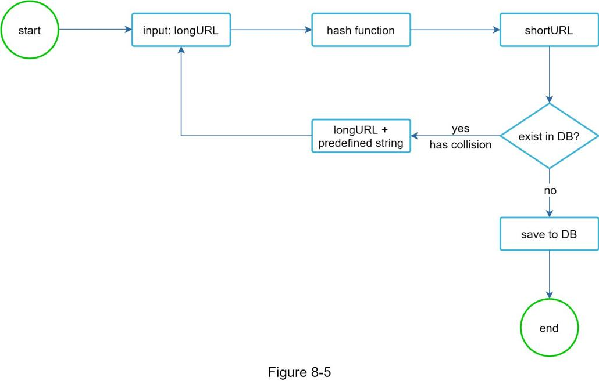

这种方法可以消除碰撞；但是，查询数据库以检查每个请求是否存在 shortURL 的成本很高。一种称为布隆过滤器 [2] 的技术可以提高性能。布隆过滤器是一种节省空间的概率技术，用于测试元素是否是集合的成员。有关详细信息，请参阅参考资料 [2]。

#### Base 62 转换
基本转换是 URL 缩短器常用的另一种方法。基本转换有助于在其不同的数字表示系统之间转换相同的数字。使用 Base 62 转换，因为 hashValue 有 62 个可能的字符。让我们用一个例子来解释转换是如何工作的：将 1115710 转换为 base 62 表示（1115710 表示在 base 10 系统中的 11157）。
- 从其名称来看，base 62 是一种使用 62 个字符进行编码的方式。映射为：0-0、...、9-9、10-a、11-b、...、35-z、36-A、...、61-Z，其中“a”代表10，“Z”代表 61，等等。
- 1115710 = 2 x 622 + 55 x 621 + 59 x 620 = [2, 55, 59] -> [2, T, X] 以基数 62 表示。图 8-6 显示了对话过程。
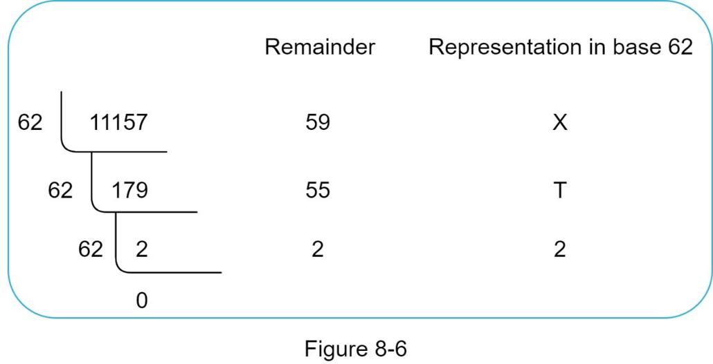
- 因此，短网址是https://tinyurl.com/2TX

#### 两种方法的比较

表 8-3 显示了两种方法的差异。
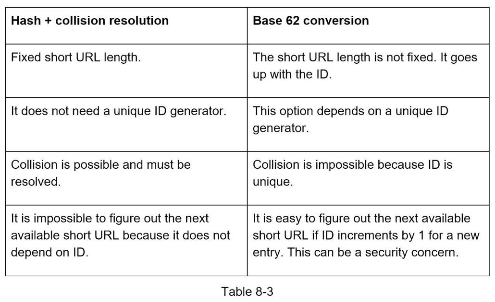

#### URL短链深入研究
作为系统的核心部分之一，我们希望 URL 缩短流程在逻辑上简单且实用。我们的设计中使用了 Base 62 转换。我们构建下图（图 8-7）来演示流程。

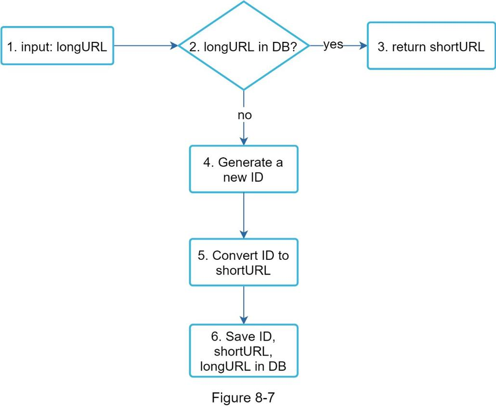

1. longURL 是输入。
2. 系统检查longURL是否在数据库中。
3. 如果是，则表示longURL之前被转换为shortURL。在这种情况下，从数据库中获取 shortURL 并将其返回给客户端。
4. 如果不是，longURL 是新的。新的唯一 ID（主键）由唯一 ID 生成器生成。
5. 通过base 62转换将ID转换为shortURL。
6. 使用 ID、shortURL 和 longURL 创建一个新的数据库行。

为了让流程更容易理解，让我们看一个具体的例子。
- 假设输入的longURL是：https://en.wikipedia.org/wiki/Systems_design
- 唯一 ID 生成器返回 ID：2009215674938。
- 使用base 62 转换将ID 转换为shortURL。 ID (2009215674938) 转换为“zn9edcu”。
- 将ID、shortURL 和longURL 保存到数据库中，如表8-4 所示。

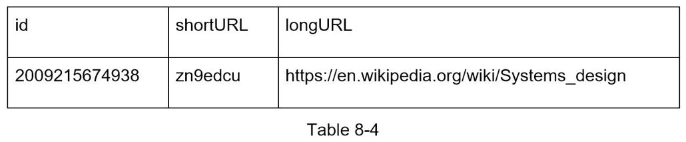

分布式唯一 ID 生成器值得一提。它的主要功能是生成全局唯一 ID，用于创建短 URL。在高度分布式的环境中，实现唯一的 ID 生成器具有挑战性。幸运的是，我们已经在“第 7 章：在分布式系统中设计唯一 ID 生成器”中讨论了一些解决方案。你可以参考它来刷新你的记忆。

#### URL 重定向深入研究
图 8-8 显示了 URL 重定向的详细设计。由于读多于写，<shortURL, longURL> 映射存储在缓存中以提高性能。

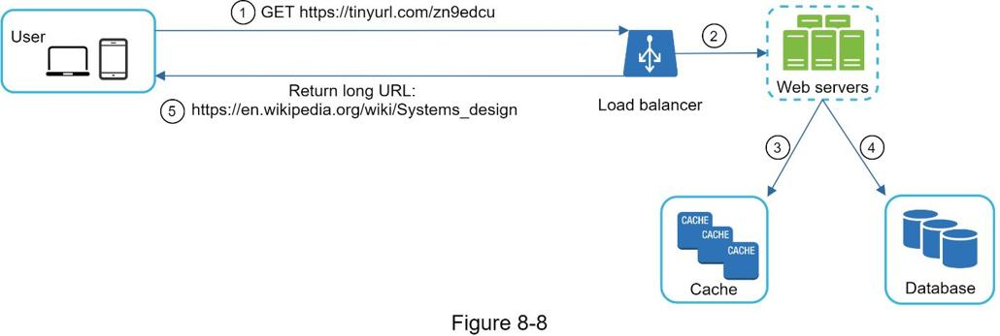

URL重定向的流程总结如下：
1. 用户点击短网址链接：https://tinyurl.com/zn9edcu
2. 负载均衡器将请求转发到 Web 服务器。
3. 如果缓存中已经有shortURL，直接返回longURL。
4. 如果缓存中没有shortURL，则从数据库中获取longURL。如果它不在数据库中，则可能是用户输入了无效的短 URL。
5. longURL 返回给用户。

### 第 4 步 - 总结
在本章中，我们讨论了 API 设计、数据模型、哈希函数、URL 缩短和 URL 重定向。

如果在采访结束时有额外的时间，这里有一些额外的谈话要点。
- 速率限制器：我们可能面临的一个潜在安全问题是恶意用户发送大量的 URL 缩短请求。速率限制器有助于根据 IP 地址或其他过滤规则过滤掉请求。如果你想刷新关于速率限制的记忆，请参阅“第 4 章：设计速率限制器”。
- Web 服务器扩展：由于Web 层是无状态的，通过添加或删除Web 服务器很容易扩展Web 层。
- 数据库扩展：数据库复制和分片是常用技术。
- 分析：数据对于业务成功越来越重要。将分析解决方案集成到 URL 缩短器有助于回答重要问题，例如有多少人点击了链接？他们什么时候点击链接？等等
- 可用性、一致性和可靠性。这些概念是任何大型系统成功的核心。我们在第 1 章中详细讨论了它们，请在这些主题上刷新你的记忆。

恭喜你走到这一步！现在拍拍自己的后背。好样的！

### 参考资料
[1] RESTful 教程：https://www.restapitutorial.com/index.html
[2] 布隆过滤器：https://en.wikipedia.org/wiki/Bloom_filter
