## 设计网络爬虫
在本章中，我们关注网络爬虫设计：一个有趣且经典的系统设计面试问题。

网络爬虫被称为机器人或蜘蛛。 它被搜索引擎广泛用于在网络上发现新的或更新的内容。 内容可以是网页、图像、视频、PDF 文件等。网络爬虫首先收集几个网页，然后跟踪这些网页上的链接以收集新内容。 图 9-1 显示了爬取过程的可视化示例。

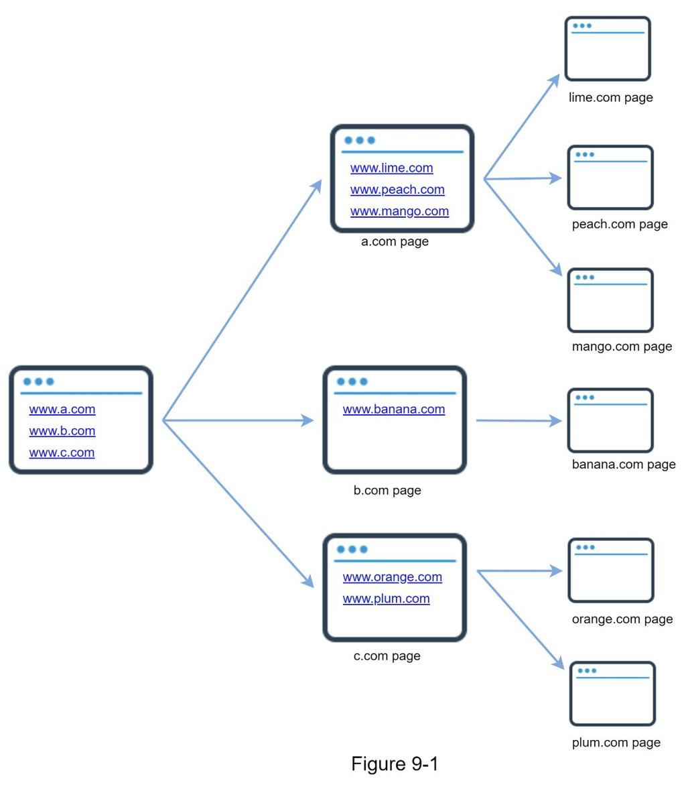

爬虫有多种用途：

- 搜索引擎索引：这是最常见的用例。爬虫收集网页以为搜索引擎创建本地索引。例如，Googlebot 是 Google 搜索引擎背后的网络爬虫。
- 网络归档：这是从网络收集信息以保存数据以备将来使用的过程。例如，许多国家图书馆运行爬虫来归档网站。著名的例子是美国国会图书馆 [1] 和欧盟网络档案 [2]。
- Web 挖掘：Web 的爆炸式增长为数据挖掘提供了前所未有的机会。网络挖掘有助于从互联网中发现有用的知识。例如，顶级金融公司使用爬虫下载股东大会和年度报告，以了解公司的关键举措。
- 网络监控。爬虫有助于监控互联网上的版权和商标侵权行为。例如，Digimarc [3] 利用爬虫来发现盗版作品和报告。

开发网络爬虫的复杂性取决于我们打算支持的规模。它可能是一个只需要几个小时即可完成的小型学校项目，也可能是一个需要专门工程团队持续改进的大型项目。因此，我们将在下面探讨要支持的规模和功能。

### 第1步 - 了解问题并确定设计范围
网络爬虫的基本算法很简单：
1. 给定一组 URL，下载 URL 寻址的所有网页。
2. 从这些网页中提取 URL
3. 将新的 URL 添加到要下载的 URL 列表中。重复这 3 个步骤。

网络爬虫真的像这个基本算法一样简单吗？不完全是。设计一个可扩展的网络爬虫是一项极其复杂的任务。任何人都不太可能在面试期间设计大型网络爬虫。在进入设计之前，我们必须提出问题以了解需求并确定设计范围：

候选人：爬虫的主要用途是什么？它是用于搜索引擎索引、数据挖掘还是其他用途？
面试官：搜索引擎索引。

候选人：网络爬虫每月收集多少网页？
面试官：10亿页。

候选人：包括哪些内容类型？仅 HTML 还是其他内容类型，例如 PDF 和图像？
面试官：只有 HTML。

候选人：我们是否应该考虑新添加或编辑的网页？
面试官：是的，我们应该考虑新添加或编辑的网页。

候选人：我们需要存储从网络上爬取的 HTML 页面吗？
面试官：是的，最长5年

候选人：我们如何处理具有重复内容的网页？
面试官：有重复内容的页面应该被忽略。

以上是你可以向面试官提出的一些示例问题。了解需求并澄清歧义非常重要。即使你被要求设计一个简单的产品，比如网络爬虫，你和你的面试官也可能不会有相同的假设。

除了与面试官澄清的功能外，记下好的网络爬虫的以下特征也很重要：

- 可扩展性：网络非常大。那里有数十亿个网页。使用并行化，Web 爬行应该非常有效。
- 鲁棒性：网络充满了陷阱。糟糕的 HTML、无响应的服务器、崩溃、恶意链接等都很常见。爬虫必须处理所有这些边缘情况。
- 礼貌：爬虫不应在短时间内向网站发出过多的请求。
- 可扩展性：系统非常灵活，因此只需极少的更改即可支持新的内容类型。例如，如果我们以后要爬取图像文件，我们应该不需要重新设计整个系统。

#### 预估背景

以下估计基于许多假设，重要的是要与面试官沟通以保持一致。

- 假设每月下载 10 亿个网页。
- QPS：1,000,000,000 / 30 天 / 24 小时 / 3600 秒 = 每秒约 400 页。
- 峰值 QPS = 2 * QPS = 800
- 假设平均网页大小为500k。
- 10 亿页 x 500k = 每月 500 TB 存储。如果你对数字存储单元不清楚，请再次阅读第 2 章中的“2 的幂”部分。
- 假设数据存储五年，500 TB * 12 个月 * 5 年 = 30 PB。存储 5 年的内容需要 30 PB 的存储空间。

### 第2步 - 提出高级设计并获得支持
一旦需求明确，我们就进入高级设计。受之前关于网络爬虫研究的启发 [4] [5]，我们提出了一种高级设计，如图 9-2 所示。

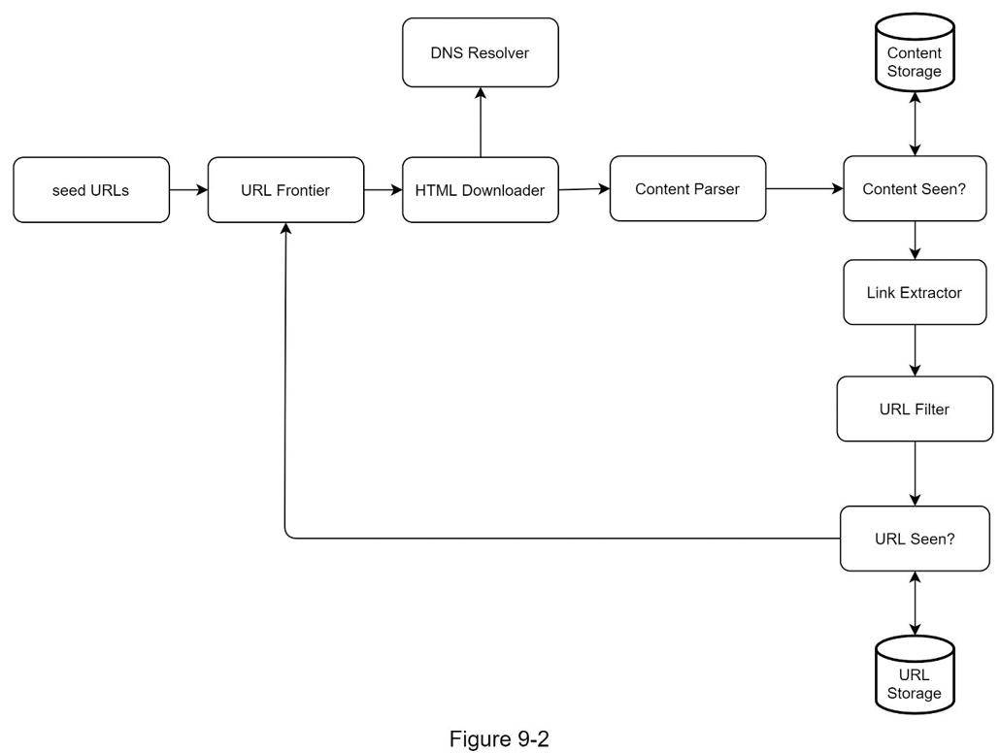

首先，我们探索每个设计组件以了解它们的功能。然后，我们逐步检查爬虫工作流程。

#### 种子 URL
网络爬虫使用种子 URL 作为爬取过程的起点。例如，要从大学网站抓取所有网页，选择种子 URL 的一种直观方法是使用大学的域名。

要抓取整个网络，我们需要在选择种子 URL 时发挥创意。一个好的种子 URL 是一个很好的起点，爬虫可以利用它来遍历尽可能多的链接。一般的策略是将整个 URL 空间划分为更小的空间。第一个提议的方法是基于地方的，因为不同的国家可能有不同的流行网站。另一种方法是根据主题选择种子 URL；例如，我们可以将 URL 空间划分为购物、运动、医疗保健等。种子 URL 选择是一个开放式问题。你不应该给出完美的答案。只是大声思考。

#### 网址边界
大多数现代网络爬虫将爬取状态分为两种：待下载和已下载。存储要下载的 URL 的组件称为 URL Frontier。你可以将此称为先进先出 (FIFO) 队列。有关 URL Frontier 的详细信息，请参阅深入研究。

#### HTML 下载器
HTML 下载器从 Internet 下载网页。这些 URL 由 URL Frontier 提供。

#### DNS解析器
要下载网页，必须将 URL 转换为 IP 地址。 HTML 下载器调用 DNS 解析器以获取 URL 的相应 IP 地址。例如，截至 2019 年 3 月 5 日，URL www.wikipedia.org 已转换为 IP 地址 198.35.26.96。

#### 内容解析器
下载网页后，必须对其进行解析和验证，因为格式错误的网页可能会引发问题并浪费存储空间。在爬网服务器中实现内容解析器会减慢爬网过程。因此，内容解析器是一个单独的组件。

#### 爬取过的内容？
在线研究 [6] 表明，29% 的网页是重复内容，这可能导致相同的内容被多次存储。我们介绍“爬取的内容？”数据结构，消除数据冗余，缩短处理时间。它有助于检测以前存储在系统中的新内容。要比较两个 HTML 文档，我们可以逐个字符地比较它们。但是，这种方法既慢又耗时，尤其是在涉及数十亿网页的情况下。完成此任务的一种有效方法是比较两个网页的哈希值 [7]。

#### 内容存储

它是一个用于存储 HTML 内容的存储系统。存储系统的选择取决于数据类型、数据大小、访问频率、寿命等因素，磁盘和内存都使用。

- 大部分内容存储在磁盘上，因为数据集太大而无法放入内存。
- 热门内容保存在内存中以减少延迟。

#### 网址提取器
URL Extractor 从 HTML 页面中解析和提取链接。图 9-3 显示了链接提取过程的示例。通过添加“https://en.wikipedia.org”前缀将相对路径转换为绝对 URL。

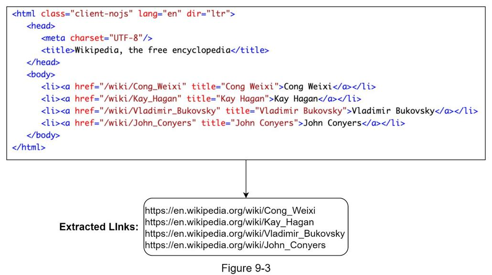

#### 网址过滤器
URL 过滤器排除“黑名单”站点中的某些内容类型、文件扩展名、错误链接和 URL。

#### 网址爬取过？

“网址爬取过？”是一种数据结构，用于跟踪在 Frontier 之前或已经访问过的 URL。 “网址爬取过？”有助于避免多次添加相同的 URL，因为这会增加服务器负载并导致潜在的无限循环。

布隆过滤器和哈希表是实现“URL Seen？”的常用技术。零件。我们不会在这里详细介绍布隆过滤器和哈希表的实现。有关详细信息，请参阅参考资料 [4] [8]。

#### URL 存储
URL Storage 存储已经访问过的 URL。

到目前为止，我们已经讨论了每个系统组件。接下来，我们将它们放在一起来解释工作流程。

#### 网络爬虫工作流程
为了更好地逐步解释工作流程，在设计图中添加了序列号，如图 9-4 所示。

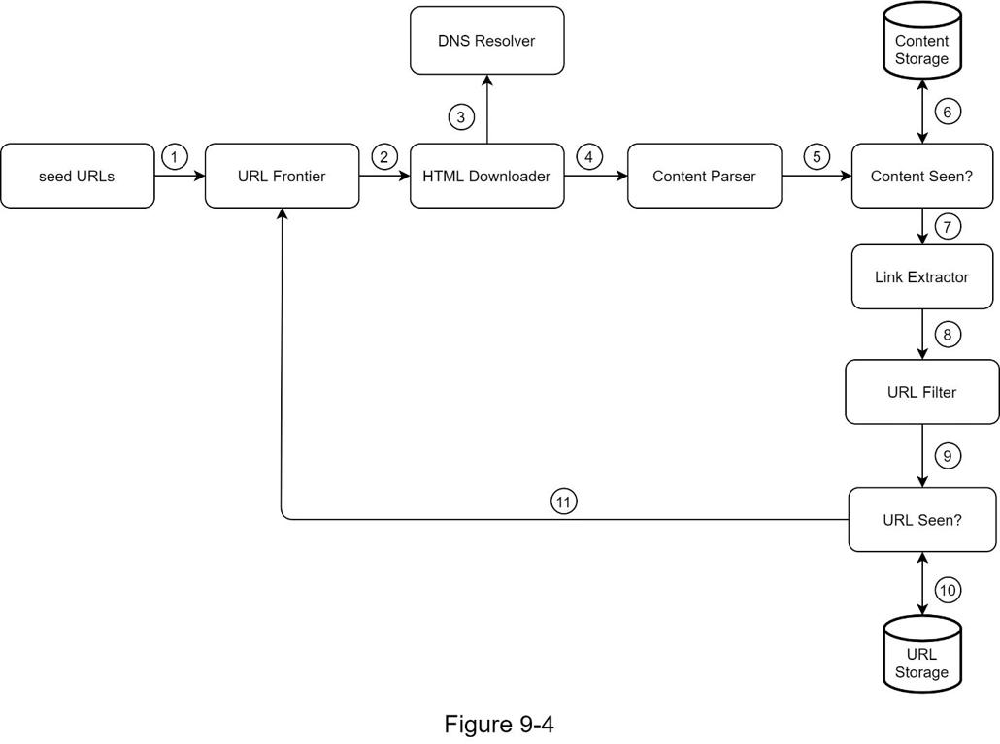

第 1 步：将种子 URL 添加到 URL Frontier
第 2 步：HTML 下载器从 URL Frontier 获取 URL 列表。
第 3 步：HTML 下载器从 DNS 解析器获取 URL 的 IP 地址并开始下载。
第 4 步：内容解析器解析 HTML 页面并检查页面是否格式错误。
第 5 步：内容解析和验证后，传递给“看到的内容？”零件。
第 6 步：“Content Seen”组件检查 HTML 页面是否已在存储中。

- 如果它在存储中，这意味着不同URL中的相同内容已经被处理。在这种情况下，HTML 页面将被丢弃。
- 如果它不在存储中，则系统之前没有处理过相同的内容。内容被传递给链接提取器。

第 7 步：链接提取器从 HTML 页面中提取链接。
第 8 步：将提取的链接传递给 URL 过滤器。
第 9 步：过滤链接后，将它们传递给“爬取过的 URL？”零件。
步骤 10：“URL Seen”组件检查一个 URL 是否已经在存储中，如果是，它之前已经处理过，不需要做任何事情。
第 11 步：如果之前没有处理过 URL，则将其添加到 URL Frontier。

### 第3步 - 设计深入研究
到目前为止，我们已经讨论了高层设计。接下来，我们将深入讨论最重要的构建组件和技术：

- 深度优先搜索（DFS）与广度优先搜索（BFS）
- URL边界
- HTML 下载器
- 鲁棒性
- 可扩展性
- 检测并避免有问题的内容

#### DFS 与 BFS

你可以将 Web 视为一个有向图，其中网页用作节点，超链接 (URL) 用作边缘。爬取过程可以看作是从一个网页到其他网页的有向图遍历。两种常见的图遍历算法是 DFS 和 BFS。但是，DFS 通常不是一个好的选择，因为 DFS 的深度可能非常深。

BFS 常被网络爬虫使用，由先进先出 (FIFO) 队列实现。在 FIFO 队列中，URL 按照它们入队的顺序出队。但是，这个实现有两个问题：

- 来自同一网页的大多数链接都链接回同一主机。在图 9-5 中，wikipedia.com 中的所有链接都是内部链接，这使得爬虫忙于处理来自同一主机（wikipedia.com）的 URL。当爬虫试图并行下载网页时，维基百科服务器将被请求淹没。这被认为是“不礼貌的”。

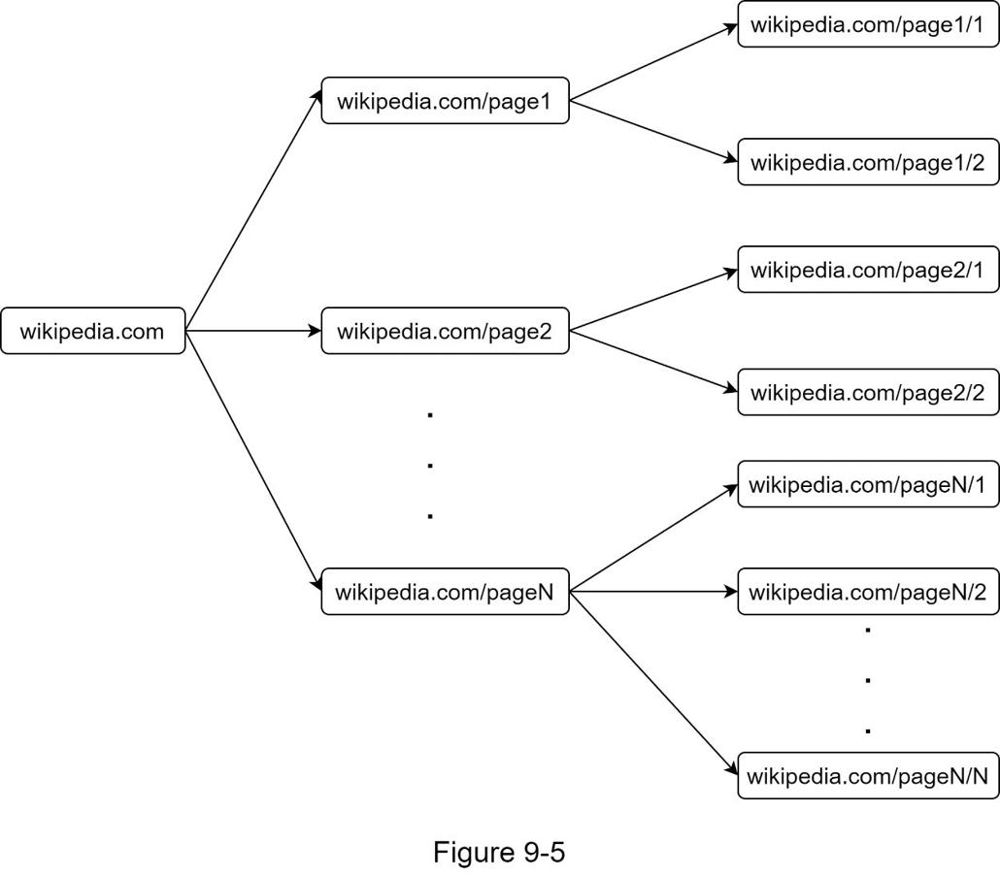

- 标准BFS 不考虑URL 的优先级。网络很大，并非每个页面都具有相同的质量和重要性。因此，我们可能希望根据页面排名、网络流量、更新频率等对 URL 进行优先级排序。

#### 网址边界
URL 边界有助于解决这些问题。 URL 边界是存储要下载的 URL 的数据结构。 URL 边界是确保礼貌、URL 优先级和新鲜度的重要组成部分。参考资料 [5] [9] 中提到了一些关于 URL 前沿的值得注意的论文。这些论文的发现如下：

#### 礼貌
一般来说，网络爬虫应避免在短时间内向同一托管服务器发送过多的请求。发送太多请求被认为是“不礼貌的”，甚至被视为拒绝服务 (DOS) 攻击。例如，在没有任何限制的情况下，爬虫每秒可以向同一个网站发送数千个请求。这可能会使 Web 服务器不堪重负。

强制执行礼貌的一般想法是从同一主机一次下载一页。可以在两个下载任务之间添加延迟。礼貌约束是通过维护从网站主机名到下载（工作）线程的映射来实现的。每个下载器线程都有一个单独的 FIFO 队列，并且只下载从该队列获得的 URL。图 9-6 显示了管理礼貌的设计。

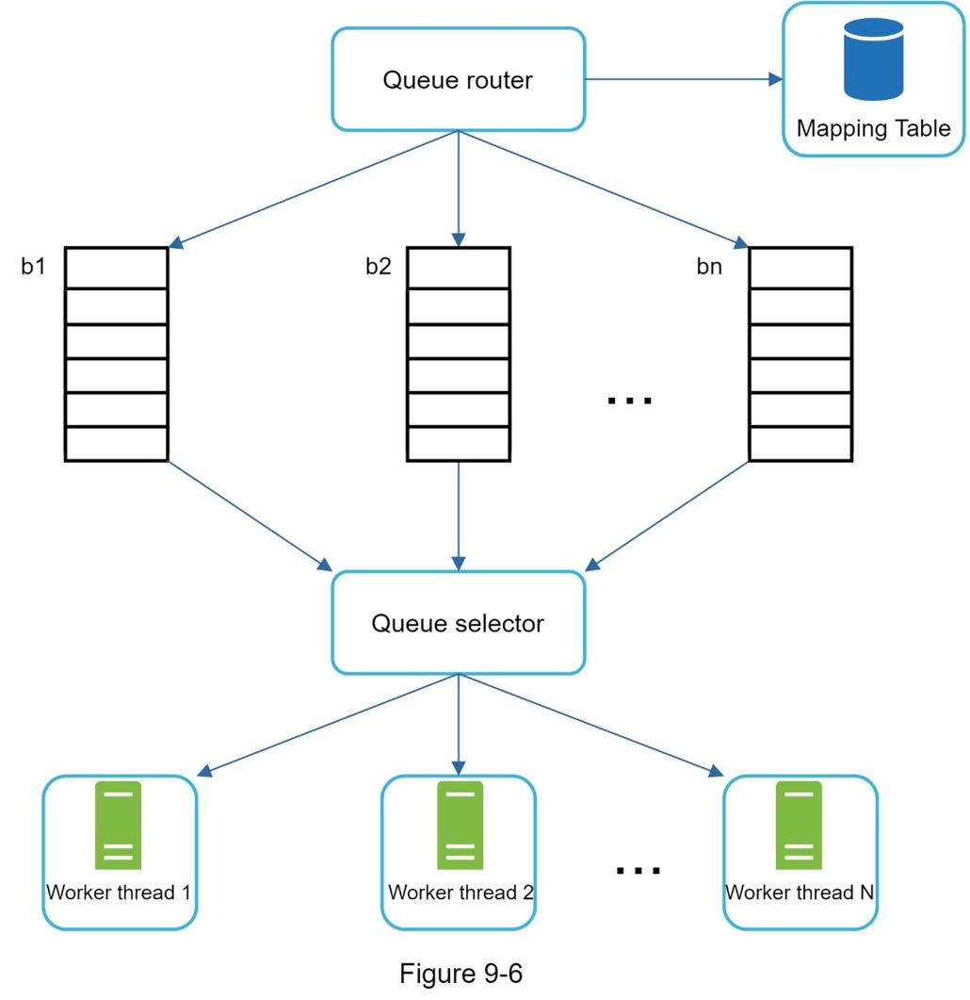

- 队列路由器：确保每个队列（b1，b2，... bn）只包含来自同一主机的 URL。
- 映射表：它将每个主机映射到一个队列。

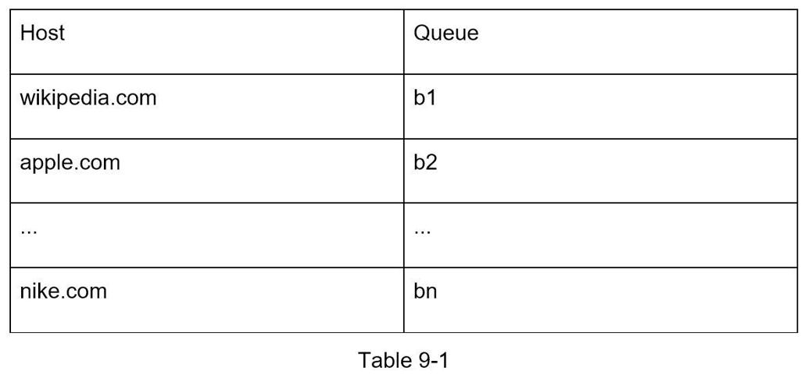

- FIFO 队列b1、b2 到bn：每个队列都包含来自同一主机的URL。
- 队列选择器：每个工作线程都映射到一个FIFO队列，它只从该队列下载URL。队列选择逻辑由队列选择器完成。
- 工作线程1 到N。工作线程从同一主机上一个一个地下载网页。可以在两个下载任务之间添加延迟。

#### 优先级
来自讨论论坛的关于 Apple 产品的随机帖子与 Apple 主页上的帖子具有非常不同的重要性。尽管它们都有“Apple”关键字，但爬虫首先爬取Apple主页是明智的。

我们根据有用性对 URL 进行优先级排序，这可以通过 PageRank [10]、网站流量、更新频率等来衡量。“Prioritizer”是处理 URL 优先级的组件。有关此概念的详细信息，请参阅参考资料 [5] [10]。

图 9-7 显示了管理 URL 优先级的设计。

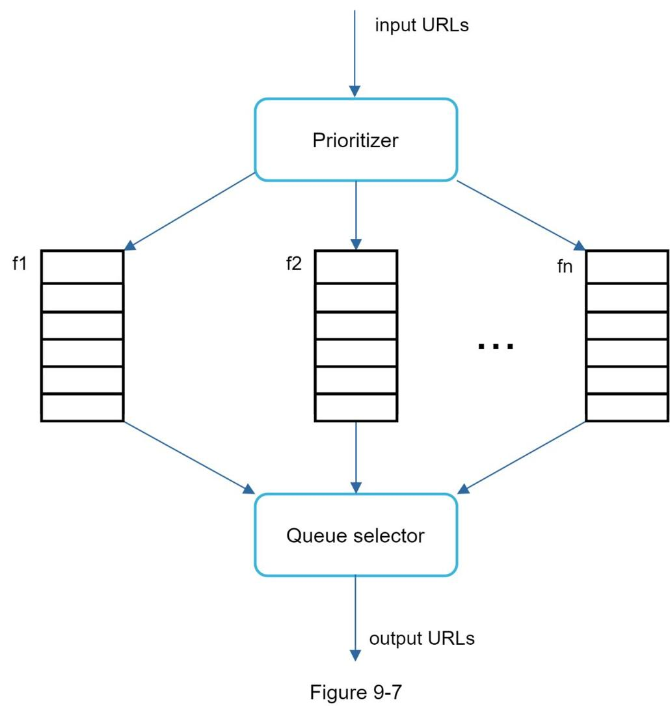

- Prioritizer：它将 URL 作为输入并计算优先级。
- 队列f1 到fn：每个队列都有一个指定的优先级。 具有高优先级的队列以更高的概率被选择。
- 队列选择器：随机选择一个优先级较高的队列。

图 9-8 展示了 URL 边界设计，它包含两个模块：

- 前排：管理优先级
- 后排：管理礼貌

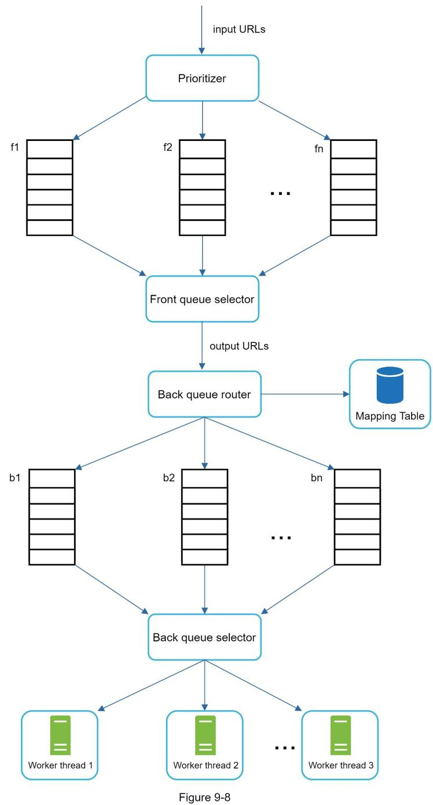

#### 刷新
网页不断被添加、删除和编辑。网络爬虫必须定期重新爬取下载的页面以保持我们的数据集新鲜。重新抓取所有 URL 既耗时又耗费资源。以下列出了一些优化新鲜度的策略：

- 根据网页的更新历史重新抓取。
- 优先考虑 URL 并首先更频繁地重新抓取重要页面。

#### URL Frontier 的存储
在搜索引擎的实际抓取中，前沿的 URL 数量可能是数亿 [4]。将所有内容都放在内存中既不持久也不可扩展。将所有内容都保存在磁盘中是不可取的，因为磁盘很慢；并且很容易成为爬取的瓶颈。

我们采用了混合方法。大多数 URL 都存储在磁盘上，因此存储空间不是问题。为了降低从磁盘读取和写入磁盘的成本，我们在内存中维护缓冲区以进行入队/出队操作。缓冲区中的数据会定期写入磁盘。

#### HTML 下载器
HTML 下载器使用 HTTP 协议从 Internet 下载网页。在讨论 HTML 下载器之前，我们先来看看机器人排除协议。

#### 机器人.txt
Robots.txt，称为机器人排除协议，是网站用于与爬虫通信的标准。它指定允许爬虫下载哪些页面。在尝试爬取网站之前，爬虫应首先检查其对应的 robots.txt 并遵循其规则。

为了避免重复下载 robots.txt 文件，我们缓存了文件的结果。该文件会定期下载并保存到缓存中。这是一段来自 https://www.amazon.com/robots.txt 的 robots.txt 文件。 Google bot 不允许使用某些目录（例如 creatorhub）。

用户代理：Googlebot
禁止：/creatorhub/*
禁止：/rss/people/*/reviews
禁止：/gp/pdp/rss/*/reviews
禁止：/gp/cdp/member-reviews/
禁止：/gp/aw/cr/

除了 robots.txt，性能优化是我们将介绍的 HTML 下载器的另一个重要概念。

#### 性能优化
以下是 HTML 下载器的性能优化列表。

**1.分布式爬取**
为了达到高性能，爬取作业被分布到多台服务器上，每台服务器运行多个线程。 URL 空间被分割成更小的部分；因此，每个下载器负责 URL 的一个子集。图 9-9 显示了分布式爬网的示例。

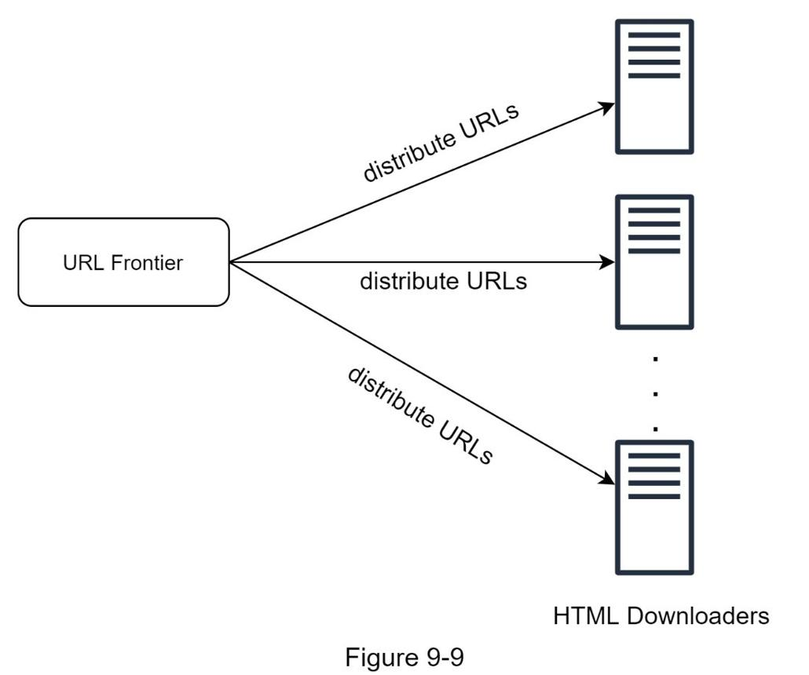

**2.缓存DNS解析器**
DNS Resolver 是爬虫的瓶颈，因为由于许多 DNS 接口的同步特性，DNS 请求可能需要一些时间。 DNS 响应时间范围从 10 毫秒到 200 毫秒。一旦爬虫线程执行了对 DNS 的请求，其他线程就会被阻塞，直到第一个请求完成。维护我们的 DNS 缓存以避免频繁调用 DNS 是一种有效的速度优化技术。我们的 DNS 缓存保存域名到 IP 地址的映射，并由 cron 作业定期更新。

**3.地点**
在地理上分布爬网服务器。当爬虫服务器离网站主机更近时，爬虫会体验到更快的下载时间。设计局部性适用于大多数系统组件：爬网服务器、缓存、队列、存储等。

**4.短暂的超时**
一些 Web 服务器响应缓慢或可能根本不响应。为避免长时间等待，指定了最大等待时间。如果主机在预定义的时间内没有响应，则爬虫将停止作业并爬取其他一些页面。

#### 鲁棒性

除了性能优化之外，鲁棒性也是一个重要的考虑因素。我们提出了一些提高系统鲁棒性的方法：

- 一致的散列：这有助于在下载者之间分配负载。可以使用一致的哈希添加或删除新的下载服务器。有关详细信息，请参阅第 5 章：设计一致的散列。
- 保存爬网状态和数据：为防止出现故障，将爬网状态和数据写入存储系统。通过加载保存的状态和数据，可以轻松地重新启动中断的爬网。
- 异常处理：错误是不可避免的并且在大型系统中很常见。爬虫必须优雅地处理异常而不会使系统崩溃。
- 数据验证：这是防止系统错误的重要措施。

#### 可扩展性
随着几乎每个系统的发展，设计目标之一是使系统足够灵活以支持新的内容类型。可以通过插入新模块来扩展爬虫。图 9-10 显示了如何添加新模块。

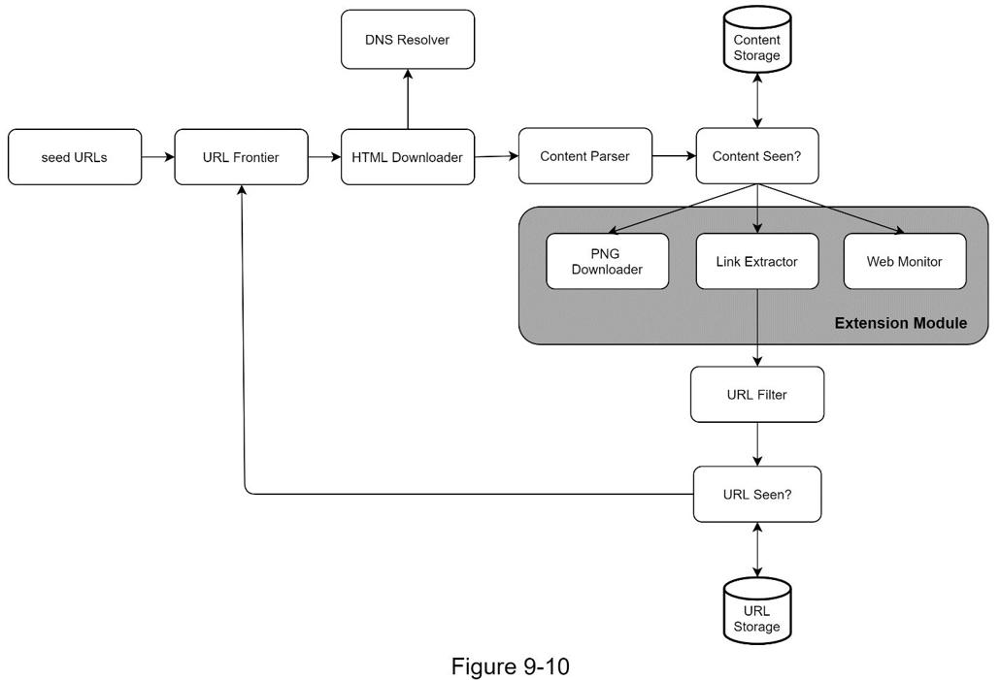

- PNG下载器模块是插件下载PNG文件。
- 添加了Web Monitor 模块来监控Web 并防止侵犯版权和商标。

#### 检测并避免有问题的内容
本节讨论冗余、无意义或有害内容的检测和预防。

1. 冗余内容
如前所述，近 30% 的网页是重复的。散列或校验和有助于检测重复 [11]。

2. 蜘蛛陷阱
蜘蛛陷阱是导致爬虫陷入无限循环的网页。例如，一个无限深的目录结构如下所示：www.spiderrapexample.com/foo/bar/foo/bar/foo/bar/...
通过设置 URL 的最大长度可以避免这种蜘蛛陷阱。然而，没有一种万能的解决方案来检测蜘蛛陷阱。包含蜘蛛陷阱的网站很容易识别，因为在此类网站上发现了异常大量的网页。很难开发自动算法来避免蜘蛛陷阱；但是，用户可以手动验证和识别蜘蛛陷阱，并从爬虫中排除这些网站或应用一些自定义的 URL 过滤器。
3. 数据噪音
一些内容几乎没有价值，例如广告、代码片段、垃圾网址等。这些内容对爬虫没有用处，应尽可能排除。

### 第4步 - 总结
在本章中，我们首先讨论了一个好的爬虫的特征：可扩展性、礼貌、可扩展性和健壮性。然后，我们提出了一个设计并讨论了关键组件。构建可扩展的网络爬虫并非易事，因为网络非常庞大且充满陷阱。尽管我们已经涵盖了许多主题，但我们仍然错过了许多相关的谈话要点：

- 服务器端渲染：许多网站使用JavaScript、AJAX 等脚本即时生成链接。如果我们直接下载和解析网页，我们将无法检索动态生成的链接。为了解决这个问题，我们在解析页面之前首先执行服务器端渲染（也称为动态渲染）[12]。
- 过滤掉不需要的页面：在有限的存储容量和爬取资源的情况下，反垃圾邮件组件有利于过滤掉低质量和垃圾邮件页面[13] [14]。
- 数据库复制和分片：复制和分片等技术用于提高数据层的可用性、可扩展性和可靠性。
- 横向扩展：对于大规模爬取，需要数百甚至数千台服务器来执行下载任务。关键是保持服务器无状态。
- 可用性、一致性和可靠性：这些概念是任何大型系统成功的核心。我们在第 1 章中详细讨论了这些概念。请刷新你对这些主题的记忆。
- 分析：收集和分析数据是任何系统的重要组成部分，因为数据是微调的关键要素。

恭喜你走到这一步！现在鼓励一下自己， 非常棒！

### 参考资料
1. 美国国会图书馆：https://www.loc.gov/websites/
2. 欧盟网络档案：http://data.europa.eu/webarchive
3. Digimarc：https://www.digimarc.com/products/digimarc-services/piracy-intelligence
4. Heydon A., Najork M. Mercator: Ascalable, extensible web crawler World Wide Web, 2 (4) (1999), pp. 219-229
5. 克里斯托弗·奥尔斯顿（Christopher Olston）、马克·纳约克（Marc Najork）：网络爬行。 http://infolab.stanford.edu/~olston/publications/crawling_survey.pdf
6. 29% 的网站面临重复内容问题：https://tinyurl.com/y6tmh55y
7. 拉宾 M.O. 等人。随机多项式指纹识别计算技术研究中心，艾肯计算实验室，大学。 (1981)
8. B. H. Bloom，“允许错误的哈希编码中的空间/时间权衡”，ACM 通讯，第一卷。 13，没有。 7，第 422-426 页，1970 年。
9. 唐纳德·J·帕特森，网络爬行：https://www.ics.uci.edu/~lopes/teaching/cs221W12/slides/Lecture05.pdf
10. L. Page、S. Brin、R. Motwani 和 T. Winograd，“PageRank 引文 排名：给网络带来秩序，”斯坦福大学技术报告， 1998 年。
11. 伯顿布鲁姆。哈希编码中的空间/时间权衡与允许的错误。 ACM 通讯，13(7)，第 422--426 页，1970 年 7 月。
12. 谷歌动态渲染：https://developers.google.com/search/docs/guides/dynamic-rendering
13. T. Urvoy、T. Lavergne 和 P. Filoche，“Tracking web spam with hidden stylesimilarity”，2nd International Workshop on Adversarial Information Retrieval on the Web 会议记录，2006 年。
14. H.-T. Lee、D. Leonard、X. Wang 和 D. Loguinov，“IRLbot：扩展到 60 亿页及以上”，第 17 届国际万维网会议论文集，2008 年。
